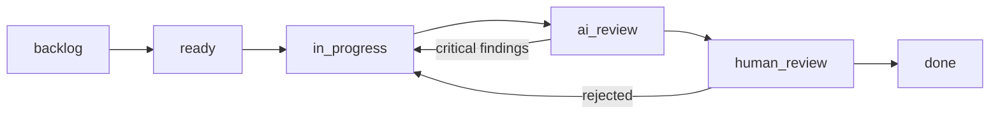
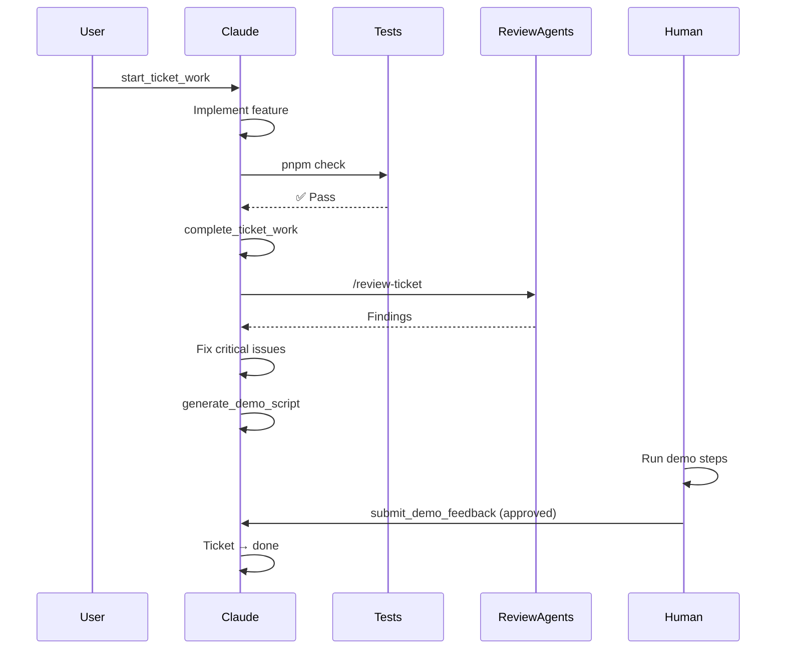
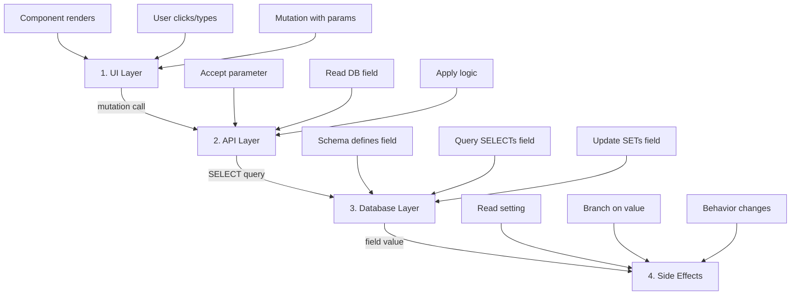

# CLAUDE.md

This file provides guidance to Claude Code (claude.ai/code) when working with code in this repository.

## Quick Navigation

**Getting Started**: [Commands](#commands) • [Architecture](#architecture) • [Quick Decisions](#when-should-i)
**Development**: [Server Functions](#server-functions-pattern) • [DO/DON'T Guidelines](#dodont-guidelines) • [End-to-End Features](#end-to-end-feature-implementation-critical)
**Workflows**: [Ralph](#ralph-workflow) • [Quality Pipeline](#universal-quality-workflow) • [Git Worktrees](#git-worktree-workflow)
**Troubleshooting**: [Common Issues](#troubleshooting-by-symptom) • [Verification](#verification-checklist)
**Deep Dives**: [Architecture](docs/architecture.md) • [Workflows](docs/workflows.md) • [Testing](docs/testing.md) • [Glossary](docs/glossary.md)

---

## Project Overview

Brain Dump is a local-first kanban task manager designed for AI-assisted development workflows. It integrates with Claude Code to provide ticket context when starting work, and includes "Ralph" - an autonomous agent mode that iterates through backlogs.

**Key features**:

- Local SQLite database with full-text search
- MCP server for Claude Code integration
- Automated quality workflow with AI code review
- Git worktree support for parallel epic development
- Enterprise conversation logging for compliance

**→ [Full Architecture Guide](docs/architecture.md)** - Tech stack, data flow, component patterns

---

## When Should I...?

### Write a detailed spec?

- ✅ State machines or complex workflows → [Use spec template](plans/spec-template.md)
- ✅ New MCP tools → See [MCP Tool Implementation](#mcp-tool-implementation)
- ✅ Database schema changes → See [Database Schema](#database-schema)
- ❌ Simple bug fixes → Just fix and test

### Use worktrees vs branches?

- ✅ Parallel work on multiple epics → [Worktree Mode](#git-worktree-workflow)
- ✅ Want complete isolation → [Enable worktree support](#enabling-worktree-support)
- ❌ Linear workflow → [Branch Mode](#branch-mode-default) (simpler)

### Run /review?

- ✅ After writing code → [Automatic Code Review](#automatic-code-review)
- ✅ Before completing ticket → [Quality Workflow](#universal-quality-workflow)
- ❌ Documentation-only changes
- ❌ Configuration file changes

### Migrate JS to TypeScript?

- ✅ **ALWAYS** when editing `.js`/`.jsx` files → [Migration Guide](#typescript-requirements)
- ✅ All new files must be `.ts`/`.tsx`
- ❌ Never create new `.js` files

---

## Commands

```bash
# Development
pnpm dev                    # Start dev server on port 4242
pnpm build                  # Build for production
pnpm start                  # Start production server

# Quality checks
pnpm check                  # Run all checks (type-check, lint, test)
pnpm type-check             # TypeScript type checking
pnpm lint                   # ESLint
pnpm test                   # Run unit tests with Vitest
pnpm test:watch             # Watch mode for tests
pnpm test:e2e               # Playwright E2E tests

# Database
pnpm db:migrate             # Run Drizzle migrations
pnpm db:generate            # Generate migration files from schema changes
pnpm db:studio              # Open Drizzle Studio for database inspection

# CLI tool (database utilities)
pnpm brain-dump backup        # Create database backup
pnpm brain-dump backup --list # List available backups
pnpm brain-dump restore       # Restore from backup
pnpm brain-dump check         # Quick integrity check
pnpm brain-dump check --full  # Full health check
pnpm brain-dump cleanup       # List stale worktrees (dry-run)
pnpm brain-dump cleanup --force # Remove stale worktrees
pnpm brain-dump doctor        # Diagnose configuration issues
```

**See also**: [Full command reference](docs/workflows.md#cli-commands)

---

## Architecture

### Tech Stack

- **Framework**: TanStack Start (React 19 + Vite + Nitro)
- **Database**: SQLite with better-sqlite3, Drizzle ORM
- **Styling**: Tailwind CSS v4
- **State**: TanStack Query for server state
- **Drag & Drop**: @dnd-kit

**→ [Architecture Deep Dive](docs/architecture.md)** - Data flow diagrams, component patterns, tech decisions

### Key Directories

- `src/api/` - Server functions (CRUD operations, terminal launching, Ralph agent)
- `src/components/` - React components (modals, kanban board, sidebar)
- `src/lib/` - Core utilities: database, schema, XDG paths, backup, logging
- `src/routes/` - TanStack Router pages
- `mcp-server/` - MCP server for Claude Code integration (standalone Node.js)
- `cli/` - CLI tool for ticket status updates from terminal

### Database Schema

Defined in [src/lib/schema.ts](src/lib/schema.ts) with Drizzle ORM:

- `projects` - Links to filesystem paths
- `epics` - Groups related tickets within a project
- `tickets` - Main work items with status, priority, tags, subtasks
- `ticket_comments` - Activity log for AI work summaries
- `settings` - App configuration (terminal emulator, Ralph options)

Full-text search via SQLite FTS5 on tickets (title, description, tags).

**Real examples**:

- ✅ Good query: [src/api/tickets.ts:45-67](src/api/tickets.ts:45-67) - Type-safe with Drizzle
- ✅ Transaction: [src/api/epics.ts:123-145](src/api/epics.ts:123-145) - Multi-table update

### Data Storage (XDG Compliance)

Cross-platform paths defined in [src/lib/xdg.ts](src/lib/xdg.ts):

- **Linux**: `~/.local/share/brain-dump/` (data), `~/.local/state/brain-dump/` (logs, backups)
- **macOS**: `~/Library/Application Support/brain-dump/`
- **Windows**: `%APPDATA%\brain-dump\`

Legacy migration from `~/.brain-dump/` is automatic on first run.

### MCP Server

The [mcp-server/index.js](mcp-server/index.js) is a standalone Node.js MCP server that provides tools for Claude to manage tickets from any project. It connects to the same SQLite database and includes:

- Project/ticket/epic CRUD operations
- Git integration (branch creation, commit linking)
- Database health monitoring

**→ [MCP Tool Implementation Guide](#mcp-tool-implementation)** - How to add new MCP tools

---

## Critical: MCP Server Database Synchronization

⚠️ **When using Ralph in worktrees or multi-process scenarios**, ticket updates may not appear in the Brain Dump UI immediately. This is because:

- Ralph runs in a separate Claude CLI process with its own MCP server
- Both processes access the same SQLite database
- The MCP server **must** use compiled JavaScript (`dist/index.js`), not TypeScript source

**Fix if needed**:

```bash
./scripts/fix-mcp-server-path.sh
```

→ **Full details**: [MCP Server Database Synchronization](docs/mcp-server-sync.md)

## Ralph Workflow

Ralph is an autonomous agent mode that:

1. Generates a `plans/prd.json` from tickets
2. Runs Claude in a loop, picking tasks where `passes: false`
3. Implements features, runs tests, updates status via MCP
4. Continues until all tasks pass or max iterations reached

**→ [Full Ralph Documentation](docs/workflows.md#ralph-workflow)** - State machines, hooks, telemetry

**See also**:

- [Universal Quality Workflow](#universal-quality-workflow) - How Ralph enforces quality
- [Hook-Based State Enforcement](#hook-based-state-enforcement) - How hooks guide Ralph
- [Telemetry Hooks](#telemetry-hooks) - How work is tracked

---

## Git Worktree Workflow

Brain Dump supports two isolation modes for epic work, allowing you to choose between simplicity and parallel development capabilities.

### Branch Mode (Default)

- Work happens in the main repository directory
- Uses standard git branching workflow
- Simple but requires clean working tree before switching tasks
- No additional setup needed

### Worktree Mode (Isolated)

- Creates separate directory for each epic at a sibling location
- Enables parallel AI sessions on different epics
- Each worktree has its own `.claude/` folder
- Eliminates checkout conflicts when switching between work contexts

**Worktree path format**:

- Sibling (default): `{projectParent}/{projectName}-epic-{shortId}-{slug}`
- Subfolder: `{projectPath}/.worktrees/epic-{shortId}-{slug}`
- Custom: User-specified base path

### Enabling Worktree Support

Worktree support is opt-in. Enable it via:

1. **Global setting**: Toggle "Enable Worktree Support" in Settings modal
2. **Per-project**: Set "Default Isolation Mode" to "Worktree" or "Ask each time" in project settings

When enabled, the StartEpicModal appears when starting work on an epic, letting you choose between branch and worktree modes.

**→ [Full Worktree Guide](docs/workflows.md#git-worktree-workflow)** - Lifecycle, cleanup, troubleshooting

### Detecting Worktree Context

When running in a worktree, `.claude/ralph-state.json` includes additional fields:

```json
{
  "sessionId": "abc-123",
  "ticketId": "def-456",
  "currentState": "implementing",
  "isolationMode": "worktree",
  "worktreePath": "/Users/dev/brain-dump-epic-abc12345-feature",
  "mainRepoPath": "/Users/dev/brain-dump"
}
```

- `isolationMode`: Either `"branch"` or `"worktree"`
- `worktreePath`: Absolute path to the worktree directory
- `mainRepoPath`: Absolute path to the main repository (for PRD file access)

Hooks use `mainRepoPath` to locate the PRD file and spawn next tickets in the main repo context.

**See also**: [Hook-Based State Enforcement](#hook-based-state-enforcement)

---

## Universal Quality Workflow

Brain Dump implements a structured quality workflow (inspired by Dillon Mulroy's "tracer review" pattern) that ensures consistent code quality regardless of which AI coding environment you use.

### Status Flow

The workflow enforces a clear progression through quality gates:



- **backlog**: Not yet ready to work on
- **ready**: Ready to be picked up by AI or human
- **in_progress**: Active development (code being written)
- **ai_review**: Automated quality review by code review agents (finding issues, fixing them)
- **human_review**: Demo approval by human reviewer
- **done**: Complete and approved

**→ [Full Quality Workflow Guide](docs/workflows.md#universal-quality-workflow)** - Detailed steps, skills, troubleshooting

### Key Workflow Steps



1. **Start Work** (`start_ticket_work`) - Creates git branch, sets status to `in_progress`
2. **Implementation** - AI writes code, runs tests, makes commits
3. **Complete Implementation** (`complete_ticket_work`) - Validation passes, moves to `ai_review`
4. **AI Review** - Three agents run in parallel, submit findings
5. **Generate Demo** (`generate_demo_script`) - Creates manual test instructions
6. **Human Review** - Human approves/rejects with feedback
7. **Reconcile Learnings** (`reconcile_learnings`) - Extract and apply learnings to docs

**See also**:

- [Automatic Code Review](#automatic-code-review) - How `/review` works
- [Testing Philosophy](#testing-philosophy-kent-c-dodds) - What to test
- [Verification Checklist](#verification-checklist) - Pre-completion checks

### Skills (Workflow Shortcuts)

- **`/next-task`** - Intelligently select the next ticket considering priority and dependencies
- **`/review-ticket`** - Run all AI review agents on current work
- **`/review-epic`** - Run Tracer Review on an entire epic
- **`/demo`** - Generate demo script after AI review passes
- **`/reconcile-learnings`** - Extract and apply learnings to project docs

### Multi-Environment Support

| Environment | AI Review | Hook Enforcement              | Telemetry          |
| ----------- | --------- | ----------------------------- | ------------------ |
| Claude Code | ✅ Full   | ✅ Hooks enforce state        | ✅ Hooks capture   |
| Cursor      | ✅ Full   | ✅ Hooks enforce state        | ✅ Hooks capture   |
| OpenCode    | ✅ Full   | ❌ MCP enforces preconditions | ✅ Plugin captures |
| VS Code     | ✅ Full   | ❌ MCP enforces preconditions | ✅ MCP captures    |

**Installation**: Run `./scripts/install.sh` to configure your environment.

**See also**: [Hook-Based State Enforcement](#hook-based-state-enforcement)

---

## Hook-Based State Enforcement

This project uses Claude Code hooks to enforce Ralph's workflow. Hooks provide guidance through feedback loops rather than just blocking actions.

### How It Works

```
┌─────────────────────────────────────────────────────────────────┐
│              ENFORCEMENT THROUGH FEEDBACK                       │
├─────────────────────────────────────────────────────────────────┤
│   Claude: "I'll write the file now"                             │
│              │                                                  │
│              ▼                                                  │
│   PreToolUse Hook: "BLOCKED - You are in 'analyzing' state      │
│   but tried to write code. Call update_session_state FIRST."    │
│              │                                                  │
│              ▼                                                  │
│   Claude: *calls update_session_state('implementing')*          │
│   Claude: *retries Write* ✅                                    │
└─────────────────────────────────────────────────────────────────┘
```

### Hook Scripts

| Hook                          | File        | Enforces                                                                      |
| ----------------------------- | ----------- | ----------------------------------------------------------------------------- |
| enforce-state-before-write.sh | PreToolUse  | Must be in 'implementing', 'testing', or 'committing' state before Write/Edit |
| record-state-change.sh        | PostToolUse | Logs state changes for debugging/audit                                        |

**→ [Full Hook Documentation](docs/workflows.md#hook-based-state-enforcement)** - State file format, cross-environment support

### If You See a STATE ENFORCEMENT Message

1. **Read the message** - it contains the exact MCP tool call needed
2. **Call the specified tool** - e.g., `update_session_state({ sessionId: "...", state: "implementing" })`
3. **Retry your original operation** - it will now succeed

Do NOT try to work around state enforcement - it ensures work is properly tracked in the Brain Dump UI.

**See also**: [Ralph Workflow](#ralph-workflow)

---

## End-to-End Feature Implementation (CRITICAL)

**LEARNING FROM PAST BUGS: Features must be implemented from UI to backend in a complete, connected flow.**

When implementing ANY feature that involves user interaction, you MUST verify the ENTIRE data flow works end-to-end.

### The Anti-Pattern (What Went Wrong)

The worktree feature was built with:

1. ✅ UI modal to select worktree mode (`StartEpicModal.tsx`)
2. ✅ Database schema for `isolation_mode` field
3. ✅ Settings toggle for "Enable Worktree Support"
4. ❌ **BUT** `launchRalphForEpic()` never read the `isolation_mode` field!

Result: Users could select "Worktree" in the UI, but Ralph would always launch in the main repo.

### The Required Pattern

For EVERY feature, verify these layers are connected:



### Verification Checklist for Features

Before marking a feature complete, trace the data flow:

| Step           | Question                                   | Verification                    |
| -------------- | ------------------------------------------ | ------------------------------- |
| UI → API       | Does the mutation pass the new parameter?  | Check mutation call site        |
| API → DB       | Does the handler query/read the new field? | Check SELECT statements         |
| DB → Logic     | Does the code branch on the setting value? | Check if-statements/switches    |
| Logic → Effect | Does the behavior actually change?         | Manual testing with both values |

### Example: How Worktree Should Have Been Tested

```
1. Set epic.isolationMode = "worktree" in UI
2. Verify StartEpicModal saves it to database
3. Click "Start Work" → launchRalphForEpic() is called
4. Verify launchRalphForEpic READS epic.isolationMode  ← THIS WAS MISSING
5. Verify it creates worktree when mode is "worktree"
6. Verify Ralph launches in worktree directory, not main repo
```

**This pattern applies to ALL features: settings, preferences, modes, toggles, etc.**

**See also**: [Verification Checklist](#verification-checklist)

---

## Specifications

### Spec Template

For complex features, create detailed specs following the 6-layer pattern in [plans/spec-template.md](plans/spec-template.md):

1. **Overview** - WHY the feature exists (not just WHAT it does)
2. **Reference Tables** - Configuration options, states, error codes
3. **Type Definitions** - Complete TypeScript interfaces with JSDoc
4. **State Machine** - Mermaid diagrams for stateful features
5. **Design Decisions** - "Why X vs Y" with numbered rationale
6. **Implementation Guide** - Step-by-step with copy-paste code

**Example spec**: [plans/specs/7.11-state-machine-observability.md](plans/specs/7.11-state-machine-observability.md)

### When to Write a Spec

Create a detailed spec for:

- Features with state machines or complex workflows
- New MCP tools
- Database schema changes
- Features touching multiple components

### Key Principle

> **"Explicit over Implicit"**: Every decision that could be made is made upfront, documented, and explained. Claude becomes an executor of a well-defined plan rather than an improviser working from vague requirements.

---

## Server Functions Pattern

API functions in `src/api/` use TanStack Start's `createServerFn`:

```typescript
import { createServerFn } from "@tanstack/react-start/server";

export const getTickets = createServerFn().handler(async () => {
  return db.select().from(tickets).all();
});
```

These are called from React components via TanStack Query.

**Real examples**:

- ✅ Good: [src/api/tickets.ts:45-67](src/api/tickets.ts:45-67) - Type-safe with validation
- ✅ Good: [src/api/epics.ts:123-145](src/api/epics.ts:123-145) - Error handling

**See also**: [React & TanStack Query](#react--tanstack-query)

---

## DO/DON'T Guidelines

### TypeScript Requirements

**🚨 CRITICAL: This project uses TypeScript exclusively. If you touch ANY `.js`/`.jsx` file, you MUST migrate it to `.ts`/`.tsx` as part of your changes. No exceptions.**

| ✅ DO                                                                                                | ❌ DON'T                                                   |
| ---------------------------------------------------------------------------------------------------- | ---------------------------------------------------------- |
| Migrate `.js`/`.jsx` → `.ts`/`.tsx` when editing them                                                | Touch a JavaScript file and leave it as JavaScript         |
| Write all new files as `.ts` or `.tsx`                                                               | Create new `.js` or `.jsx` files                           |
| Use explicit type annotations for function parameters and return types                               | Rely on JSDoc comments for type information                |
| Define interfaces/types for complex objects: `interface User { id: string; name: string }`           | Use untyped object parameters                              |
| Export types alongside implementations: `export type CommandResult = { success: boolean; ... }`      | Keep types internal or use separate `.d.ts` files          |
| Use `unknown` for error types, then narrow: `error instanceof Error ? error.message : String(error)` | Use `any` for error types                                  |
| Use strict type checking (already configured in `tsconfig.json`)                                     | Add `// @ts-ignore` or `// @ts-expect-error` unnecessarily |

**Migration Guide:** Rename → Add types → Fix errors → Update imports. See `mcp-server/` for examples of partially-migrated code.

### Database Queries

| ✅ DO                                                                      | ❌ DON'T                                              |
| -------------------------------------------------------------------------- | ----------------------------------------------------- |
| Use Drizzle ORM: `db.select().from(tickets)`                               | Raw SQL strings: `db.run("SELECT * FROM tickets")`    |
| Use typed schema imports: `import { tickets } from "../lib/schema"`        | String-based table names                              |
| Use `eq()`, `and()`, `sql` from drizzle-orm for conditions                 | String concatenation for WHERE clauses                |
| Use transactions for multi-table operations: `db.transaction(() => {...})` | Multiple independent queries that should be atomic    |
| Use `.get()` for single row, `.all()` for multiple                         | Assume query returns what you expect without checking |

**Real examples**: [src/api/tickets.ts:45-67](src/api/tickets.ts:45-67), [src/api/epics.ts:123-145](src/api/epics.ts:123-145)

### React & TanStack Query

| ✅ DO                                                                                                | ❌ DON'T                                                |
| ---------------------------------------------------------------------------------------------------- | ------------------------------------------------------- |
| Use `useQuery` with `queryKeys` for data fetching                                                    | `useState` + `useEffect` for fetched data               |
| Use `useMutation` with `onSuccess` for state changes                                                 | Direct API calls without proper cache invalidation      |
| Invalidate queries after mutations: `queryClient.invalidateQueries({ queryKey: queryKeys.tickets })` | Manual cache manipulation or refetch after every change |
| Use centralized `queryKeys` object from `src/lib/hooks.ts`                                           | Hardcoded query key strings throughout components       |
| Create custom hooks in `src/lib/hooks.ts` for reusable query logic                                   | Duplicate query setup in multiple components            |

### Styling Patterns

| ✅ DO                                                                                 | ❌ DON'T                                             |
| ------------------------------------------------------------------------------------- | ---------------------------------------------------- |
| Use Tailwind classes for static styles: `className="p-4 bg-slate-800"`                | Inline style objects for single-use styles           |
| Use CSS variables for theming: `var(--bg-primary)`, `var(--shadow-modal)`             | Hardcoded colors that don't adapt to themes          |
| Reserve inline styles for dynamic/computed values: `style={{ width: `${percent}%` }}` | Mix Tailwind and inline styles inconsistently        |
| Define shared style constants at module level for referential stability               | Create new objects inside components that are reused |
| Use `React.CSSProperties` type for inline style objects when needed                   | Untyped style objects that miss IDE autocomplete     |

### Server Functions

| ✅ DO                                                                         | ❌ DON'T                                       |
| ----------------------------------------------------------------------------- | ---------------------------------------------- |
| Use `createServerFn({ method: "GET" })` for reads, `"POST"` for writes        | Mix GET/POST inconsistently                    |
| Use `.inputValidator()` for type-safe input handling                          | Access raw input without validation            |
| Return typed data directly: `return db.select().from(tickets).all()`          | Wrap in unnecessary response objects           |
| Use `ensureExists()` for required lookups: `ensureExists(project, "Project")` | Return null and let caller handle missing data |
| Import from `@tanstack/react-start` (not `@tanstack/react-start/server`)      | Wrong import path                              |

### MCP Tool Implementation

| ✅ DO                                                                                      | ❌ DON'T                                 |
| ------------------------------------------------------------------------------------------ | ---------------------------------------- |
| Use Zod schemas for input validation: `{ ticketId: z.string() }`                           | Trust input without validation           |
| Return structured `{ content: [{ type: "text", text: ... }] }` format                      | Return plain strings                     |
| Set `isError: true` for error responses                                                    | Return error text without the error flag |
| Use `log.info()` / `log.error()` from `../lib/logging.js`                                  | `console.log` in MCP server code         |
| Include helpful error messages: `"Project not found. Use list_projects to see available."` | Generic "Not found" errors               |

### Testing Patterns (Kent C. Dodds)

| ✅ DO                                                     | ❌ DON'T                                                        |
| --------------------------------------------------------- | --------------------------------------------------------------- |
| Test user behavior: what users see, click, and experience | Test implementation details, internal state, or private methods |
| Integration tests for workflows: test components together | Unit tests for every function                                   |
| Real database fixtures with actual schema                 | Excessive mocking of internals                                  |
| Tests that fail when user-facing behavior breaks          | Tests that break on refactoring internals                       |
| Ask: "Does this test catch bugs users would encounter?"   | Chase 100% code coverage as a goal                              |

**→ [Full Testing Guide](docs/testing.md)** - Philosophy, examples, rules

---

## Testing Philosophy (Kent C. Dodds)

**"The more your tests resemble the way your software is used, the more confidence they can give you."**

**The single most important question: "What real user behavior does this test verify?"**

If you cannot answer this question with a concrete user action and expected outcome, DO NOT write the test.

**→ [Full Testing Guide](docs/testing.md)** - Concrete examples, litmus test, rules

### The Litmus Test

Before writing ANY test, ask yourself:

1. **Can a user trigger this?** (click, type, navigate, wait)
2. **Can a user see the result?** (text on screen, element appears/disappears, navigation occurs)
3. **Would a user report a bug if this broke?**

If the answer to all three is YES, write the test. Otherwise, don't.

**See also**: [DO/DON'T Guidelines - Testing](#testing-patterns-kent-c-dodds)

---

## Verification Checklist

After implementing ANY feature, you MUST complete these steps:

### Code Quality (Always Required)

- [ ] Run `pnpm type-check` - must pass with no errors
- [ ] Run `pnpm lint` - must pass with no errors
- [ ] Run `pnpm test` - all tests must pass

### If You Added New Code

- [ ] Added tests for new functionality (ONLY tests that verify real user behavior - see [Testing Philosophy](#testing-philosophy-kent-c-dodds))
- [ ] Used typed error classes (not generic `Error`)
- [ ] Used Drizzle ORM (not raw SQL) - see [Database Queries](#database-queries)
- [ ] Followed existing patterns from [DO/DON'T tables](#dodont-guidelines)
- [ ] No hardcoded values that should be configurable

### If You Modified Existing Code

- [ ] Existing tests still pass
- [ ] No regressions in related functionality
- [ ] Updated tests if behavior changed
- [ ] Did not break backward compatibility (unless explicitly requested)

### If UI Changes

- [ ] Manually verified in browser at `localhost:4242`
- [ ] Checked responsive layout
- [ ] Verified TanStack Query invalidates and updates correctly
- [ ] Accessibility: keyboard navigation works, proper ARIA labels

### If Database Changes

- [ ] Migration file created via `pnpm db:generate`
- [ ] Migration tested with `pnpm db:migrate`
- [ ] Backup tested if schema changed (use `pnpm brain-dump backup` then test restore)
- [ ] Updated `src/lib/schema.ts` with proper types and constraints

### If MCP Server Changes

- [ ] Tested tool via Claude Code integration
- [ ] Verified error responses are informative (see [MCP Tool Implementation](#mcp-tool-implementation))
- [ ] Updated tool documentation if interface changed
- [ ] Added Zod schema for input validation

### Before Marking Complete

- [ ] All acceptance criteria from ticket met
- [ ] Work summary added via `add_ticket_comment` (for Ralph sessions)
- [ ] Session completed with appropriate outcome (for Ralph sessions)
- [ ] Committed with proper message format: `feat(<ticket-id>): <description>`

**See also**: [End-to-End Feature Implementation](#end-to-end-feature-implementation-critical)

---

## Automatic Code Review

**IMPORTANT: After completing any code changes (using Write, Edit, or NotebookEdit tools), you MUST run the code review pipeline before responding to the user.**

### How It Works

The code review system is enforced automatically via hooks:

1. **Stop Hook (`check-for-code-changes.sh`)**: Detects uncommitted source file changes when the conversation ends and blocks until `/review` is run
2. **Review Skill (`/review`)**: Launches all 3 review agents in parallel and summarizes findings
3. **Marker File (`.claude/.review-completed`)**: Prevents duplicate review prompts within 5 minutes

### Review Pipeline

The pipeline consists of three agents that should be run in parallel:

1. `pr-review-toolkit:code-reviewer` - Reviews code against project guidelines
2. `pr-review-toolkit:silent-failure-hunter` - Identifies silent failures and error handling issues
3. `pr-review-toolkit:code-simplifier` - Simplifies and refines code for clarity

Run all three at once using: `/review`

### When to Skip Review

- Documentation-only changes (.md files)
- Configuration file changes (package.json, tsconfig.json, etc.)
- Git operations (commits, merges)
- Read-only operations (searching, exploring)

**This is mandatory** - the Stop hook will remind you if you forget, but you should proactively run reviews after completing code work.

**See also**: [Universal Quality Workflow](#universal-quality-workflow)

---

## Troubleshooting by Symptom

### "Cannot proceed - open critical findings"

**Cause**: Tried to generate demo while critical issues remain
**Fix**: Run `/review-ticket` again, fix findings
**→ [Quality Workflow](#universal-quality-workflow)**

### "Ticket must be in ai_review to submit findings"

**Cause**: Tried to submit a finding for a ticket not in AI review
**Fix**: Call `complete_ticket_work` first to move to `ai_review`
**→ [Quality Workflow Steps](#key-workflow-steps)**

### "Cannot start ticket - previous ticket still in review"

**Cause**: A previous ticket is waiting for human feedback
**Fix**: Review and approve/reject it before starting a new ticket
**→ [Human Review](#key-workflow-steps)**

### "Worktree limit reached"

**Cause**: Too many active worktrees (default: 5)
**Fix**: `pnpm brain-dump cleanup --force`
**→ [Worktree Cleanup](#git-worktree-workflow)**

### "Path already exists"

**Cause**: The worktree directory already exists
**Fix**: Remove it manually or use a different epic
**→ [Worktree Troubleshooting](docs/workflows.md#worktree-troubleshooting)**

### "Hooks not working in worktree"

**Cause**: Missing `mainRepoPath` in `.claude/ralph-state.json`
**Fix**: Ensure hooks detect worktree context
**→ [Detecting Worktree Context](#detecting-worktree-context)**

### Type errors after editing JS file

**Cause**: Didn't migrate to TypeScript
**Fix**: Rename to `.ts`/`.tsx`, add type annotations
**→ [TypeScript Migration](#typescript-requirements)**

### Tests failing after changes

**Cause**: Breaking user-facing behavior OR testing implementation details
**Fix**: If user behavior broke, fix it. If implementation changed but behavior is same, update/remove test
**→ [Testing Philosophy](#testing-philosophy-kent-c-dodds)**

**For more issues**: Run `pnpm brain-dump doctor` to diagnose configuration problems.

**→ [Full Troubleshooting Guide](docs/troubleshooting.md)** - All common issues, solutions, diagnostics

---

## Enterprise Conversation Logging

Brain Dump includes enterprise-grade conversation logging for compliance auditing (SOC2, GDPR, ISO 27001).

**Quick overview**:

- Automatic session tracking with `start_ticket_work`/`complete_ticket_work`
- HMAC-SHA256 tamper detection
- Secret scanning for 20+ credential patterns
- Configurable 7-365 day retention

**→ [Full Enterprise Logging Documentation](docs/enterprise-logging.md)** - SQL queries, GDPR compliance, troubleshooting

**Key MCP tools**:

- `start_conversation_session` - Create session
- `log_conversation_message` - Record with tamper detection
- `end_conversation_session` - Mark complete
- `export_compliance_logs` - Generate audit export

---

## Glossary

**Ralph**: Autonomous agent mode that iterates through ticket backlogs
**Worktree**: Git feature for parallel work in isolated directories
**Tracer Review**: Structured quality review pattern (3 agents in parallel)
**Isolation Mode**: How epics are worked on (branch vs worktree)
**PRD**: Product Requirements Document (plans/prd.json)
**MCP**: Model Context Protocol - standard for Claude tool integration
**XDG**: Cross-platform directory specification for app data storage

**→ [Full Glossary](docs/glossary.md)** - All terminology, abbreviations, patterns

---

## Deep Documentation

For comprehensive guides on specific topics:

- **[Architecture](docs/architecture.md)** - Tech stack deep dive, data flow diagrams, component patterns
- **[Workflows](docs/workflows.md)** - Ralph, Quality Pipeline, Git Worktrees, Hooks
- **[Testing](docs/testing.md)** - Kent C. Dodds philosophy, examples, rules
- **[Troubleshooting](docs/troubleshooting.md)** - All common issues, diagnostics, solutions
- **[Glossary](docs/glossary.md)** - Complete terminology reference

**Specs and Templates**:

- [Spec Template](plans/spec-template.md) - 6-layer pattern for complex features
- [Example Spec](plans/specs/7.11-state-machine-observability.md) - Real-world spec

**Configuration**:

- [Enterprise Logging](docs/enterprise-logging.md) - Compliance, GDPR, audit trails
