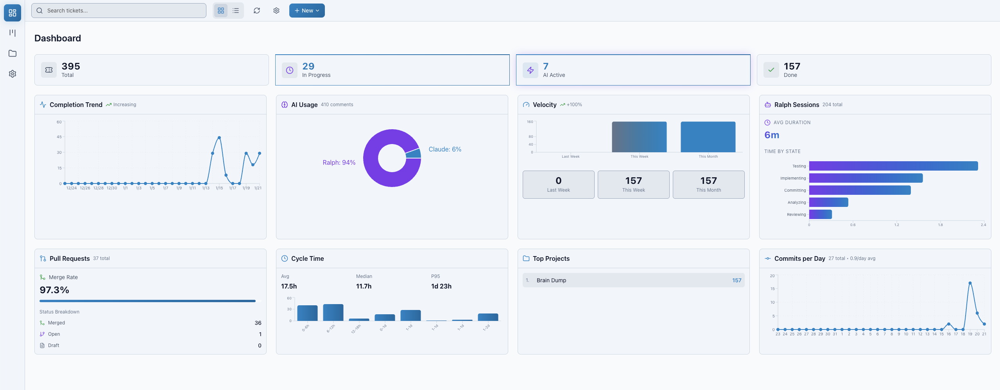

# Brain Dump

> **⚠️ Experimental Tool**
>
> Brain Dump is under active development and continuously evolving. Features may change, break, or be removed without notice. Not all configurations are fully supported. Use at your own risk and [report issues](https://github.com/salmanrrana/brain-dump/issues) to help us improve!

**Your backlog, worked by AI.** A kanban board where clicking a ticket launches Claude, OpenCode, Copilot, or Cursor with full context — or let Ralph, the autonomous agent, implement tickets while you're away.


### Real Results, Real Metrics



> _"Set up your backlog. Let Ralph work it."_

## Quick Start

```bash
git clone https://github.com/salmanrrana/brain-dump.git
cd brain-dump && ./scripts/install.sh
pnpm dev
```

Open [localhost:4242](http://localhost:4242). Done.

---

## Why Brain Dump?

| Feature                 | What It Does                                                                                  |
| ----------------------- | --------------------------------------------------------------------------------------------- |
| **One-click context**   | Click a ticket → AI opens with full context (description, acceptance criteria, linked files)  |
| **Quality Workflow**    | AI review → Fix loop → Human demo approval. Same quality in all environments.                 |
| **Configurable Skills** | Choose which AI review agents run. Import skills from Vercel Skills ecosystem.                |
| **Ralph Mode**          | Autonomous agent works your backlog while you sleep                                           |
| **Multi-environment**   | Works in Claude Code, Cursor, VS Code, OpenCode with same tools and workflows                 |
| **MCP-powered**         | AI can update tickets, link commits, manage your board directly                               |
| **Telemetry & audits**  | Tracks AI work sessions, tool usage, decisions made. View detailed telemetry in ticket detail |
| **Local-first**         | SQLite on your machine. Your data stays yours.                                                |

---

## Quick Reference

### Commands

| Command          | Description                         |
| ---------------- | ----------------------------------- |
| `pnpm dev`       | Start Brain Dump (localhost:4242)   |
| `pnpm check`     | Type-check + lint + test            |
| `pnpm build`     | Build for production                |
| `pnpm db:studio` | Browse database with Drizzle Studio |

### CLI (Database Utilities)

| Command                    | Description                |
| -------------------------- | -------------------------- |
| `brain-dump backup`        | Create database backup     |
| `brain-dump backup --list` | List available backups     |
| `brain-dump restore`       | Restore from backup        |
| `brain-dump check`         | Quick integrity check      |
| `brain-dump check --full`  | Full database health check |

> **Note:** For ticket management, use MCP tools (`start_ticket_work`, `complete_ticket_work`, etc.)

[Full CLI reference →](docs/cli.md)

### Slash Commands

| Command      | Description                                    |
| ------------ | ---------------------------------------------- |
| `/inception` | Interview-driven project creation              |
| `/breakdown` | Generate tickets from spec.md                  |
| `/review`    | Run code review pipeline (configurable skills) |
| `/simplify`  | Find refactoring opportunities                 |

### Agents

| Agent             | What It Does                                                    |
| ----------------- | --------------------------------------------------------------- |
| **ralph**         | Autonomous backlog worker — iterates through tickets until done |
| **ticket-worker** | Interactive single-ticket implementation                        |
| **planner**       | Create plans and tickets from requirements                      |
| **code-reviewer** | Automated quality checks                                        |
| **inception**     | Start new projects from scratch                                 |

### Key MCP Tools

| Tool                    | Purpose                                   |
| ----------------------- | ----------------------------------------- |
| `start_ticket_work`     | Create branch + set status to in_progress |
| `complete_ticket_work`  | Move to review + suggest next ticket      |
| `create_ticket`         | Create new ticket                         |
| `list_tickets`          | List tickets (filter by status, project)  |
| `list_tickets_by_epic`  | List all tickets in an epic               |
| `add_ticket_comment`    | Add work summaries or notes               |
| `link_commit_to_ticket` | Track git history                         |

[Full MCP reference →](docs/mcp-tools.md)

---

## Choose Your Environment

All environments get the same MCP tools, agents, and workflows.

| Environment     | Install                           | Best For                       |
| --------------- | --------------------------------- | ------------------------------ |
| **Claude Code** | `./scripts/install.sh --claude`   | Terminal-native AI development |
| **VS Code**     | `./scripts/install.sh --vscode`   | Copilot Chat + extensions      |
| **OpenCode**    | `./scripts/install.sh --opencode` | Open-source AI coding          |
| **Cursor**      | `./scripts/install.sh --cursor`   | Modern AI-first IDE experience |
| **All**         | `./scripts/install.sh --all`      | Try everything                 |

<details>
<summary><strong>Environment-specific details</strong></summary>

### Claude Code

- Click "Start with Claude" on any ticket → Claude opens with full context
- Click "Start with Ralph" for autonomous mode
- Uses `~/.claude.json` for MCP config
- [Full setup guide →](docs/claude-code-setup.md)

### VS Code (Copilot)

- Agents available in Copilot Chat: `@ralph`, `@ticket-worker`, `@planner`
- Background Agents for autonomous work
- Uses `~/.vscode/mcp.json` for MCP config
- [Full setup guide →](docs/vscode-setup.md)

### OpenCode

- Tab to switch agents, `@agent-name` to invoke subagents
- Uses `.opencode/` directory for config
- [Full setup guide →](docs/opencode-setup.md)

### Cursor

- Subagents available in Agent chat: `@ralph`, `@ticket-worker`, `@planner`, `@code-reviewer`
- Skills and commands available globally across all projects
- Uses `~/.cursor/mcp.json` for MCP config
- [Full setup guide →](docs/cursor-setup.md)
</details>

---

## Key Workflows

### Starting Fresh? Use Inception

```
/inception
```

Claude interviews you with quick multiple-choice questions about your idea, then generates:

- Complete `spec.md` with requirements
- `plans/` folder with implementation structure
- Tickets ready to work on

### Have a Spec? Break It Down

```
/breakdown path/to/project
```

Reads your spec.md and creates epics + tickets in Brain Dump, sized for 1-4 hours of work.

### Ready to Work? Click a Ticket

1. Open Brain Dump at [localhost:4242](http://localhost:4242)
2. Click **"Start with Claude"** (or Ralph for autonomous)
3. AI opens with full ticket context
4. Work gets tracked automatically

### Done? Complete the Ticket

```bash
brain-dump done        # Move to review
brain-dump complete    # Move to done (skip review)
```

Or use MCP: `complete_ticket_work` adds a work summary and suggests the next ticket.

### Universal Quality Workflow

Every ticket goes through a quality workflow:

```
ready → in_progress → ai_review → human_review → done
                          ↑
                    [fix loop]
```

1. **Start work** - AI writes code with automatic task tracking
2. **AI review** - Configurable review agents find issues (defaults: code-reviewer, silent-failure-hunter, code-simplifier)
3. **Fix loop** - AI fixes findings, rinse and repeat until no critical/major issues
4. **Demo** - AI generates step-by-step test instructions
5. **Human approval** - You run the demo and approve or request changes

All automatic via MCP tools. Same workflow in Claude Code, Cursor, VS Code, and OpenCode.

[Detailed workflow guide →](docs/universal-workflow.md)

---

## Data

All data is local: SQLite database on your machine.

| OS    | Location                                    |
| ----- | ------------------------------------------- |
| macOS | `~/Library/Application Support/brain-dump/` |
| Linux | `~/.local/share/brain-dump/`                |

Run `brain-dump backup` to create backups. [Data locations & backup procedures →](docs/data-locations.md)

---

## Visual Workflow Guides

Understand exactly how Brain Dump works with visual flow diagrams:

| Flow                                                       | What You'll Learn                                                    |
| ---------------------------------------------------------- | -------------------------------------------------------------------- |
| [Kanban & Tickets](docs/flows/kanban-workflow.md)          | Data model, status transitions, drag-drop board                      |
| [Ralph Autonomous Agent](docs/flows/ralph-workflow.md)     | State machine, iteration loop, how Ralph picks and completes tickets |
| [Docker Sandbox](docs/flows/docker-runtime.md)             | Container isolation, terminal detection, resource limits             |
| [Code Review Pipeline](docs/flows/code-review-pipeline.md) | Three-agent review system, hook enforcement, quality gates           |

See the [complete flows index](docs/flows/README.md) for the big picture.

---

## UI v2 Development (feature/ui-v2 Branch)

Brain Dump is undergoing a greenfield UI rebuild on the `feature/ui-v2` branch. Both UIs can run simultaneously during development.

### Branch Strategy

| Branch          | Purpose                         | Port |
| --------------- | ------------------------------- | ---- |
| `main`          | Current stable UI               | 4242 |
| `feature/ui-v2` | New UI under active development | 4243 |

### Quick Start (Parallel Development)

```bash
# Terminal 1: Run old UI
git checkout main && pnpm dev          # http://localhost:4242

# Terminal 2: Run new UI
git checkout feature/ui-v2 && pnpm dev:v2   # http://localhost:4243
```

### What's Shared vs Rebuilt

| Shared (Backend)                      | Rebuilt (Frontend)             |
| ------------------------------------- | ------------------------------ |
| `src/api/*` - Server functions        | `src/components-v2/*` - New UI |
| `src/lib/schema.ts` - Database schema | `src/routes-v2/*` - New routes |
| `src/lib/db.ts` - Database connection | `src/styles.css` - New styles  |
| `mcp-server/*` - MCP integration      | `src/lib/theme.ts` - Theme     |
| `cli/*` - CLI tool                    |                                |

### Development Commands

| Command       | Description                         |
| ------------- | ----------------------------------- |
| `pnpm dev`    | Start old UI (localhost:4242)       |
| `pnpm dev:v2` | Start new UI (localhost:4243)       |
| `pnpm check`  | Type-check + lint + test (both UIs) |

### Important Notes

- Both UIs share the same SQLite database (WAL mode enables concurrent access)
- Do NOT try to migrate existing components — start fresh with the new design
- Reference old code for API patterns only

[Verification documentation →](docs/parallel-development-verification.md)

---

## Learn More

| Topic                 | Link                                                         |
| --------------------- | ------------------------------------------------------------ |
| Claude Code setup     | [docs/claude-code-setup.md](docs/claude-code-setup.md)       |
| VS Code setup         | [docs/vscode-setup.md](docs/vscode-setup.md)                 |
| Cursor setup          | [docs/cursor-setup.md](docs/cursor-setup.md)                 |
| OpenCode setup        | [docs/opencode-setup.md](docs/opencode-setup.md)             |
| MCP Tools reference   | [docs/mcp-tools.md](docs/mcp-tools.md)                       |
| CLI reference         | [docs/cli.md](docs/cli.md)                                   |
| Ralph autonomous mode | [docs/flows/ralph-workflow.md](docs/flows/ralph-workflow.md) |
| Troubleshooting       | [docs/troubleshooting.md](docs/troubleshooting.md)           |
| Docker sandbox        | [docs/docker-sandbox-guide.md](docs/docker-sandbox-guide.md) |
| Backup & restore      | [docs/backup-restore.md](docs/backup-restore.md)             |

---

## License

MIT
