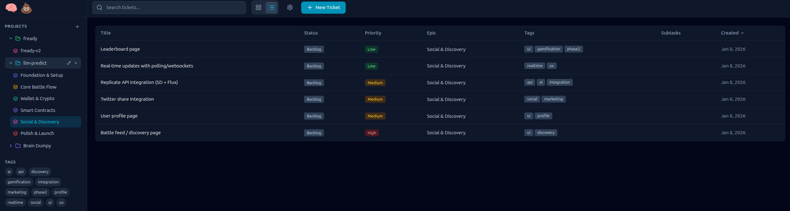
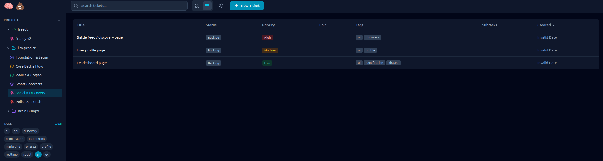
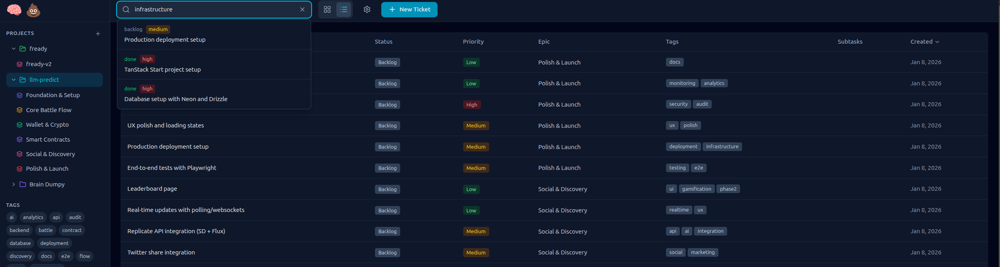
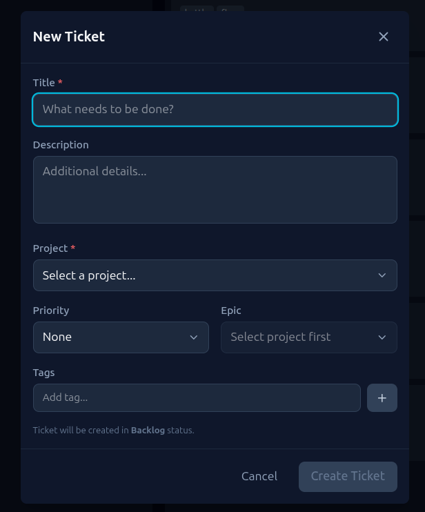

# 🧠 💩

### The AI-Native Task Manager for Claude Code Workflows

> **Dump your brain, let Claude do the work.** A local-first kanban board designed from the ground up for AI-assisted development. Launch Claude Code with full ticket context in one click, or let Ralph handle it autonomously.


---

## Why 🧠 💩 ?

Traditional task managers weren't built for the way we work with AI coding assistants. 🧠 💩  bridges the gap:

- **One-click Claude sessions** - "Start with Claude" launches a terminal with full ticket context
- **Autonomous agent mode** - "Start with Ralph" runs Claude in a loop until your backlog is done
- **MCP integration** - Claude can create and update tickets directly from any project
- **Real-time sync** - CLI updates and MCP changes appear instantly in the UI

No cloud, no subscriptions, no data leaving your machine. Just SQLite and your projects.

---

## Screenshots

### Kanban Board View

Drag and drop tickets across your workflow. Five columns take you from idea to shipped: Backlog, Ready, In Progress, Review, and Done. Color-coded priorities and tags give you instant visibility into what matters.


### List View with Full Details

Switch to list view for a sortable, scannable overview. See status, priority, epic, tags, subtask progress, and creation dates at a glance. Click any column header to sort.



### Powerful Filtering

Filter your view by tags in the sidebar. Combine multiple filters to drill down to exactly what you need. The tag cloud shows all available tags with quick toggle access.



### Full-Text Search

Instant search across all your tickets. Filter by project, search by keyword, and watch results update in real-time. FTS5-powered for blazing fast queries even with thousands of tickets.



### Quick Ticket Creation

Create tickets without losing your flow. The modal lets you set title, description, project, priority, epic, and tags all in one place. Tickets land in Backlog, ready for triage.



---

## Requirements

- **Node.js** 18+
- **pnpm** (recommended) or npm
- **Claude Code** CLI installed (`claude` command available)

---

## Quick Start

```bash
# Clone the repository
git clone https://github.com/salmanrrana/brain-dump.git
cd brain-dump

# Install dependencies
pnpm install

# Run database migrations
pnpm db:migrate

# Start the development server
pnpm dev
```

Open [http://localhost:4242](http://localhost:4242) in your browser.

On first launch, sample data is loaded to help you explore. Delete it anytime from the sidebar.

---

## Features

### Local-First SQLite Database

All data stays on your machine at `~/.brain-dump/brain-dump.db`. No accounts, no sync, no vendor lock-in. Export anytime with standard SQLite tools.

### Projects & Epics Organization

Organize work across multiple codebases. Each project links to a filesystem path, and epics group related tickets within a project.

### Kanban Board with Drag-and-Drop

Five-column workflow: **Backlog** -> **Ready** -> **In Progress** -> **Review** -> **Done**

Drag tickets between columns and reorder within. Powered by dnd-kit for smooth animations.

### List View with Sorting & Filtering

Toggle to a sortable table view. Filter by status, priority, project, epic, or tags from the sidebar.

### Full-Text Search

Blazing fast FTS5-powered search across ticket titles, descriptions, and tags. Press `/` to focus the search bar.

### Subtasks & Progress Tracking

Break tickets into checkable subtasks. Progress is shown on ticket cards and in the detail modal.

### File Attachments

Drag and drop images and files onto tickets. Attachments are stored locally in `~/.brain-dump/attachments/`.

### Keyboard Shortcuts

| Key | Action |
|-----|--------|
| `n` | New ticket |
| `/` | Focus search |
| `?` | Show shortcuts help |
| `Esc` | Close modal |

---

## Claude Code Integration

### Start with Claude

Click **"Start with Claude"** on any ticket to:

1. Open a new terminal window in your project directory
2. Launch `claude` with the full ticket context as the initial prompt
3. Automatically move the ticket to "In Progress"
4. Track the ticket for CLI status updates

The context includes the ticket title, description, subtasks, epic info, and recently completed related work.

### Terminal Emulator Selection

In Settings, choose your preferred terminal:

- **Ghostty** (default if detected)
- GNOME Terminal, Konsole, Alacritty, kitty
- Xfce Terminal, MATE Terminal, Terminator, Tilix, xterm

Brain Dumpy auto-detects installed terminals if no preference is set.

---

## The Ralph Workflow

**Ralph** is an autonomous agent mode that iterates through your backlog without human intervention.

### How it Works

1. Click **"Start with Ralph"** on a ticket (or an entire epic)
2. Brain Dumpy generates a `plans/prd.json` file in your project with all pending tasks
3. Ralph launches in your terminal, running Claude in a loop:
   - Reads the PRD and `plans/progress.txt`
   - Picks one task where `passes: false`
   - Implements the feature, runs tests
   - Updates the PRD to mark it complete
   - Updates ticket status via MCP
   - Commits the change
   - Repeats until all tasks pass or max iterations reached

### The Files

```
your-project/
  plans/
    prd.json        # Auto-generated from tickets (user stories + acceptance criteria)
    progress.txt    # Ralph's notes for the next iteration (survives context reset)
```

### When to Use Ralph

- Grinding through a well-defined backlog
- Implementing multiple similar features
- Working through an epic overnight

Ralph works best with clear acceptance criteria (use subtasks!) and projects with good test coverage.

---

## MCP Server Integration

Brain Dumpy includes an MCP (Model Context Protocol) server that lets Claude manage tickets from **any project**.

### Setup

Add to your `~/.claude.json`:

```json
{
  "mcpServers": {
    "brain-dumpy": {
      "command": "node",
      "args": ["/path/to/brain-dumpy/mcp-server/index.js"]
    }
  }
}
```

Restart Claude Code to load the server.

### Available Tools

| Tool | Description |
|------|-------------|
| `list_projects` | List all registered projects |
| `find_project_by_path` | Auto-detect project from current directory |
| `create_project` | Register a new project |
| `create_ticket` | Create a ticket with title, description, priority, tags |
| `list_tickets` | List tickets with optional filters |
| `update_ticket_status` | Move ticket between columns |
| `list_epics` | List epics for a project |
| `create_epic` | Create a new epic |

### Example Usage

From any project, just tell Claude:

```
"Create a high-priority ticket to fix the authentication bug"
"Show me all in-progress tickets"
"Mark ticket abc-123 as done"
```

Claude auto-detects your project and updates Brain Dumpy in real-time.

---

## CLI Tool

The `brain-dump` CLI lets you update ticket status from the command line or Claude Code hooks.

```bash
# Show current ticket info
pnpm brain-dump current

# Mark current ticket ready for review
pnpm brain-dump done

# Mark current ticket as completed
pnpm brain-dump complete

# Update a specific ticket
pnpm brain-dump status <ticket-id> <status>

# Clear current ticket tracking
pnpm brain-dump clear
```

### Claude Code Hooks Integration

Automatically update ticket status when Claude finishes work. Add to your `~/.claude.json`:

```json
{
  "hooks": {
    "PostToolUse": [
      {
        "command": "cd /path/to/brain-dumpy && pnpm brain-dump done",
        "trigger": "when the task is complete"
      }
    ]
  }
}
```

---

## Docker

Run Brain Dumpy in a container:

```bash
# Using docker compose (recommended)
docker compose up -d

# Or build and run manually
docker build -t brain-dumpy .
docker run -d -p 4242:4242 -v brain-dump-data:/root/.brain-dump brain-dumpy

# View logs
docker compose logs -f

# Stop
docker compose down
```

The SQLite database and attachments are persisted in a Docker volume.

---

## Tech Stack

| Layer | Technology |
|-------|------------|
| **Framework** | [TanStack Start](https://tanstack.com/start) (React 19 + Vite) |
| **Database** | SQLite with [Drizzle ORM](https://orm.drizzle.team/) |
| **Styling** | [Tailwind CSS](https://tailwindcss.com/) v4 |
| **Drag & Drop** | [@dnd-kit](https://dndkit.com/) |
| **Search** | SQLite FTS5 (full-text search) |
| **State** | [TanStack Query](https://tanstack.com/query) |
| **Testing** | [Vitest](https://vitest.dev/) + [Playwright](https://playwright.dev/) |
| **MCP Server** | [@modelcontextprotocol/sdk](https://modelcontextprotocol.io/) |

---

## Scripts Reference

| Command | Description |
|---------|-------------|
| `pnpm dev` | Start development server |
| `pnpm build` | Build for production |
| `pnpm start` | Start production server |
| `pnpm type-check` | Run TypeScript type checking |
| `pnpm lint` | Run ESLint |
| `pnpm test` | Run unit tests |
| `pnpm test:e2e` | Run Playwright E2E tests |
| `pnpm check` | Run all checks (type-check, lint, test) |
| `pnpm db:migrate` | Run database migrations |
| `pnpm db:generate` | Generate migration files |
| `pnpm db:studio` | Open Drizzle Studio |
| `pnpm brain-dump` | CLI tool for ticket status updates |

---

## Project Structure

```
brain-dumpy/
  src/
    api/           # Server functions (CRUD, terminal, Ralph)
    components/    # React components (modals, kanban, sidebar)
    lib/           # Database schema, hooks, utilities
    routes/        # TanStack Router pages
    styles.css     # Tailwind global styles
  cli/             # CLI tool for status updates
  mcp-server/      # MCP server for Claude integration
  e2e/             # Playwright E2E tests
  drizzle/         # Database migrations
  plans/           # PRD and planning docs
```

---

## Data Storage

| Data | Location |
|------|----------|
| Database | `~/.brain-dump/brain-dump.db` |
| Attachments | `~/.brain-dump/attachments/` |
| Current ticket state | `~/.brain-dump/current-ticket.json` |
| Launch scripts | `~/.brain-dump/scripts/` |

---

## Contributing

Contributions are welcome! Please feel free to submit a Pull Request.

1. Fork the repository
2. Create your feature branch (`git checkout -b feature/amazing-feature`)
3. Commit your changes (`git commit -m 'Add some amazing feature'`)
4. Push to the branch (`git push origin feature/amazing-feature`)
5. Open a Pull Request

---

## License

This project is licensed under the MIT License - see the [LICENSE](LICENSE) file for details.

---

## Acknowledgments

- Built with Claude Code (naturally)
- Inspired by the need for a task manager that actually understands AI-assisted development
- Thanks to the TanStack, Drizzle, and MCP teams for excellent tooling

---

<p align="center">
  <strong>Stop context-switching. Start shipping.</strong>
</p>
