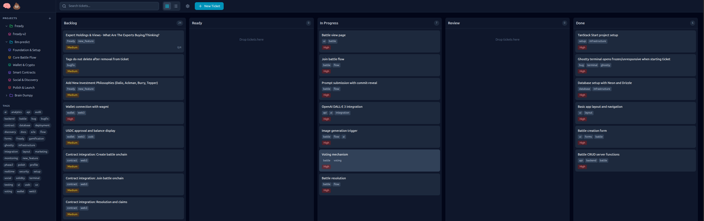

# Brain Dump

A local-first kanban board for AI-assisted development. Click an epic, Claude gets the context.



## Install

```bash
git clone https://github.com/salmanrrana/brain-dump.git
cd brain-dump
./install.sh --claude   # or --vscode
pnpm dev
```

Open [http://localhost:4242](http://localhost:4242). Done.

The installer handles Node.js, pnpm, dependencies, database, and MCP server setup automatically.

## How It Works

1. **Create tickets** in the web UI (or use `/inception` to have Claude interview you)
2. **Click "Start with Claude"** on a ticket
3. Claude opens with full ticket context
4. Work gets tracked automatically

That's it. No cloud, no accounts, all local.

## Start a New Project

Don't know where to begin? Run `/inception` in Claude Code:

```
> /inception
```

Claude will interview you with quick multiple-choice questions about your idea, then generate:

- A complete `spec.md` with requirements
- A `plans/` folder with implementation steps
- Tickets ready to work on

Go from "I have an idea" to "I have a backlog" in 5 minutes.

## Features

- **Kanban board** - Drag tickets between Backlog → Ready → In Progress → Review → Done
- **MCP integration** - Claude can create/update tickets from any project
- **Ralph mode** - Autonomous agent that works through your backlog
- **Full-text search** - Find anything instantly
- **File attachments** - Drag and drop onto tickets

## OpenCode Support

Brain Drop now supports OpenCode with full agent and skill integration. OpenCode provides specialized agents and tools for enhanced development workflows.

### Quick Setup

1. **Install OpenCode** (if not already installed):

   ```bash
   # Follow installation at https://opencode.ai
   ```

2. **Configure OpenCode** for Brain Dump:

   ```bash
   cd brain-dump
   # The .opencode/ directory is already configured
   ```

3. **Start OpenCode** in the Brain Dump directory:
   ```bash
   opencode
   ```

### Available Agents

Brain Dump includes these OpenCode agents:

| Agent             | Mode     | Description                                         |
| ----------------- | -------- | --------------------------------------------------- |
| **ralph**         | Primary  | Autonomous coding agent that works through backlogs |
| **ticket-worker** | Subagent | Interactive single-ticket implementation            |
| **planner**       | Subagent | Creates implementation plans and tickets            |
| **code-reviewer** | Subagent | Automated code review and quality checks            |
| **inception**     | Subagent | Starts new projects through interview               |

### Usage Examples

```bash
# Switch between primary agents with Tab
# Start autonomous work
@ralph

# Work on specific ticket interactively
@ticket-worker

# Plan new features
@planner "Add user authentication"

# Review recent changes
@code-reviewer

# Start new project
@inception
```

### Brain Dump Skills

OpenCode automatically discovers these specialized skills:

| Skill               | Description                                        |
| ------------------- | -------------------------------------------------- |
| brain-dump-workflow | Complete Brain Dump ticket and workflow management |
| ralph-autonomous    | Guide for Ralph's autonomous decision making       |
| tanstack-query      | React Query patterns and best practices            |
| tanstack-mutations  | Type-safe mutation patterns                        |
| tanstack-forms      | Form integration with TanStack Query               |
| tanstack-types      | TypeScript patterns for type safety                |
| tanstack-errors     | Error handling strategies                          |

### MCP Integration

OpenCode connects to Brain Dump's MCP server for:

- Creating and managing tickets
- Starting ticket work with branch creation
- Progress tracking and comments
- Project and ticket discovery

## VS Code & Claude Code Support

Brain Dump also works with VS Code Copilot and Claude Code:

### Agent Skills (VS Code & Claude Code)

| Skill                 | Description                                     | Source                                                |
| --------------------- | ----------------------------------------------- | ----------------------------------------------------- |
| react-best-practices  | 45 React/Next.js performance optimization rules | [Vercel](https://github.com/vercel-labs/agent-skills) |
| web-design-guidelines | 100+ accessibility and UX best practices        | [Vercel](https://github.com/vercel-labs/agent-skills) |

### How Skills Work

Skills are discovered automatically by your AI agent:

1. At startup, the agent loads skill names and descriptions (~100 tokens each)
2. When your request matches a skill's keywords, the agent asks to use it
3. Once approved, the full skill instructions load into context

### Updating Skills

To get the latest skill updates from upstream:

```bash
cd brain-dump
git submodule update --remote    # Pull latest from Vercel
./install.sh --claude --vscode   # Re-install to skill directories
```

### Learn More

- [OpenCode Documentation](https://opencode.ai/docs/)
- [Claude Code Skills](https://docs.anthropic.com/en/docs/claude-code/skills)
- [VS Code Agent Skills](https://code.visualstudio.com/docs/copilot/copilot-extensibility-overview)
- [Agent Skills Specification](https://agentskills.dev)

## Commands

```bash
pnpm dev          # Start dev server
pnpm build        # Build for production
pnpm test         # Run tests
pnpm db:studio    # Browse database
```

## Data

Everything stored locally:

- **macOS**: `~/Library/Application Support/brain-dump/`
- **Linux**: `~/.local/share/brain-dump/`

## More Info

- [OpenCode Integration Guide](docs/opencode-setup.md)
- [MCP Server Tools](docs/mcp-tools.md)
- [Ralph Workflow](docs/ralph.md)
- [CLI Reference](docs/cli.md)
- [Troubleshooting](docs/troubleshooting.md)

## License

MIT
