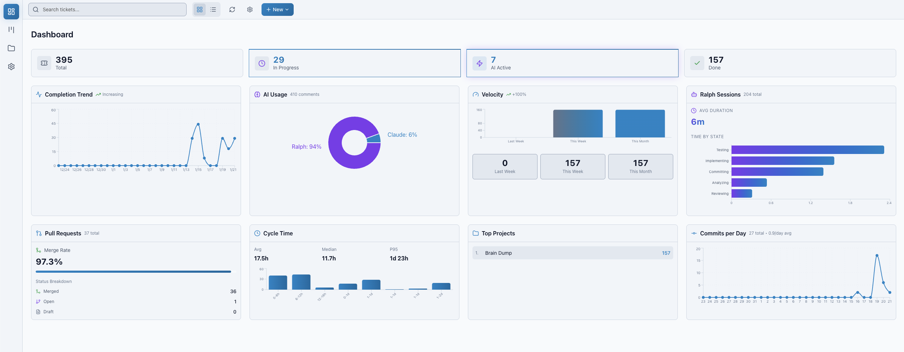

# Brain Dump

> **⚠️ Experimental Tool**
>
> Brain Dump is under active development and continuously evolving. Features may change, break, or be removed without notice. Not all configurations are fully supported. Use at your own risk and [report issues](https://github.com/salmanrrana/brain-dump/issues) to help us improve!

**Your backlog, worked by AI.** A kanban board where clicking a ticket launches Claude, Codex, OpenCode, Copilot, or Cursor with full context — or let Ralph, the autonomous agent, implement tickets while you're away.

### Real Results, Real Metrics



> _"Set up your backlog. Let Ralph work it."_

## Quickstart

### 1. Requirements

- macOS or Linux (WSL works)
- `git`, `bash`, `curl`
- Node.js 18+ and `pnpm` (installer will install/upgrade if missing)
- One AI environment to integrate (`--claude`, `--codex`, `--cursor`, `--vscode`, `--opencode`, `--copilot`)

### 2. Install (recommended)

```bash
git clone https://github.com/salmanrrana/brain-dump.git
cd brain-dump
./install.sh --codex
```

If you want to choose interactively, run:

```bash
./install.sh
```

See all options:

```bash
./install.sh --help
```

### 3. Run the app

```bash
pnpm dev
```

Open [localhost:4242](http://localhost:4242).

### 4. Verify and explore

```bash
pnpm check              # Type-check + lint + tests
brain-dump doctor        # Validate installation + wiring
brain-dump status --pretty  # See your project dashboard
```

If `brain-dump` is not in your PATH yet, prefix with `pnpm`:

```bash
pnpm brain-dump doctor
pnpm brain-dump status --pretty
```

---

## Why Brain Dump?

| Feature                | What It Does                                                                                  |
| ---------------------- | --------------------------------------------------------------------------------------------- |
| **One-click context**  | Click a ticket → AI opens with full context (description, acceptance criteria, linked files)  |
| **Quality Workflow**   | AI review → fix loop → human demo approval. Same quality in all environments.                 |
| **Ralph Mode**         | Autonomous agent works your backlog while you sleep                                           |
| **Multi-environment**  | Works in Claude Code, Codex, Cursor, VS Code, OpenCode, Copilot CLI with same tools/workflows |
| **MCP-powered**        | AI can update tickets, link commits, manage your board directly                               |
| **Telemetry & audits** | Tracks AI work sessions, tool usage, decisions made. View detailed telemetry in ticket detail |
| **Local-first**        | SQLite on your machine. Your data stays yours.                                                |

---

## Quick Reference

### Development Commands

| Command           | Description                                |
| ----------------- | ------------------------------------------ |
| `pnpm dev`        | Start app (current UI) on `localhost:4242` |
| `pnpm dev:v2`     | Start UI v2 branch app on `localhost:4243` |
| `pnpm check`      | Type-check + lint + tests (required gate)  |
| `pnpm test`       | Run unit/integration tests                 |
| `pnpm test:e2e`   | Run Playwright tests                       |
| `pnpm db:migrate` | Run database migrations                    |
| `pnpm db:studio`  | Open Drizzle Studio                        |
| `pnpm build`      | Build for production                       |

### CLI Tool

The `brain-dump` CLI provides full resource management from the terminal — 15 resources with 90+ actions, plus quick-access power commands. All commands output JSON by default; add `--pretty` for human-readable output.

#### Power Commands

| Command                              | Description                                                 |
| ------------------------------------ | ----------------------------------------------------------- |
| `brain-dump init`                    | Register current directory as a project (auto-detects name) |
| `brain-dump status --pretty`         | Project dashboard: ticket counts, active work, activity     |
| `brain-dump search "query" --pretty` | Full-text search across tickets (FTS5)                      |
| `brain-dump context --ticket <id>`   | Full ticket context: details, criteria, files, comments     |
| `brain-dump log --pretty`            | Chronological activity stream across tickets                |
| `brain-dump open`                    | Open the web UI in your browser                             |
| `brain-dump completions zsh`         | Generate shell completions (zsh/bash/fish)                  |
| `brain-dump doctor`                  | Validate installation and wiring                            |

#### Resource Commands

Work with any resource using `brain-dump <resource> <action>`:

| Resource     | Actions                                                      |
| ------------ | ------------------------------------------------------------ |
| `project`    | `list`, `find`, `create`, `delete`                           |
| `ticket`     | `create`, `list`, `get`, `update`, `delete`, `link-files`... |
| `epic`       | `create`, `list`, `update`, `delete`, `get-learnings`...     |
| `workflow`   | `start-work`, `complete-work`, `start-epic`                  |
| `comment`    | `add`, `list`                                                |
| `review`     | `submit-finding`, `generate-demo`, `get-findings`...         |
| `session`    | `create`, `update-state`, `complete`, `get`, `list`...       |
| `git`        | `link-commit`, `link-pr`, `sync`                             |
| `telemetry`  | `start`, `end`, `get`, `list`, `log-tool`...                 |
| `files`      | `link`, `get-tickets`                                        |
| `tasks`      | `save`, `get`, `clear`, `snapshots`                          |
| `compliance` | `start`, `log`, `end`, `list`, `export`, `archive`           |
| `settings`   | `get`, `update`                                              |
| `transfer`   | `export-epic`, `export-project`, `import`, `preview`         |
| `admin`      | `backup`, `restore`, `check`, `doctor`, `health`             |

#### Examples

```bash
# Register this project and see your dashboard
brain-dump init
brain-dump status --pretty

# Search for tickets and get full context
brain-dump search "auth bug" --pretty
brain-dump context --ticket abc123 --pretty

# Manage tickets from the terminal
brain-dump ticket create --project <id> --title "Fix login timeout"
brain-dump ticket list --status ready --pretty
brain-dump workflow start-work --ticket <id>

# Launch Ralph from the terminal with any provider (parity with UI Launch menu)
brain-dump workflow launch-ticket --ticket <id> --provider claude-code
brain-dump workflow launch-epic --epic <id> --provider copilot-cli --max-iterations 20

# Link git work to tickets
brain-dump git link-commit --ticket <id> --hash $(git rev-parse HEAD)
brain-dump git link-pr --ticket <id> --pr 42

# Activity and admin
brain-dump log --limit 5 --pretty
brain-dump admin backup
brain-dump admin check --full
```

[Full CLI reference →](docs/cli.md)

### Quality Workflow (Required)

Status flow:

```text
ready → in_progress → ai_review → human_review → done
                          ↑
                    [fix loop]
```

1. Start work (`workflow` tool, `action: "start-work"`).
2. Implement and run gates (`pnpm check`).
3. Complete work (`workflow` tool, `action: "complete-work"`), ticket moves to `ai_review`.
4. Review agents run (code reviewer + silent failure hunter + code simplifier) and fix loop repeats until critical/major findings are closed.
5. Generate demo and human approve to move to `done`.

[Detailed workflow guide →](docs/universal-workflow.md)

### MCP Tools (Action-Dispatched)

Brain Dump exposes 9 MCP tools. Each tool uses an `action` field.

| Tool        | Purpose                                     |
| ----------- | ------------------------------------------- |
| `workflow`  | Start/complete work, epic starts, git links |
| `ticket`    | Ticket CRUD, status, criteria, attachments  |
| `session`   | Ralph sessions, events, task tracking       |
| `review`    | Findings, demo scripts, human feedback      |
| `telemetry` | AI usage/session telemetry                  |
| `comment`   | Ticket comments/work summaries              |
| `epic`      | Epic CRUD + learnings                       |
| `project`   | Project registration/discovery              |
| `admin`     | Health, settings, compliance ops            |

Examples:

```text
workflow { action: "start-work", ticketId: "<ticket-id>" }
workflow { action: "complete-work", ticketId: "<ticket-id>", summary: "..." }
ticket { action: "list", status: "ready" }
review { action: "generate-demo", ticketId: "<ticket-id>", steps: [...] }
```

[Full MCP reference →](docs/mcp-tools.md)

### Slash Commands / Prompt Commands

Common commands available from installed command packs:

| Command                | Description                           |
| ---------------------- | ------------------------------------- |
| `/inception`           | Interview-driven project creation     |
| `/breakdown`           | Generate epics/tickets from `spec.md` |
| `/next-task`           | Pick best next ticket                 |
| `/review-ticket`       | Run ticket review pipeline            |
| `/demo`                | Generate human review demo script     |
| `/review-epic`         | Run cross-ticket epic review          |
| `/reconcile-learnings` | Extract and store learnings           |
| `/extended-review`     | Extended multi-agent review           |

[Workflow skills and commands →](docs/workflow-skills.md)

### Agents

Three core agents (installed globally from `.github/agents/`):

- `ralph` — Autonomous ticket implementation
- `ticket-worker` — Guided ticket implementation
- `planner` — Implementation planning

Review agents (`code-reviewer`, `silent-failure-hunter`, `code-simplifier`) are invoked on-demand via `/review` and `/review-ticket` commands — not loaded as separate agent files.

---

## Choose Your Environment

All environments get the same MCP tools, quality workflow, and 3 global skills (`brain-dump-workflow`, `review`, `review-aggregation`). Telemetry is handled by MCP self-instrumentation — no client-side telemetry plugins needed.

| Environment          | Install                   | Best For                       |
| -------------------- | ------------------------- | ------------------------------ |
| **Claude Code**      | `./install.sh --claude`   | Terminal-native AI development |
| **VS Code**          | `./install.sh --vscode`   | Copilot Chat + extensions      |
| **OpenCode**         | `./install.sh --opencode` | Open-source AI coding          |
| **Cursor Editor**    | `./install.sh --cursor`   | Modern AI-first IDE experience |
| **Cursor Agent CLI** | `./install.sh --cursor`   | Headless terminal multi-model  |
| **Copilot CLI**      | `./install.sh --copilot`  | GitHub Copilot in the terminal |
| **Codex**            | `./install.sh --codex`    | OpenAI Codex in terminal/app   |
| **All**              | `./install.sh --all`      | Try everything                 |

<details>
<summary><strong>Environment-specific details</strong></summary>

### Claude Code

- Click "Start with Claude" on any ticket → Claude opens with full context
- Click "Start with Ralph" for autonomous mode
- Installs: MCP server, 9 commands, 3 global skills, hooks (enforcement + PR automation)
- Agent personas inlined into commands (no separate agent files)
- [Full setup guide →](docs/claude-code-setup.md)

### VS Code (Copilot)

- Agents available in Copilot Chat: `@ralph`, `@ticket-worker`, `@planner`
- Background Agents for autonomous work
- Installs: MCP server, 3 agents, 3 prompts, 3 global skills
- [Full setup guide →](docs/vscode-setup.md)

### OpenCode

- Tab to switch agents, `@agent-name` to invoke subagents
- Installs: MCP server, 2 safety plugins, 1 skill, 1 agent
- Uses `~/.config/opencode/opencode.json` for MCP config
- [Full setup guide →](docs/opencode-setup.md)

### Cursor Editor

- Subagents available in Agent chat: `@ralph`, `@ticket-worker`, `@planner`
- Installs: MCP server, 3 agents, 3 global skills, 9 commands, 1 rule
- Review agents invoked on-demand via commands
- [Full setup guide →](docs/cursor-setup.md)

### Cursor Agent CLI

- Headless terminal mode: `agent --force --approve-mcps --trust -p "prompt"`
- Ralph uses `cursor-agent` backend for autonomous headless loops
- Installs: `cli-config.json` permissions, optional `hooks.json` state enforcement
- Binary: `agent` (or `cursor-agent`) — install via `curl https://cursor.com/install -fsS | bash`
- Shares MCP config with Cursor Editor (`~/.cursor/mcp.json`)

### Copilot CLI

- Agents available: `@ralph`, `@ticket-worker`, `@planner`
- Installs: MCP server, 3 agents, 3 global skills, 1 enforcement hook
- No telemetry hooks — MCP self-instrumentation handles telemetry
- Skills shared with VS Code (`~/.copilot/skills/`)

### Codex

- Use `Start with Codex` in ticket launch actions
- Installs: MCP server only (`config.toml` entry)
- Supports AGENTS.md, rules, and skills-based workflow guidance
- [Full setup guide →](docs/environments/codex.md)
</details>

---

## Key Workflows

### Starting Fresh? Use Inception

```
/inception
```

Claude interviews you with quick multiple-choice questions about your idea, then generates:

- Complete `spec.md` with requirements
- `plans/` folder with implementation structure
- Tickets ready to work on

### Have a Spec? Break It Down

```
/breakdown path/to/project
```

Reads your spec.md and creates epics + tickets in Brain Dump, sized for 1-4 hours of work.

### Ready to Work? Click a Ticket

1. Open Brain Dump at [localhost:4242](http://localhost:4242)
2. Click **"Start with Claude"** (or Ralph for autonomous)
3. AI opens with full ticket context
4. Work gets tracked automatically

### Done? Complete the Ticket

```bash
brain-dump workflow complete-work --ticket <ticket-id> --summary "Implemented X"
```

Or via MCP: `workflow { action: "complete-work", ticketId: "<ticket-id>", summary: "..." }`

### Track Everything from the Terminal

The CLI mirrors every MCP tool action, so you can drive your entire workflow without the web UI:

```bash
brain-dump init                                    # Register project
brain-dump ticket create --project <id> --title "Add caching"  # Create ticket
brain-dump workflow start-work --ticket <id>       # Start work (creates branch)
# ... write code ...
brain-dump git link-commit --ticket <id> --hash $(git rev-parse HEAD)
brain-dump workflow complete-work --ticket <id> --summary "Added Redis caching"
brain-dump log --pretty                            # See activity stream
```

### Universal Quality Workflow

Every ticket goes through a quality workflow:

```
ready → in_progress → ai_review → human_review → done
                          ↑
                    [fix loop]
```

1. **Start work** - AI writes code with automatic task tracking
2. **AI review** - Three agents (code-reviewer, silent-failure-hunter, code-simplifier) find issues
3. **Fix loop** - AI fixes findings, rinse and repeat until no critical/major issues
4. **Demo** - AI generates step-by-step test instructions
5. **Human approval** - You run the demo and approve or request changes

All automatic via MCP tools. Same workflow in Claude Code, Codex, Cursor, VS Code, OpenCode, and Copilot CLI.

[Detailed workflow guide →](docs/universal-workflow.md)

---

## Data

All data is local: SQLite database on your machine.

| OS    | Location                                    |
| ----- | ------------------------------------------- |
| macOS | `~/Library/Application Support/brain-dump/` |
| Linux | `~/.local/share/brain-dump/`                |

```bash
brain-dump admin backup          # Create backup
brain-dump admin backup --list   # List available backups
brain-dump admin restore         # Restore from backup
brain-dump admin check --full    # Full database integrity check
brain-dump admin health          # Detailed health report
```

[Data locations & backup procedures →](docs/data-locations.md)

---

## Visual Workflow Guides

Understand exactly how Brain Dump works with visual flow diagrams:

| Flow                                                       | What You'll Learn                                                    |
| ---------------------------------------------------------- | -------------------------------------------------------------------- |
| [Kanban & Tickets](docs/flows/kanban-workflow.md)          | Data model, status transitions, drag-drop board                      |
| [Ralph Autonomous Agent](docs/flows/ralph-workflow.md)     | State machine, iteration loop, how Ralph picks and completes tickets |
| [Docker Sandbox](docs/flows/docker-runtime.md)             | Container isolation, terminal detection, resource limits             |
| [Code Review Pipeline](docs/flows/code-review-pipeline.md) | Three-agent review system, hook enforcement, quality gates           |

See the [complete flows index](docs/flows/README.md) for the big picture.

---

## Learn More

| Topic                   | Link                                                         |
| ----------------------- | ------------------------------------------------------------ |
| **CLI reference**       | [docs/cli.md](docs/cli.md)                                   |
| **MCP Tools reference** | [docs/mcp-tools.md](docs/mcp-tools.md)                       |
| Claude Code setup       | [docs/claude-code-setup.md](docs/claude-code-setup.md)       |
| VS Code setup           | [docs/vscode-setup.md](docs/vscode-setup.md)                 |
| Cursor setup            | [docs/cursor-setup.md](docs/cursor-setup.md)                 |
| OpenCode setup          | [docs/opencode-setup.md](docs/opencode-setup.md)             |
| Ralph autonomous mode   | [docs/flows/ralph-workflow.md](docs/flows/ralph-workflow.md) |
| Troubleshooting         | [docs/troubleshooting.md](docs/troubleshooting.md)           |
| Docker sandbox          | [docs/docker-sandbox-guide.md](docs/docker-sandbox-guide.md) |
| Backup & restore        | [docs/backup-restore.md](docs/backup-restore.md)             |

---

## License

MIT
