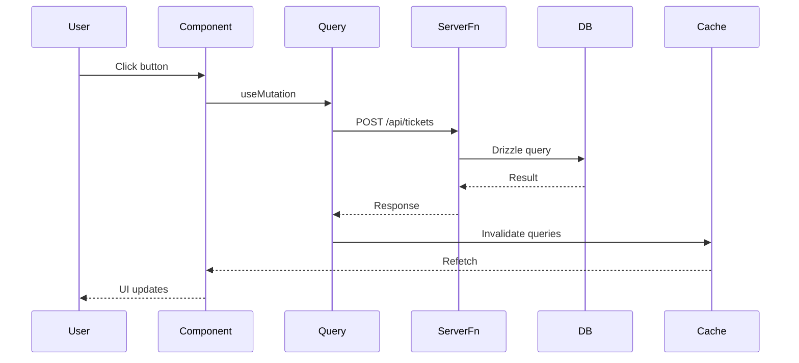
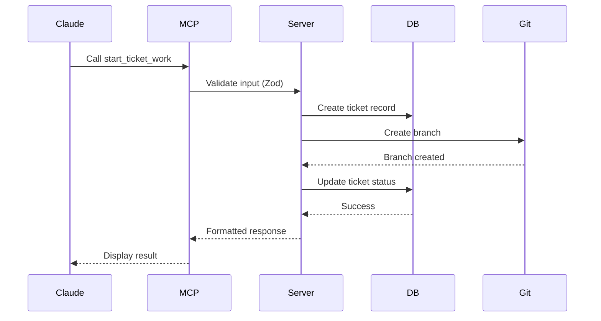
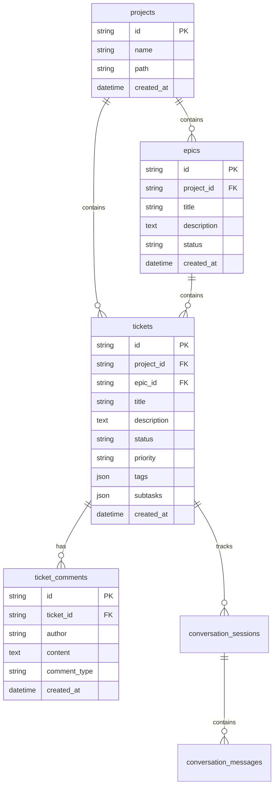

# Architecture Deep Dive

Complete technical architecture reference for Brain Dump.

[← Back to CLAUDE.md](../CLAUDE.md)

---

## Table of Contents

- [Tech Stack](#tech-stack)
- [Data Flow](#data-flow)
- [Component Architecture](#component-architecture)
- [Database Design](#database-design)
- [API Layer](#api-layer)
- [State Management](#state-management)
- [File Structure](#file-structure)

---

## Tech Stack

### Frontend

- **React 19**: Latest React with concurrent features
- **TanStack Start**: Full-stack React framework
  - File-based routing
  - Server-side rendering (SSR)
  - Server functions
- **TanStack Query**: Server state management
  - Automatic caching
  - Background refetching
  - Optimistic updates
- **Tailwind CSS v4**: Utility-first CSS
  - CSS variables for theming
  - Responsive design
  - Dark mode support
- **@dnd-kit**: Drag and drop
  - Keyboard accessible
  - Touch-friendly
  - Customizable animations

### Backend

- **SQLite**: Embedded database
  - `better-sqlite3` for synchronous API
  - FTS5 for full-text search
  - WAL mode for concurrent reads
- **Drizzle ORM**: Type-safe SQL builder
  - Migrations
  - Type inference
  - Compile-time safety
- **Nitro**: Server runtime
  - Hot module replacement
  - API routes
  - Middleware support

### Development Tools

- **TypeScript**: Static typing
- **ESLint**: Code linting
- **Vitest**: Unit testing
- **Playwright**: E2E testing
- **Drizzle Studio**: Database GUI

---

## Data Flow

### User Interaction Flow



### MCP Tool Flow



---

## Component Architecture

### Component Hierarchy

```
App
├── Router
│   ├── Index Route (/)
│   │   ├── ProjectSidebar
│   │   │   ├── ProjectList
│   │   │   └── ProjectSelector
│   │   ├── KanbanBoard
│   │   │   ├── Column (x6: backlog, ready, in_progress, etc.)
│   │   │   │   └── TicketCard (draggable)
│   │   │   │       ├── TicketTags
│   │   │   │       ├── TicketPriority
│   │   │   │       └── TicketSubtasks
│   │   └── SearchBar
│   ├── Ticket Detail Route (/tickets/:id)
│   │   ├── TicketHeader
│   │   ├── TicketDescription
│   │   ├── TicketComments
│   │   ├── TicketTelemetry
│   │   └── TicketActions
│   └── Settings Route (/settings)
│       ├── GeneralSettings
│       ├── ProjectSettings
│       └── HookConfiguration
├── Modals
│   ├── CreateTicketModal
│   ├── CreateEpicModal
│   ├── StartEpicModal (worktree selection)
│   ├── SettingsModal
│   └── ConfirmationModal
└── Toasts (notifications)
```

### Key Patterns

**Compound Components**: Modals use compound component pattern for flexibility

```tsx
<Modal>
  <Modal.Header>Title</Modal.Header>
  <Modal.Body>Content</Modal.Body>
  <Modal.Footer>Actions</Modal.Footer>
</Modal>
```

**Controlled vs Uncontrolled**: Forms use controlled inputs with React Hook Form

**Optimistic Updates**: TanStack Query optimistic updates for instant feedback

---

## Database Design

### Schema Overview



### Indexes

- `tickets.status` - Fast filtering by status column
- `tickets.project_id` - Fast project-level queries
- `tickets.epic_id` - Fast epic-level queries
- `tickets_fts` - Full-text search on title, description, tags

### Constraints

- `ON DELETE CASCADE` for foreign keys - deleting a project deletes all its tickets
- `NOT NULL` on required fields
- `CHECK` constraints on status enum values

**See also**: [src/lib/schema.ts](../src/lib/schema.ts) for complete schema

---

## API Layer

### Server Functions

Brain Dump uses TanStack Start server functions for type-safe API:

```typescript
// src/api/tickets.ts
export const createTicket = createServerFn({ method: "POST" })
  .inputValidator(
    z.object({
      title: z.string(),
      projectId: z.string(),
      // ...
    })
  )
  .handler(async ({ data }) => {
    const ticket = await db.insert(tickets).values(data).returning();
    return ticket;
  });
```

### Benefits

- **Type safety**: Input/output types inferred automatically
- **Code splitting**: Server code never sent to client
- **Error handling**: Errors serialized and typed
- **Validation**: Zod schemas validate input before handler runs

### MCP Server

Separate Node.js process that exposes Brain Dump functionality to Claude:

**Location**: `mcp-server/dist/index.js`

**Protocol**: Model Context Protocol (JSON-RPC over stdio)

**Tools**: 30+ tools for ticket management, git operations, telemetry

**Example tool**:

```javascript
{
  name: "start_ticket_work",
  description: "Start work on a ticket",
  inputSchema: {
    type: "object",
    properties: {
      ticketId: { type: "string" }
    }
  },
  handler: async ({ ticketId }) => {
    // Create git branch
    // Update ticket status
    // Return formatted response
  }
}
```

---

## State Management

### Server State (TanStack Query)

All server data managed through TanStack Query:

```typescript
// src/lib/hooks.ts
export const queryKeys = {
  tickets: (projectId?: string) => ["tickets", projectId] as const,
  ticket: (id: string) => ["tickets", id] as const,
  epics: (projectId?: string) => ["epics", projectId] as const,
  // ...
};

// Usage in component
const { data: tickets } = useQuery({
  queryKey: queryKeys.tickets(projectId),
  queryFn: () => getTickets({ projectId }),
});
```

### Client State (React.useState)

Ephemeral UI state managed with `useState`:

- Modal open/closed
- Form input values
- Drag and drop state
- Search query

### URL State (TanStack Router)

Shareable state in URL:

- Selected project
- Ticket detail view
- Search filters

---

## File Structure

```
brain-dump/
├── src/
│   ├── api/              # Server functions
│   │   ├── tickets.ts
│   │   ├── epics.ts
│   │   ├── projects.ts
│   │   └── ralph.ts
│   ├── components/       # React components
│   │   ├── modals/
│   │   ├── kanban/
│   │   └── sidebar/
│   ├── lib/              # Core utilities
│   │   ├── db.ts         # Database connection
│   │   ├── schema.ts     # Drizzle schema
│   │   ├── xdg.ts        # Path management
│   │   ├── backup.ts     # Backup/restore
│   │   └── logging.ts    # Structured logging
│   ├── routes/           # TanStack Router
│   │   ├── index.tsx     # Home page
│   │   └── tickets.$id.tsx
│   └── styles/           # Global CSS
├── mcp-server/           # MCP server (Node.js)
│   ├── index.js          # Main server
│   ├── tools/            # Tool implementations
│   └── lib/              # Shared utilities
├── cli/                  # CLI tool
│   └── index.ts
├── docs/                 # Documentation
├── plans/                # Specs and PRDs
├── e2e/                  # E2E tests
└── drizzle/              # Database migrations
```

### Why This Structure?

- **Colocation**: Related files close together
- **Clear boundaries**: API, components, lib are distinct layers
- **Scalability**: Easy to find and add new features
- **Convention**: Follows TanStack Start best practices

---

## Performance Considerations

### Database

- **WAL mode**: Enables concurrent reads
- **Prepared statements**: Drizzle ORM uses prepared statements
- **Indexes**: Critical paths are indexed
- **FTS5 optimization**: Run `optimize` periodically

### Frontend

- **Code splitting**: Routes are lazy-loaded
- **Query deduplication**: TanStack Query dedupes identical requests
- **Optimistic updates**: Instant feedback, reconcile later
- **Virtual scrolling**: (Future) for large ticket lists

### Bundle Size

- **Tree shaking**: Vite removes unused code
- **Dynamic imports**: Heavy libraries loaded on demand
- **CSS purging**: Tailwind purges unused classes in production

---

## Security

### Database

- **Prepared statements**: Prevents SQL injection
- **Input validation**: Zod schemas on all inputs
- **Constraint enforcement**: Database constraints catch invalid data

### MCP Server

- **Zod validation**: All tool inputs validated
- **Path traversal protection**: Paths validated before filesystem access
- **Secret detection**: Automatic scanning for leaked credentials in logs

### Frontend

- **XSS prevention**: React escapes by default
- **CSRF protection**: TanStack Start includes CSRF tokens
- **Content Security Policy**: (Future) Strict CSP headers

---

## Testing Strategy

### Unit Tests (Vitest)

- **What**: Pure functions, utilities
- **Where**: Alongside source files (`*.test.ts`)
- **Philosophy**: Test user-facing behavior, not internals

### Integration Tests (Vitest)

- **What**: Components with database, multiple components together
- **Where**: `src/` directory
- **Fixtures**: Real database with test data

### E2E Tests (Playwright)

- **What**: Full user workflows
- **Where**: `e2e/` directory
- **Coverage**: Critical paths (create ticket, drag-drop, search)

**See also**: [Testing Guide](testing.md) for philosophy and examples

---

## Related Documentation

- [CLAUDE.md](../CLAUDE.md) - Main documentation
- [Workflows](workflows.md) - Ralph, Quality Pipeline
- [Testing](testing.md) - Testing philosophy
- [Troubleshooting](troubleshooting.md) - Common issues
- [Glossary](glossary.md) - Terminology
