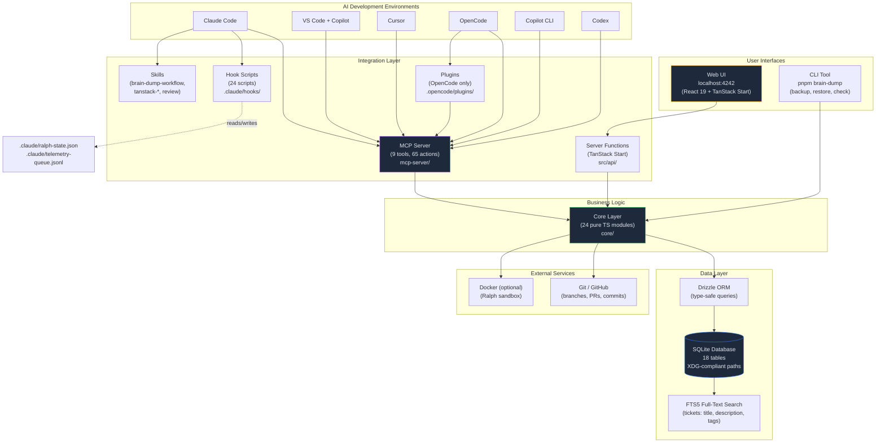
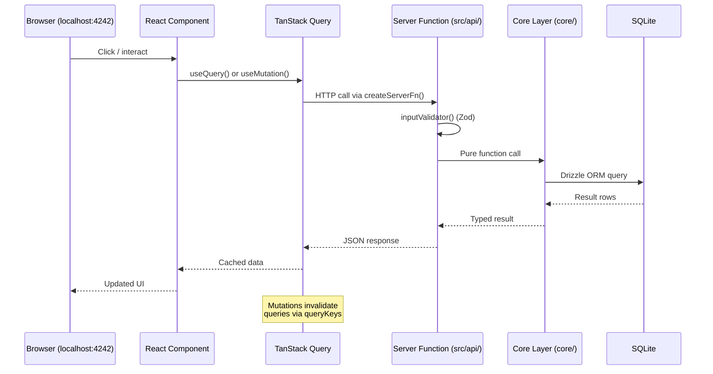
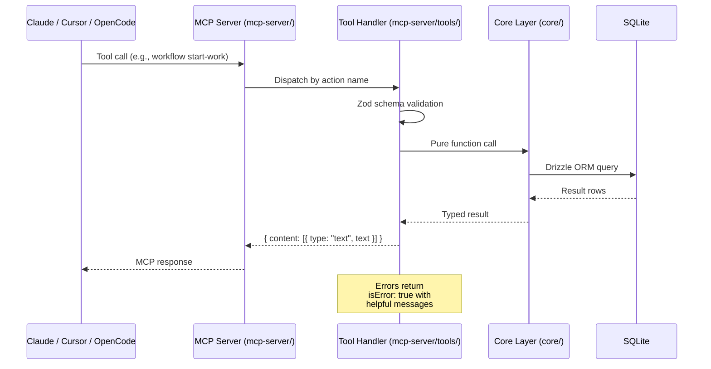
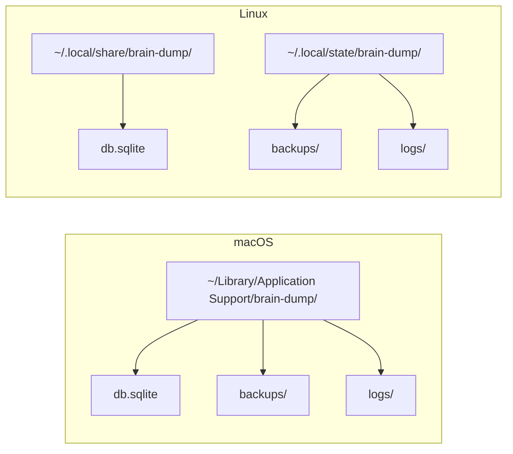

# Brain Dump - System Architecture

## High-Level Component Diagram


```mermaid
graph TB
    subgraph "User Interfaces"
        WebUI["Web UI<br/>localhost:4242<br/>(React 19 + TanStack Start)"]
        CLI["CLI Tool<br/>pnpm brain-dump<br/>(backup, restore, check)"]
    end

    subgraph "AI Development Environments"
        CC["Claude Code"]
        VS["VS Code + Copilot"]
        CU["Cursor"]
        OC["OpenCode"]
        CP["Copilot CLI"]
        CX["Codex"]
    end

    subgraph "Integration Layer"
        MCP["MCP Server<br/>(9 tools, 65 actions)<br/>mcp-server/"]
        SF["Server Functions<br/>(TanStack Start)<br/>src/api/"]
        Hooks["Hook Scripts<br/>(24 scripts)<br/>.claude/hooks/"]
        Skills["Skills<br/>(brain-dump-workflow,<br/>tanstack-*, review)"]
        Plugins["Plugins<br/>(OpenCode only)<br/>.opencode/plugins/"]
    end

    subgraph "Business Logic"
        Core["Core Layer<br/>(24 pure TS modules)<br/>core/"]
    end

    subgraph "Data Layer"
        ORM["Drizzle ORM<br/>(type-safe queries)"]
        DB[("SQLite Database<br/>18 tables<br/>XDG-compliant paths")]
        FTS["FTS5 Full-Text Search<br/>(tickets: title, description, tags)"]
    end

    subgraph "External Services"
        Git["Git / GitHub<br/>(branches, PRs, commits)"]
        Docker["Docker (optional)<br/>(Ralph sandbox)"]
    end

    %% UI connections
    WebUI --> SF
    CLI --> Core

    %% AI environment connections
    CC --> MCP
    CC --> Hooks
    CC --> Skills
    VS --> MCP
    CU --> MCP
    OC --> MCP
    OC --> Plugins
    CP --> MCP
    CX --> MCP

    %% Integration to core
    MCP --> Core
    SF --> Core
    Hooks -.->|"reads/writes"| StateFiles[".claude/ralph-state.json<br/>.claude/telemetry-queue.jsonl"]
    Plugins --> MCP

    %% Core to data
    Core --> ORM
    ORM --> DB
    DB --> FTS

    %% External
    Core --> Git
    Core --> Docker

    style DB fill:#1e293b,stroke:#3b82f6,color:#e2e8f0
    style Core fill:#1e293b,stroke:#22c55e,color:#e2e8f0
    style MCP fill:#1e293b,stroke:#a855f7,color:#e2e8f0
    style WebUI fill:#1e293b,stroke:#f59e0b,color:#e2e8f0
```

## Data Flow

Brain Dump has two independent data paths that converge on the same Core layer and database:

### Path 1: Web UI


```mermaid
sequenceDiagram
    participant User as Browser (localhost:4242)
    participant React as React Component
    participant TQ as TanStack Query
    participant SF as Server Function (src/api/)
    participant Core as Core Layer (core/)
    participant DB as SQLite

    User->>React: Click / interact
    React->>TQ: useQuery() or useMutation()
    TQ->>SF: HTTP call via createServerFn()
    SF->>SF: inputValidator() (Zod)
    SF->>Core: Pure function call
    Core->>DB: Drizzle ORM query
    DB-->>Core: Result rows
    Core-->>SF: Typed result
    SF-->>TQ: JSON response
    TQ-->>React: Cached data
    React-->>User: Updated UI

    Note over TQ: Mutations invalidate<br/>queries via queryKeys
```

### Path 2: MCP (AI Tool Calls)


```mermaid
sequenceDiagram
    participant AI as Claude / Cursor / OpenCode
    participant MCP as MCP Server (mcp-server/)
    participant Tool as Tool Handler (mcp-server/tools/)
    participant Core as Core Layer (core/)
    participant DB as SQLite

    AI->>MCP: Tool call (e.g., workflow start-work)
    MCP->>Tool: Dispatch by action name
    Tool->>Tool: Zod schema validation
    Tool->>Core: Pure function call
    Core->>DB: Drizzle ORM query
    DB-->>Core: Result rows
    Core-->>Tool: Typed result
    Tool-->>MCP: { content: [{ type: "text", text }] }
    MCP-->>AI: MCP response

    Note over Tool: Errors return<br/>isError: true with<br/>helpful messages
```

### Shared Core Layer

Both paths call the same functions in `core/`. This is the key architectural decision - **no business logic lives in the MCP server or server functions**. They are thin adapters.

```
core/
├── project.ts      # Project CRUD
├── epic.ts         # Epic CRUD + lifecycle
├── ticket.ts       # Ticket CRUD + status transitions
├── workflow.ts     # start-work, complete-work, git linking
├── session.ts      # Ralph session management
├── review.ts       # Findings, demos, feedback
├── comment.ts      # Ticket comments
├── telemetry.ts    # AI interaction metrics
├── compliance.ts   # Enterprise conversation logging
├── learnings.ts    # Epic learning extraction
├── tasks.ts        # Claude task management
├── files.ts        # File linking to tickets
├── git.ts          # Git operations (branches, commits)
├── git-utils.ts    # Branch naming, slugification
├── health.ts       # Database integrity checks
├── transfer.ts     # Project export/import
├── transfer-zip.ts # ZIP export format
├── db.ts           # Database initialization
├── errors.ts       # Custom typed error classes
├── types.ts        # Shared TypeScript types
├── db-rows.ts      # Row type utilities
├── json.ts         # JSON parsing helpers
└── index.ts        # Public API exports
```

## Database Entity-Relationship Diagram

```mermaid
erDiagram
    projects ||--o{ epics : "has many"
    projects ||--o{ tickets : "has many"
    epics ||--o{ tickets : "groups"

    tickets ||--o{ ticketComments : "has many"
    tickets ||--o| ticketWorkflowState : "has one"
    tickets ||--o{ reviewFindings : "has many"
    tickets ||--o| demoScripts : "has one"
    tickets ||--o{ ralphSessions : "has many"
    tickets ||--o{ claudeTasks : "has many"
    tickets ||--o{ claudeTaskSnapshots : "has many"

    epics ||--o| epicWorkflowState : "has one"

    ralphSessions ||--o{ ralphEvents : "emits"

    telemetrySessions ||--o{ telemetryEvents : "captures"

    conversationSessions ||--o{ conversationMessages : "records"
    conversationSessions ||--o{ auditLogAccess : "audited by"

    projects {
        text id PK
        text name
        text path UK
        text color
        text workingMethod
    }

    epics {
        text id PK
        text title
        text description
        text projectId FK
        text color
    }

    tickets {
        text id PK
        text title
        text description
        text status "backlog|ready|in_progress|ai_review|human_review|done"
        text priority "low|medium|high"
        real position
        text projectId FK
        text epicId FK
        text tags "JSON array"
        text subtasks "JSON array"
        boolean isBlocked
        text branchName
        integer prNumber
        text prUrl
        text prStatus "draft|open|merged|closed"
    }

    ticketComments {
        text id PK
        text ticketId FK
        text content
        text author "claude|ralph|opencode|user"
        text type "comment|work_summary|test_report"
    }

    settings {
        text id PK "singleton: 'default'"
        text terminalEmulator
        boolean ralphSandbox
        integer ralphTimeout
        integer ralphMaxIterations
        boolean autoCreatePr
        text prTargetBranch
        text dockerRuntime
        integer conversationRetentionDays
        boolean conversationLoggingEnabled
    }

    ralphSessions {
        text id PK
        text ticketId FK
        text currentState "idle|analyzing|implementing|testing|committing|reviewing|done"
        text stateHistory "JSON array"
        text outcome "success|failure|timeout|cancelled"
        text errorMessage
    }

    ralphEvents {
        text id PK
        text sessionId FK
        text type "thinking|tool_start|tool_end|file_change|progress|state_change|error"
        text data "JSON"
    }

    ticketWorkflowState {
        text id PK
        text ticketId FK UK
        text currentPhase "implementation|ai_review|human_review|done"
        integer reviewIteration
        integer findingsCount
        integer findingsFixed
        boolean demoGenerated
    }

    epicWorkflowState {
        text id PK
        text epicId FK UK
        integer ticketsTotal
        integer ticketsDone
        text currentTicketId FK
        text learnings "JSON array"
        text epicBranchName
        integer prNumber
        text prUrl
        text prStatus
    }

    reviewFindings {
        text id PK
        text ticketId FK
        integer iteration
        text agent "code-reviewer|silent-failure-hunter|code-simplifier"
        text severity "critical|major|minor|suggestion"
        text category
        text description
        text filePath
        text status "open|fixed|wont_fix|duplicate"
    }

    demoScripts {
        text id PK
        text ticketId FK UK
        text steps "JSON array"
        text feedback
        boolean passed
    }

    telemetrySessions {
        text id PK
        text ticketId FK
        text projectId FK
        text environment
        text branchName
        integer totalPrompts
        integer totalToolCalls
        integer totalDurationMs
        text outcome
    }

    telemetryEvents {
        text id PK
        text sessionId FK
        text ticketId FK
        text eventType "prompt|tool_start|tool_end|mcp_call|error"
        text toolName
        text eventData "JSON"
        integer durationMs
        text correlationId
    }

    conversationSessions {
        text id PK
        text projectId FK
        text ticketId FK
        text userId
        text environment
        text dataClassification "public|internal|confidential|restricted"
        boolean legalHold
    }

    conversationMessages {
        text id PK
        text sessionId FK
        text role "user|assistant|system|tool"
        text content
        text contentHash "HMAC-SHA256"
        text toolCalls "JSON"
        integer tokenCount
        integer sequenceNumber
        boolean containsPotentialSecrets
    }

    auditLogAccess {
        text id PK
        text accessorId
        text targetType "session|message|export"
        text targetId
        text action "read|export|delete|legal_hold"
        text result "success|denied|error"
    }

    claudeTasks {
        text id PK
        text ticketId FK
        text subject
        text status "pending|in_progress|completed"
        text activeForm
        real position
        text statusHistory "JSON"
        text sessionId
    }

    claudeTaskSnapshots {
        text id PK
        text ticketId FK
        text sessionId
        text tasks "JSON array"
        text reason
    }
```

## Directory Map

```
brain-dump/
│
├── src/                          # TanStack Start web application
│   ├── api/                      #   Server functions (CRUD, Ralph launcher, terminal)
│   ├── components/               #   React components
│   │   ├── board/                #     Kanban board, columns, cards, drag-and-drop
│   │   ├── modals/               #     Create/edit ticket, project, epic modals
│   │   ├── sidebar/              #     Navigation, project list, search
│   │   ├── settings/             #     Settings form, tabs
│   │   └── tickets/              #     Ticket detail view, comments, attachments
│   ├── lib/                      #   Utilities
│   │   ├── schema.ts             #     Drizzle ORM schema (18 tables)
│   │   ├── db.ts                 #     Database connection (web app)
│   │   ├── hooks.ts              #     TanStack Query hooks + queryKeys
│   │   ├── xdg.ts                #     XDG path resolution
│   │   └── ...                   #     Backup, logging, environment detection
│   ├── routes/                   #   TanStack Router pages
│   └── styles/                   #   CSS, themes
│
├── core/                         # Pure business logic (24 modules)
│   └── (see Core Layer above)
│
├── mcp-server/                   # Standalone MCP server
│   ├── index.ts                  #   Entry point, tool registration
│   ├── tools/                    #   9 tool handlers
│   │   ├── project.ts            #     4 actions
│   │   ├── ticket.ts             #     10 actions
│   │   ├── epic.ts               #     6 actions
│   │   ├── comment.ts            #     2 actions
│   │   ├── workflow.ts           #     6 actions
│   │   ├── session.ts            #     12 actions
│   │   ├── review.ts             #     8 actions
│   │   ├── telemetry.ts          #     7 actions
│   │   └── admin.ts              #     10 actions
│   ├── lib/                      #   MCP-specific utilities
│   └── types.ts                  #   Shared MCP types
│
├── cli/                          # Terminal CLI
│   └── commands/                 #   backup, restore, check, admin
│
├── .claude/                      # Claude Code configuration
│   ├── hooks/                    #   24 hook scripts
│   ├── skills/                   #   brain-dump-workflow, tanstack-*, review
│   ├── commands/                 #   Slash commands
│   └── agents/                   #   Agent definitions
│
├── .opencode/                    # OpenCode configuration
│   ├── plugins/                  #   3 TypeScript plugins
│   ├── skill/                    #   Skills (same as Claude)
│   └── opencode.json             #   MCP + tool config
│
├── .cursor/                      # Cursor configuration
│   ├── rules/                    #   Workspace rules
│   └── skills/                   #   Skills
│
├── scripts/                      # Setup scripts
│   ├── setup-claude-code.sh      #   Claude Code integration
│   ├── setup-codex.sh            #   Codex integration
│   ├── setup-copilot-cli.sh      #   Copilot CLI integration
│   ├── setup-cursor.sh           #   Cursor integration
│   ├── setup-opencode.sh         #   OpenCode integration
│   ├── setup-vscode.sh           #   VS Code integration
│   └── install.sh                #   Universal auto-detect installer
│
├── hooks/                        # Global/Copilot-specific hooks
│   └── copilot/                  #   pre-tool-use.sh, etc.
│
├── docs/                         # Documentation
│   ├── flows/                    #   Workflow flow docs
│   ├── environments/             #   Per-IDE setup guides
│   └── ...                       #   MCP reference, troubleshooting
│
├── plans/                        # Specifications and PRDs
│   ├── spec-template.md          #   6-layer spec template
│   └── specs/                    #   Feature specifications
│
├── drizzle/                      # SQL migration files
├── e2e/                          # Playwright E2E tests
└── integration-tests/            # Ralph workflow integration tests
```

## XDG-Compliant Data Storage


```mermaid
graph LR
    subgraph "macOS"
        M_DATA["~/Library/Application Support/brain-dump/"]
        M_DB["db.sqlite"]
        M_BACK["backups/"]
        M_LOG["logs/"]
    end

    subgraph "Linux"
        L_DATA["~/.local/share/brain-dump/"]
        L_STATE["~/.local/state/brain-dump/"]
        L_DB2["db.sqlite"]
        L_BACK2["backups/"]
        L_LOG2["logs/"]
    end

    M_DATA --> M_DB
    M_DATA --> M_BACK
    M_DATA --> M_LOG

    L_DATA --> L_DB2
    L_STATE --> L_BACK2
    L_STATE --> L_LOG2
```

| Item      | macOS                                                | Linux                                 |
| --------- | ---------------------------------------------------- | ------------------------------------- |
| Database  | `~/Library/Application Support/brain-dump/db.sqlite` | `~/.local/share/brain-dump/db.sqlite` |
| Backups   | `~/Library/Application Support/brain-dump/backups/`  | `~/.local/state/brain-dump/backups/`  |
| Logs      | `~/Library/Application Support/brain-dump/logs/`     | `~/.local/state/brain-dump/logs/`     |
| Lock file | `~/Library/Application Support/brain-dump/.lock`     | `~/.local/state/brain-dump/.lock`     |

## Server Functions Pattern

API functions in `src/api/` use TanStack Start's `createServerFn`:

```typescript
import { createServerFn } from "@tanstack/react-start/server";

export const getTickets = createServerFn().handler(async () => {
  return db.select().from(tickets).all();
});
```

These are called from React components via TanStack Query.
