# Brain Dump - Claude Code Ticket Lifecycle

The complete flow of a ticket through Brain Dump when using Claude Code as the AI development environment. This documents every MCP tool call, hook firing, state file write, telemetry event, and state transition from start to finish.

## Ticket Status State Machine

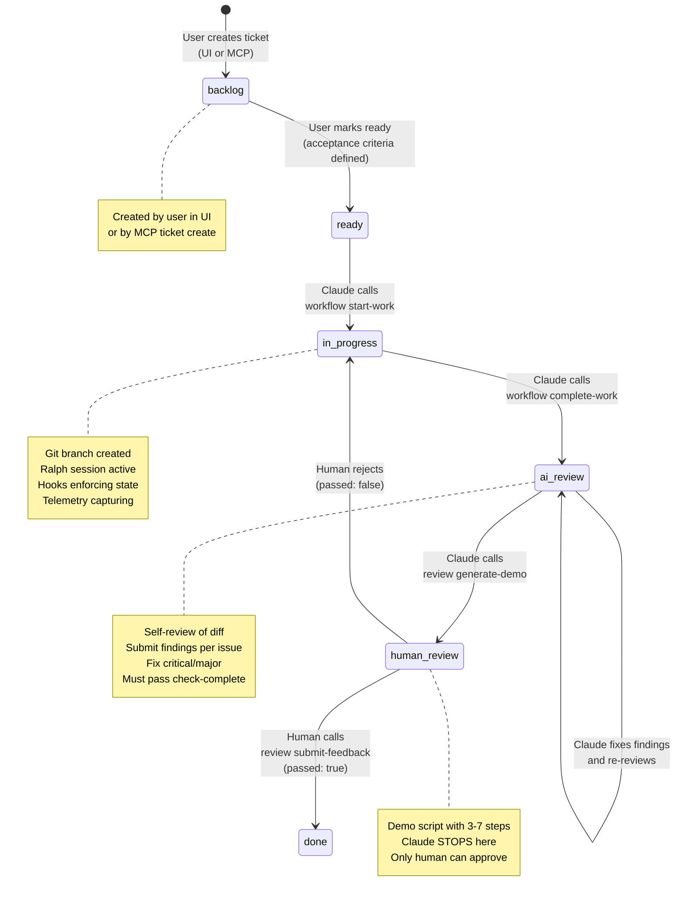

## Phase 0: Session Start (Before Any Ticket)

When Claude Code launches, hooks fire immediately.

```mermaid
sequenceDiagram
    participant User
    participant Claude as Claude Code
    participant Hook as Hook Scripts
    participant StateFile as .claude/ Files
    participant MCP as MCP Server
    participant DB as SQLite

    Note over User,DB: Claude Code session begins

    User->>Claude: Opens Claude Code

    rect rgb(40, 40, 60)
        Note over Hook: SessionStart hooks fire
        Hook->>Hook: start-telemetry-session.sh
        Hook-->>Claude: "TELEMETRY: No active ticket detected.<br/>Call telemetry start to track this session."
        Hook->>Hook: detect-libraries.sh
        Hook-->>Claude: Detected libraries info
        Hook->>Hook: check-pending-links.sh
        Hook-->>Claude: Pending commit/PR links (if any)
    end

    Note over Claude: Claude is now ready for commands
```

## Phase 1: Starting a Ticket (`workflow start-work`)

This is the most event-dense moment. A single MCP call triggers a cascade of hooks.

```mermaid
sequenceDiagram
    participant User
    participant Claude as Claude Code
    participant PreHook as PreToolUse Hooks
    participant MCP as MCP Server
    participant Core as Core Layer
    participant DB as SQLite
    participant PostHook as PostToolUse Hooks
    participant Git as Git / GitHub
    participant StateFile as .claude/ Files
    participant Terminal as Terminal (Spawn)

    User->>Claude: "Work on ticket ABC-123"

    Note over Claude: Claude loads brain-dump-workflow skill<br/>(mandatory quality workflow)

    rect rgb(30, 50, 30)
        Note over Claude,DB: Step 1: Start Work
        Claude->>MCP: workflow { action: "start-work",<br/>ticketId: "ABC-123" }

        rect rgb(50, 40, 40)
            Note over PreHook: PreToolUse: mcp__brain-dump__workflow
            PreHook->>PreHook: log-tool-start.sh
            PreHook->>StateFile: Write tool-correlation-{uuid}.txt
            PreHook->>StateFile: Append to telemetry-queue.jsonl<br/>{ type: "tool_start", tool: "workflow" }
        end

        MCP->>Core: startWork(db, { ticketId })
        Core->>DB: SELECT ticket WHERE id = "ABC-123"
        Core->>DB: UPDATE ticket SET status = "in_progress"
        Core->>Core: Generate branch name:<br/>feature/{short-id}-{slug}
        Core->>Git: git checkout -b feature/abc123-add-login
        Core->>DB: UPDATE ticket SET branchName = "feature/abc123-add-login"
        Core->>DB: INSERT INTO ticket_workflow_state<br/>{ ticketId, currentPhase: "implementation" }
        Core->>DB: INSERT INTO ticket_comments<br/>{ type: "work_summary", content: "Started work" }
        Core-->>MCP: { ticket, branch, workflowState }

        rect rgb(50, 40, 40)
            Note over PostHook: PostToolUse: mcp__brain-dump__workflow
            PostHook->>PostHook: log-tool-end.sh
            PostHook->>StateFile: Read tool-correlation-{uuid}.txt
            PostHook->>StateFile: Append to telemetry-queue.jsonl<br/>{ type: "tool_end", duration, success: true }
            PostHook->>PostHook: create-pr-on-ticket-start.sh
            PostHook->>Git: git commit --allow-empty -m "WIP: ABC-123"
            PostHook->>Git: git push -u origin feature/abc123-add-login
            PostHook->>Git: gh pr create --draft --title "ABC-123: Add login"
            PostHook-->>Claude: "Draft PR #42 created.<br/>Link it: workflow link-pr ticketId ABC-123 prNumber 42"
        end

        MCP-->>Claude: Ticket context + branch info
    end

    rect rgb(30, 50, 30)
        Note over Claude,DB: Step 2: Create Ralph Session
        Claude->>MCP: session { action: "create",<br/>ticketId: "ABC-123" }

        rect rgb(50, 40, 40)
            Note over PreHook: PreToolUse hooks fire (telemetry)
        end

        MCP->>Core: createSession(db, { ticketId })
        Core->>DB: INSERT INTO ralph_sessions<br/>{ ticketId, currentState: "idle" }
        Core-->>MCP: { sessionId: "sess-789" }

        rect rgb(50, 40, 40)
            Note over PostHook: PostToolUse hooks fire
            PostHook->>PostHook: record-state-change.sh
            PostHook->>StateFile: Write .claude/ralph-state.json<br/>{ sessionId, ticketId, currentState: "idle" }
        end

        MCP-->>Claude: Session created
    end

    rect rgb(30, 50, 30)
        Note over Claude,DB: Step 3: Link PR (from hook output)
        Claude->>MCP: workflow { action: "link-pr",<br/>ticketId: "ABC-123", prNumber: 42 }
        MCP->>Core: linkPr(db, { ticketId, prNumber })
        Core->>DB: UPDATE ticket SET prNumber = 42,<br/>prUrl, prStatus = "draft"
        Core->>DB: Sync all PR statuses in project
        Core-->>MCP: PR linked
        MCP-->>Claude: PR #42 linked to ticket
    end

    rect rgb(30, 50, 30)
        Note over Claude,DB: Step 4: Start Telemetry
        Claude->>MCP: telemetry { action: "start",<br/>ticketId: "ABC-123" }
        MCP->>Core: startTelemetry(db, { ticketId })
        Core->>DB: INSERT INTO telemetry_sessions<br/>{ ticketId, environment: "claude-code" }
        Core-->>MCP: { telemetrySessionId }
        MCP-->>Claude: Telemetry session started
    end

    rect rgb(30, 50, 30)
        Note over Claude,DB: Step 5: Update Session State
        Claude->>MCP: session { action: "update-state",<br/>sessionId: "sess-789", state: "analyzing" }
        MCP->>Core: updateState(db, { sessionId, state })
        Core->>DB: UPDATE ralph_sessions<br/>SET currentState = "analyzing"
        Core-->>MCP: State updated

        rect rgb(50, 40, 40)
            Note over PostHook: PostToolUse hooks fire
            PostHook->>PostHook: record-state-change.sh
            PostHook->>StateFile: Update .claude/ralph-state.json<br/>{ currentState: "analyzing",<br/>stateHistory: ["idle", "analyzing"] }
        end

        MCP-->>Claude: Now in "analyzing" state
    end
```

## Phase 2: Implementation (Writing Code)

During implementation, hooks enforce that Claude is in the correct session state before writing files.

```mermaid
sequenceDiagram
    participant Claude as Claude Code
    participant PreHook as PreToolUse Hooks
    participant StateFile as .claude/ralph-state.json
    participant Tool as Write/Edit Tool
    participant PostHook as PostToolUse Hooks
    participant MCP as MCP Server
    participant DB as SQLite

    Note over Claude: Claude reads ticket, specs,<br/>understands requirements

    rect rgb(60, 30, 30)
        Note over Claude,Tool: State Enforcement: First Write Attempt
        Claude->>Tool: Write { file: "src/feature.ts" }

        PreHook->>PreHook: enforce-state-before-write.sh
        PreHook->>StateFile: Read ralph-state.json
        Note over PreHook: currentState = "analyzing"<br/>NOT in [implementing, testing, committing]

        PreHook-->>Claude: "BLOCKED: State is 'analyzing'<br/>but Write requires 'implementing'.<br/>Call: session update-state<br/>sessionId: sess-789<br/>state: implementing"

        Note over Claude: Claude follows the guidance
    end

    rect rgb(30, 50, 30)
        Note over Claude,DB: Transition to Implementing
        Claude->>MCP: session { action: "update-state",<br/>sessionId: "sess-789",<br/>state: "implementing" }
        MCP->>DB: UPDATE ralph_sessions<br/>SET currentState = "implementing"

        PostHook->>PostHook: record-state-change.sh
        PostHook->>StateFile: Update ralph-state.json<br/>{ currentState: "implementing" }

        MCP-->>Claude: Now in "implementing" state
    end

    rect rgb(30, 50, 30)
        Note over Claude,Tool: Write Succeeds
        Claude->>Tool: Write { file: "src/feature.ts" }

        PreHook->>PreHook: enforce-state-before-write.sh
        PreHook->>StateFile: Read ralph-state.json
        Note over PreHook: currentState = "implementing" ✓

        PreHook->>PreHook: log-tool-start.sh
        PreHook->>StateFile: Append telemetry-queue.jsonl<br/>{ type: "tool_start", tool: "Write" }

        Tool->>Tool: Write file to disk

        PostHook->>PostHook: log-tool-end.sh
        PostHook->>StateFile: Append telemetry-queue.jsonl<br/>{ type: "tool_end", tool: "Write",<br/>success: true, durationMs: 45 }
    end

    Note over Claude: Claude continues writing code...<br/>(each Write/Edit triggers same hook cycle)

    rect rgb(30, 50, 30)
        Note over Claude,DB: Transition to Testing
        Claude->>MCP: session { action: "update-state",<br/>state: "testing" }
        PostHook->>StateFile: Update ralph-state.json<br/>{ currentState: "testing" }
    end

    rect rgb(30, 50, 30)
        Note over Claude,Tool: Run Tests
        Claude->>Tool: Bash { command: "pnpm check" }

        PreHook->>PreHook: log-tool-start.sh (telemetry)

        Note over Tool: pnpm type-check ✓<br/>pnpm lint ✓<br/>pnpm test ✓

        PostHook->>PostHook: log-tool-end.sh (telemetry)
    end

    rect rgb(30, 50, 30)
        Note over Claude,DB: Transition to Committing
        Claude->>MCP: session { action: "update-state",<br/>state: "committing" }
        PostHook->>StateFile: Update ralph-state.json<br/>{ currentState: "committing" }
    end

    rect rgb(30, 50, 30)
        Note over Claude,Tool: Git Commit
        Claude->>Tool: Bash { command: "git commit -m 'feat(abc123): add login'" }

        PreHook->>PreHook: log-tool-start.sh

        Tool->>Tool: git commit executes

        PostHook->>PostHook: log-tool-end.sh
        PostHook->>PostHook: link-commit-to-ticket.sh
        PostHook-->>Claude: "Commit a1b2c3d created.<br/>Link it: workflow link-commit<br/>ticketId ABC-123<br/>commitHash a1b2c3d"
    end

    rect rgb(30, 50, 30)
        Note over Claude,DB: Link Commit
        Claude->>MCP: workflow { action: "link-commit",<br/>ticketId: "ABC-123",<br/>commitHash: "a1b2c3d" }
        MCP->>DB: Record commit link
        MCP-->>Claude: Commit linked
    end
```

### Telemetry During Implementation

Every tool call generates telemetry events. Here's how they flow:

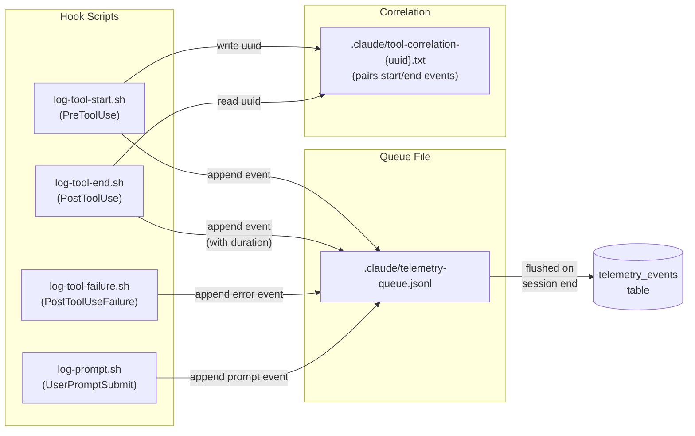

**Telemetry event format (JSONL):**

```json
{"type":"tool_start","tool":"Write","correlationId":"uuid-1","params":{"file":"src/feature.ts"},"timestamp":"2026-02-28T10:15:00Z"}
{"type":"tool_end","tool":"Write","correlationId":"uuid-1","success":true,"durationMs":45,"timestamp":"2026-02-28T10:15:00.045Z"}
{"type":"prompt","text":"Add the login feature...","tokenCount":150,"timestamp":"2026-02-28T10:14:55Z"}
```

### User Prompt Telemetry

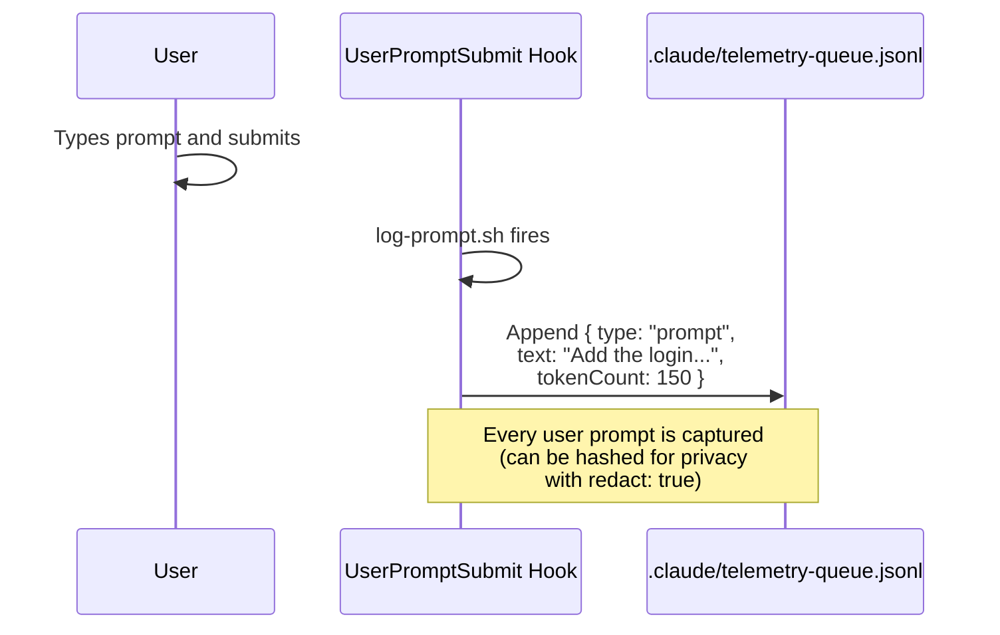

## Phase 3: Complete Work (`workflow complete-work`)

```mermaid
sequenceDiagram
    participant Claude as Claude Code
    participant PreHook as PreToolUse Hooks
    participant MCP as MCP Server
    participant Core as Core Layer
    participant DB as SQLite
    participant PostHook as PostToolUse Hooks
    participant StateFile as .claude/ Files

    rect rgb(30, 50, 30)
        Note over Claude,DB: Transition to Reviewing
        Claude->>MCP: session { action: "update-state",<br/>state: "reviewing" }
        PostHook->>StateFile: Update ralph-state.json<br/>{ currentState: "reviewing" }
    end

    rect rgb(30, 50, 30)
        Note over Claude,DB: Complete Work
        Claude->>MCP: workflow { action: "complete-work",<br/>ticketId: "ABC-123",<br/>summary: "Implemented login with..." }

        rect rgb(50, 40, 40)
            Note over PreHook: PreToolUse telemetry hooks fire
        end

        MCP->>Core: completeWork(db, { ticketId, summary })
        Core->>DB: UPDATE ticket SET status = "ai_review"
        Core->>DB: UPDATE ticket_workflow_state<br/>SET currentPhase = "ai_review"
        Core->>DB: INSERT INTO ticket_comments<br/>{ type: "work_summary",<br/>content: "Implemented login with..." }
        Core-->>MCP: { ticket, workflowState }

        rect rgb(50, 40, 40)
            Note over PostHook: PostToolUse hooks fire
            PostHook->>PostHook: log-tool-end.sh (telemetry)
            PostHook->>PostHook: spawn-next-ticket.sh
            Note over PostHook: If AUTO_SPAWN_NEXT_TICKET=1:<br/>Parse next ticket from PRD<br/>Spawn new terminal with Claude<br/>(current session continues review)
        end

        MCP-->>Claude: Ticket moved to ai_review
    end
```

## Phase 4: AI Review (Self-Review)

Claude reviews its own diff and submits findings for each issue discovered.

```mermaid
sequenceDiagram
    participant Claude as Claude Code
    participant MCP as MCP Server
    participant Core as Core Layer
    participant DB as SQLite
    participant PostHook as PostToolUse Hooks

    Note over Claude: Claude reads its own diff:<br/>git diff main...HEAD

    rect rgb(30, 50, 30)
        Note over Claude,DB: Submit Finding #1 (Critical)
        Claude->>MCP: review { action: "submit-finding",<br/>ticketId: "ABC-123",<br/>agent: "code-reviewer",<br/>severity: "critical",<br/>category: "security",<br/>description: "SQL injection in...",<br/>filePath: "src/api/users.ts",<br/>lineNumber: 42,<br/>suggestedFix: "Use parameterized..." }
        MCP->>Core: submitFinding(db, { ... })
        Core->>DB: INSERT INTO review_findings
        Core->>DB: UPDATE ticket_workflow_state<br/>SET findingsCount = findingsCount + 1
        Core-->>MCP: Finding recorded
        MCP-->>Claude: Finding #1 submitted
    end

    rect rgb(30, 50, 30)
        Note over Claude,DB: Submit Finding #2 (Minor)
        Claude->>MCP: review { action: "submit-finding",<br/>severity: "minor",<br/>category: "style",<br/>description: "Inconsistent naming..." }
        MCP->>DB: INSERT INTO review_findings
        MCP-->>Claude: Finding #2 submitted
    end

    Note over Claude: Claude fixes the critical issue

    rect rgb(30, 50, 30)
        Note over Claude,DB: Mark Finding Fixed
        Claude->>MCP: review { action: "mark-fixed",<br/>findingId: "finding-1",<br/>fixStatus: "fixed",<br/>fixDescription: "Used parameterized query" }
        MCP->>Core: markFixed(db, { findingId, fixStatus })
        Core->>DB: UPDATE review_findings<br/>SET status = "fixed", fixedAt = now()
        Core->>DB: UPDATE ticket_workflow_state<br/>SET findingsFixed = findingsFixed + 1
        Core-->>MCP: Marked as fixed
        MCP-->>Claude: Finding marked fixed
    end

    rect rgb(30, 50, 30)
        Note over Claude,DB: Check If Review Complete
        Claude->>MCP: review { action: "check-complete",<br/>ticketId: "ABC-123" }
        MCP->>Core: checkComplete(db, { ticketId })
        Core->>DB: SELECT FROM review_findings<br/>WHERE ticketId AND severity IN ('critical','major')<br/>AND status = 'open'
        Note over Core: 0 open critical/major findings
        Core-->>MCP: { canProceedToHumanReview: true,<br/>openCritical: 0, openMajor: 0 }
        MCP-->>Claude: Ready for human review
    end
```

### Optional: Extended Review Pipeline (`/review` skill)

If Claude runs the `/review` skill, three review agents run in parallel:

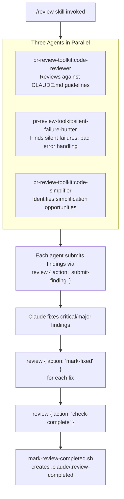

## Phase 5: Demo Generation (Transition to Human Review)

```mermaid
sequenceDiagram
    participant Claude as Claude Code
    participant MCP as MCP Server
    participant Core as Core Layer
    participant DB as SQLite

    rect rgb(30, 50, 30)
        Note over Claude,DB: Generate Demo Script
        Claude->>MCP: review { action: "generate-demo",<br/>ticketId: "ABC-123",<br/>steps: [<br/>  { order: 1, type: "manual",<br/>    description: "Navigate to /login",<br/>    expectedOutcome: "Login form displays" },<br/>  { order: 2, type: "manual",<br/>    description: "Enter invalid credentials",<br/>    expectedOutcome: "Error message shown" },<br/>  { order: 3, type: "manual",<br/>    description: "Enter valid credentials",<br/>    expectedOutcome: "Redirected to dashboard" },<br/>  { order: 4, type: "visual",<br/>    description: "Check responsive layout",<br/>    expectedOutcome: "Form works on mobile" }<br/>] }

        MCP->>Core: generateDemo(db, { ticketId, steps })
        Core->>DB: INSERT INTO demo_scripts<br/>{ ticketId, steps: [...] }
        Core->>DB: UPDATE ticket SET status = "human_review"
        Core->>DB: UPDATE ticket_workflow_state<br/>SET currentPhase = "human_review",<br/>demoGenerated = true
        Core-->>MCP: Demo script generated
        MCP-->>Claude: Ticket moved to human_review
    end

    rect rgb(30, 50, 30)
        Note over Claude,DB: Complete Session
        Claude->>MCP: session { action: "complete",<br/>sessionId: "sess-789",<br/>outcome: "success" }
        MCP->>Core: completeSession(db, { sessionId, outcome })
        Core->>DB: UPDATE ralph_sessions<br/>SET outcome = "success",<br/>completedAt = now(),<br/>currentState = "done"
        Core-->>MCP: Session completed
    end

    Note over Claude: Claude STOPS here.<br/>Does not continue to next ticket<br/>unless AUTO_SPAWN_NEXT_TICKET=1
```

## Phase 6: Human Review

This phase happens in the Brain Dump web UI, not in Claude Code.

```mermaid
sequenceDiagram
    participant Human as Human Reviewer
    participant UI as Brain Dump UI (localhost:4242)
    participant SF as Server Functions
    participant Core as Core Layer
    participant DB as SQLite

    Human->>UI: Open ticket ABC-123
    UI->>SF: getTicket("ABC-123")
    SF->>DB: SELECT ticket, demo_script, findings
    DB-->>UI: Ticket + demo steps + review findings

    Note over Human,UI: Human sees demo script:<br/>1. Navigate to /login ✓<br/>2. Enter invalid credentials ✓<br/>3. Enter valid credentials ✓<br/>4. Check responsive layout ✓

    Human->>UI: Execute each demo step<br/>Mark pass/fail for each

    rect rgb(30, 50, 30)
        Note over Human,DB: Option A: Approve
        Human->>UI: Click "Approve"
        UI->>SF: submitFeedback({ ticketId, passed: true,<br/>feedback: "Looks great!" })
        SF->>Core: submitFeedback(db, { ... })
        Core->>DB: UPDATE demo_scripts<br/>SET passed = true,<br/>feedback = "Looks great!",<br/>completedAt = now()
        Core->>DB: UPDATE ticket<br/>SET status = "done",<br/>completedAt = now()
        Core->>DB: UPDATE ticket_workflow_state<br/>SET currentPhase = "done"
        Core-->>UI: Ticket completed!
    end

    rect rgb(60, 30, 30)
        Note over Human,DB: Option B: Reject
        Human->>UI: Click "Request Changes"
        UI->>SF: submitFeedback({ ticketId, passed: false,<br/>feedback: "Login button misaligned on mobile" })
        SF->>Core: submitFeedback(db, { ... })
        Core->>DB: UPDATE demo_scripts<br/>SET passed = false,<br/>feedback = "Login button misaligned..."
        Core->>DB: UPDATE ticket<br/>SET status = "in_progress"
        Core->>DB: UPDATE ticket_workflow_state<br/>SET currentPhase = "implementation"
        Core-->>UI: Ticket returned to in_progress
        Note over Human: Claude picks it up again<br/>and the cycle repeats
    end
```

## Phase 7: Session End (Cleanup)

When Claude Code exits (or the user ends the session):

```mermaid
sequenceDiagram
    participant Claude as Claude Code
    participant StopHook as Stop Hooks
    participant StateFile as .claude/ Files
    participant MCP as MCP Server
    participant DB as SQLite

    Note over Claude: User exits or session times out

    rect rgb(50, 40, 40)
        Note over StopHook: Stop hooks fire

        StopHook->>StopHook: check-for-code-changes.sh
        StopHook->>StopHook: Check for uncommitted changes
        alt Has uncommitted source file changes
            StopHook-->>Claude: "REVIEW REQUIRED: You have<br/>uncommitted changes. Run /review<br/>before ending the session."
            Note over Claude: Claude runs /review pipeline
        end

        StopHook->>StopHook: end-telemetry-session.sh
        StopHook-->>Claude: "TELEMETRY: Session ending.<br/>Call telemetry end to finalize."
    end

    rect rgb(30, 50, 30)
        Note over Claude,DB: Finalize Telemetry
        Claude->>MCP: telemetry { action: "end",<br/>sessionId: "telem-456",<br/>outcome: "success" }
        MCP->>MCP: Flush telemetry-queue.jsonl → DB
        MCP->>DB: INSERT INTO telemetry_events<br/>(batch insert all queued events)
        MCP->>DB: UPDATE telemetry_sessions<br/>SET endedAt = now(),<br/>totalPrompts, totalToolCalls,<br/>totalDurationMs, outcome
        MCP-->>Claude: Telemetry finalized
    end

    rect rgb(30, 50, 30)
        Note over Claude,DB: Capture Tasks (if any)
        StopHook->>StopHook: capture-claude-tasks.sh
        StopHook->>MCP: session { action: "save-tasks",<br/>tasks: [...current task list] }
        MCP->>DB: UPSERT claude_tasks
        MCP->>DB: INSERT INTO claude_task_snapshots<br/>{ reason: "session_end" }
    end

    Note over StateFile: .claude/ralph-state.json remains<br/>(persists across sessions if ticket<br/>is still in_progress)
```

## Complete Hook Firing Timeline

Every hook, when it fires, and what it does:

### SessionStart Hooks

| Hook Script                  | Fires When        | What It Does                                                                     | Files Touched                      |
| ---------------------------- | ----------------- | -------------------------------------------------------------------------------- | ---------------------------------- |
| `start-telemetry-session.sh` | Claude Code opens | Detects active ticket from `ralph-state.json`, prompts Claude to start telemetry | Reads `.claude/ralph-state.json`   |
| `detect-libraries.sh`        | Claude Code opens | Scans `package.json` for known libraries, provides context                       | Reads `package.json`               |
| `check-pending-links.sh`     | Claude Code opens | Checks for unlinked commits/PRs from previous session                            | Reads `.claude/pending-links.json` |

### PreToolUse Hooks

| Hook Script                      | Matcher                                    | What It Does                                                             | Files Touched                                                 |
| -------------------------------- | ------------------------------------------ | ------------------------------------------------------------------------ | ------------------------------------------------------------- |
| `enforce-state-before-write.sh`  | `Write`, `Edit`, `NotebookEdit`            | Blocks if not in `implementing`/`testing`/`committing` state             | Reads `.claude/ralph-state.json`                              |
| `enforce-session-before-work.sh` | `mcp__brain-dump__workflow`                | Blocks `start-work` if no session exists                                 | Reads `.claude/ralph-state.json`                              |
| `enforce-review-before-push.sh`  | `Bash(git push:*)`, `Bash(gh pr create:*)` | Blocks push/PR until `.claude/.review-completed` exists and is <5min old | Reads `.claude/.review-completed`                             |
| `log-tool-start.sh`              | `*` (all tools)                            | Records tool start event with correlation ID                             | Writes `telemetry-queue.jsonl`, `tool-correlation-{uuid}.txt` |

### PostToolUse Hooks

| Hook Script                    | Matcher                     | What It Does                                                         | Files Touched                                                        |
| ------------------------------ | --------------------------- | -------------------------------------------------------------------- | -------------------------------------------------------------------- |
| `log-tool-end.sh`              | `*` (all tools)             | Records tool completion with duration                                | Appends `telemetry-queue.jsonl`, reads `tool-correlation-{uuid}.txt` |
| `record-state-change.sh`       | `mcp__brain-dump__session`  | Updates `ralph-state.json` on state transitions                      | Writes `.claude/ralph-state.json`                                    |
| `create-pr-on-ticket-start.sh` | `mcp__brain-dump__workflow` | Auto-creates draft PR on `start-work`                                | Invokes `git`, `gh`                                                  |
| `link-commit-to-ticket.sh`     | `Bash(git commit:*)`        | Outputs MCP commands to link commit                                  | Reads `.claude/ralph-state.json`                                     |
| `mark-review-completed.sh`     | `mcp__brain-dump__review`   | Creates `.claude/.review-completed` after successful review          | Writes `.claude/.review-completed`                                   |
| `chain-extended-review.sh`     | Review tools                | Chains extended review agents after initial review                   | --                                                                   |
| `capture-claude-tasks.sh`      | `*` (periodic)              | Captures Claude's current task list                                  | Reads task state                                                     |
| `save-tasks-to-db.cjs`         | Task events                 | Persists task snapshots to database                                  | Writes via MCP                                                       |
| `spawn-next-ticket.sh`         | `mcp__brain-dump__workflow` | Spawns new terminal with next ticket (if `AUTO_SPAWN_NEXT_TICKET=1`) | Reads PRD, spawns terminal                                           |
| `spawn-after-pr.sh`            | `Bash(gh pr create:*)`      | Spawns next ticket after PR creation                                 | Reads PRD, spawns terminal                                           |
| `clear-pending-links.sh`       | Link tools                  | Clears pending links after they're applied                           | Writes `.claude/pending-links.json`                                  |

### PostToolUseFailure Hooks

| Hook Script           | Matcher         | What It Does                            | Files Touched                   |
| --------------------- | --------------- | --------------------------------------- | ------------------------------- |
| `log-tool-failure.sh` | `*` (all tools) | Records tool failure with error details | Appends `telemetry-queue.jsonl` |

### UserPromptSubmit Hooks

| Hook Script               | Fires When              | What It Does                  | Files Touched                   |
| ------------------------- | ----------------------- | ----------------------------- | ------------------------------- |
| `log-prompt.sh`           | User submits any prompt | Records prompt text (or hash) | Appends `telemetry-queue.jsonl` |
| `log-prompt-telemetry.sh` | User submits any prompt | Advanced prompt telemetry     | Appends `telemetry-queue.jsonl` |

### Stop Hooks

| Hook Script                 | Fires When        | What It Does                                          | Files Touched                                        |
| --------------------------- | ----------------- | ----------------------------------------------------- | ---------------------------------------------------- |
| `check-for-code-changes.sh` | Claude Code exits | Blocks if uncommitted changes exist without `/review` | Reads `.claude/.review-completed`, runs `git status` |
| `end-telemetry-session.sh`  | Claude Code exits | Prompts Claude to finalize telemetry                  | Reads `.claude/telemetry-session.json`               |

## State Files Reference

All ephemeral state lives in `.claude/` within the project directory:

| File                          | Created By                   | Read By                         | Purpose                      | Lifespan                     |
| ----------------------------- | ---------------------------- | ------------------------------- | ---------------------------- | ---------------------------- |
| `ralph-state.json`            | `session create` hook        | `enforce-state-*` hooks         | Current session + state      | Until `session complete`     |
| `telemetry-queue.jsonl`       | `log-tool-*` hooks           | `telemetry end` MCP call        | Queued telemetry events      | Flushed to DB on session end |
| `telemetry-session.json`      | `start-telemetry-session.sh` | `end-telemetry-session.sh`      | Current telemetry session ID | Until session end            |
| `tool-correlation-{uuid}.txt` | `log-tool-start.sh`          | `log-tool-end.sh`               | Pairs start/end events       | Cleaned up after read        |
| `.review-completed`           | `mark-review-completed.sh`   | `enforce-review-before-push.sh` | Review marker (5min TTL)     | Auto-expires after 5 minutes |
| `pending-links.json`          | `link-commit-to-ticket.sh`   | `check-pending-links.sh`        | Unlinked commits/PRs         | Until links applied          |
| `telemetry.log`               | All telemetry hooks          | Debugging                       | Hook activity debug log      | Persists                     |

## Ralph Autonomous Mode

When Ralph runs autonomously (instead of interactive Claude), the flow is the same but automated:

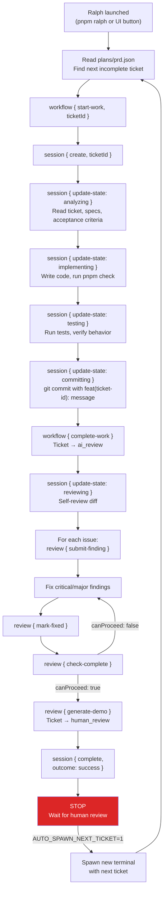

### Ralph vs Interactive Claude

| Aspect             | Interactive Claude                 | Ralph Autonomous                      |
| ------------------ | ---------------------------------- | ------------------------------------- |
| Who starts work?   | User says "work on ticket X"       | Ralph reads PRD, picks next           |
| State enforcement? | Same hooks apply                   | Same hooks apply                      |
| Review?            | Claude self-reviews (or `/review`) | Ralph self-reviews                    |
| When does it stop? | After `generate-demo`              | After `generate-demo`                 |
| Next ticket?       | User decides                       | Auto-spawn (if enabled)               |
| Timeout?           | No limit                           | `ralphTimeout` setting (default: 1hr) |
| Max iterations?    | No limit                           | `ralphMaxIterations` (default: 10)    |
| Docker sandbox?    | No                                 | Optional (`ralphSandbox` setting)     |

## Enterprise Compliance Logging

Optionally, the entire conversation can be logged for SOC2/GDPR/ISO 27001 compliance:

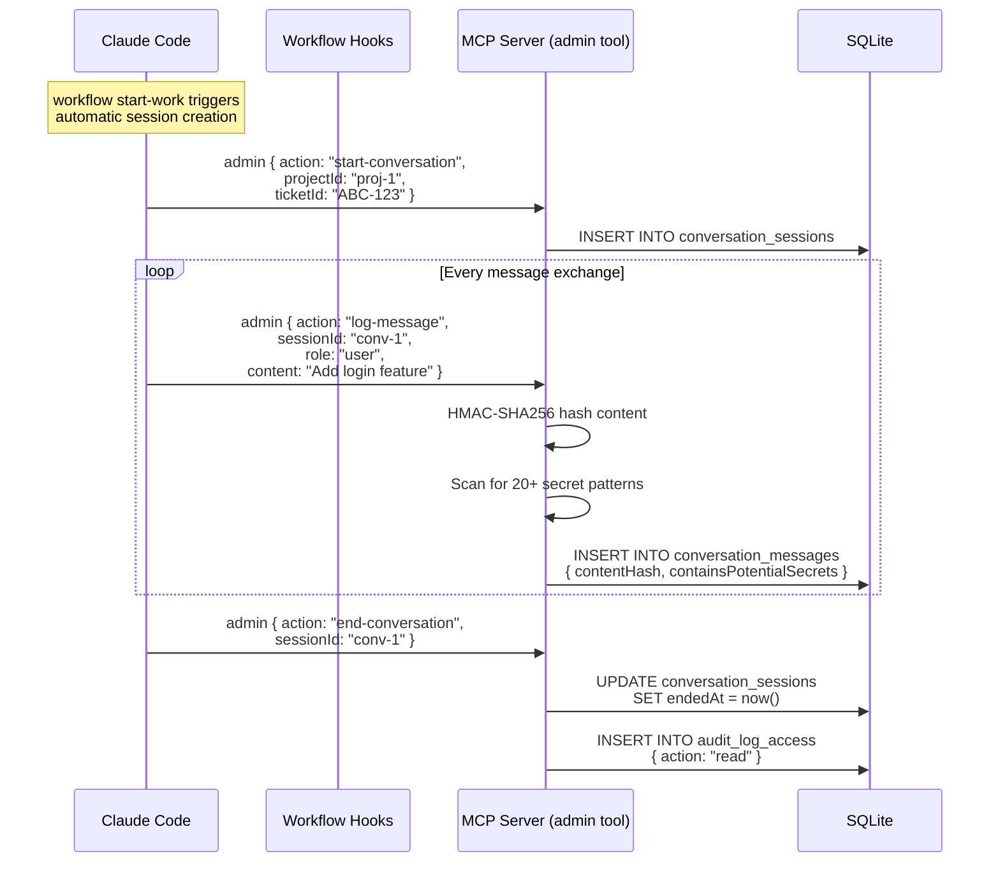

**Secret patterns detected:** AWS keys, GitHub tokens, Slack tokens, database URLs, private keys, JWT secrets, API keys, and 13+ more patterns.

## Full Lifecycle Summary

```mermaid
graph TB
    subgraph "Phase 0: Session Start"
        A1["Claude opens"] --> A2["SessionStart hooks fire"]
        A2 --> A3["Telemetry + library detection"]
    end

    subgraph "Phase 1: Start Work"
        B1["workflow start-work"] --> B2["Branch created"]
        B2 --> B3["Draft PR auto-created (hook)"]
        B3 --> B4["Session created"]
        B4 --> B5["PR linked"]
        B5 --> B6["Telemetry started"]
    end

    subgraph "Phase 2: Implementation"
        C1["State: analyzing → implementing"] --> C2["Write/Edit code"]
        C2 --> C3["Hooks enforce state"]
        C3 --> C4["Telemetry captures every tool call"]
        C4 --> C5["State: testing"]
        C5 --> C6["pnpm check (type-check + lint + test)"]
        C6 --> C7["State: committing"]
        C7 --> C8["git commit"]
        C8 --> C9["Commit linked to ticket (hook)"]
    end

    subgraph "Phase 3: Complete Work"
        D1["workflow complete-work"] --> D2["Ticket → ai_review"]
        D2 --> D3["Work summary posted"]
    end

    subgraph "Phase 4: AI Review"
        E1["Self-review diff"] --> E2["Submit findings"]
        E2 --> E3["Fix critical/major"]
        E3 --> E4["Mark fixed"]
        E4 --> E5["check-complete → canProceed"]
    end

    subgraph "Phase 5: Demo Generation"
        F1["Generate demo (3-7 steps)"] --> F2["Ticket → human_review"]
        F2 --> F3["Session complete"]
        F3 --> F4["Claude STOPS"]
    end

    subgraph "Phase 6: Human Review"
        G1["Human executes demo steps"] --> G2{Passed?}
        G2 -->|Yes| G3["Ticket → done"]
        G2 -->|No| G4["Ticket → in_progress<br/>(cycle repeats)"]
    end

    subgraph "Phase 7: Cleanup"
        H1["Stop hooks fire"] --> H2["Review check"]
        H2 --> H3["Telemetry flushed"]
        H3 --> H4["Tasks captured"]
    end

    A3 --> B1
    B6 --> C1
    C9 --> D1
    D3 --> E1
    E5 --> F1
    F4 --> G1
    G4 --> C1
    G3 --> H1
```
