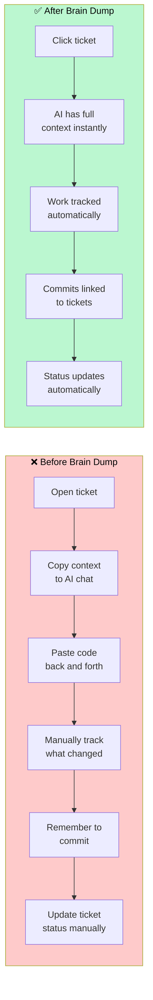
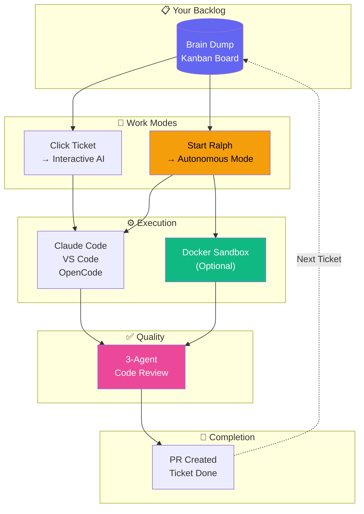
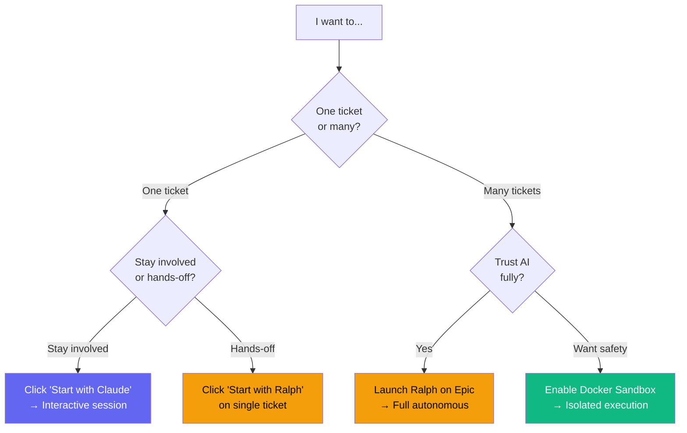

# Brain Dump Workflow Guides

> **Ship features faster with an AI teammate that works your backlog while you sleep.**

Turn your kanban board into an autonomous development pipeline. Brain Dump gives AI the context it needs to implement tickets correctly—then gets out of the way.

---

## See It In Action: Ralph Completes 3 Tickets

Here's what happens when you click "Start Ralph" on an epic and walk away:

```
┌─────────────────────────────────────────────────────────────────────────┐
│  6:00 PM  You click "Start Ralph" on the Auth epic                      │
│           └─ PRD generated with 3 tickets                               │
│           └─ Terminal opens, Ralph starts working                       │
├─────────────────────────────────────────────────────────────────────────┤
│  6:15 PM  Ticket 1: "Add login form" ✓                                  │
│           └─ Branch created: feature/abc-login-form                     │
│           └─ LoginForm.tsx written with validation                      │
│           └─ Tests passing, committed                                   │
├─────────────────────────────────────────────────────────────────────────┤
│  6:35 PM  Ticket 2: "Add logout button" ✓                               │
│           └─ Branch created: feature/def-logout                         │
│           └─ LogoutButton component added to header                     │
│           └─ Tests passing, committed                                   │
├─────────────────────────────────────────────────────────────────────────┤
│  6:50 PM  Ticket 3: "Session timeout handling" ✓                        │
│           └─ Branch created: feature/ghi-session-timeout                │
│           └─ Auto-logout after 30 min inactivity                        │
│           └─ Tests passing, committed                                   │
├─────────────────────────────────────────────────────────────────────────┤
│  7:00 PM  You come back from dinner                                     │
│           └─ 3 PRs ready for review                                     │
│           └─ All tests passing                                          │
│           └─ Work summaries in each ticket                              │
└─────────────────────────────────────────────────────────────────────────┘
```

**Result:** 3 tickets implemented, tested, and committed while you were away.

---

## Before & After Brain Dump



| Manual Workflow               | With Brain Dump               |
| ----------------------------- | ----------------------------- |
| Copy ticket description to AI | AI reads ticket automatically |
| Paste code back and forth     | AI writes directly to files   |
| Manually track changes        | Git commits linked to tickets |
| Update Jira/Linear separately | Status updates automatically  |
| Context lost between sessions | Full history preserved        |

---

## What Developers Are Saying

> "I started Ralph before dinner and woke up to 5 completed PRs. It's like having a junior dev who works overnight."
> — _Early adopter_

> "The state machine enforcement seemed annoying at first, but it actually prevents the AI from skipping steps. My code quality improved."
> — _Solo founder_

> "Finally, a tool that understands my codebase conventions. It reads my CLAUDE.md and actually follows it."
> — _Tech lead_

---

## Quick Navigation

| Flow                                                  | What You'll Learn                                    | Time to Read |
| ----------------------------------------------------- | ---------------------------------------------------- | ------------ |
| [**Kanban & Tickets**](./kanban-workflow.md)          | Data model, ticket lifecycle, drag-drop board        | 5 min        |
| [**Ralph Autonomous Agent**](./ralph-workflow.md)     | State machine, iteration loop, hands-off development | 8 min        |
| [**Docker Sandbox**](./docker-runtime.md)             | Container isolation, resource limits, security       | 5 min        |
| [**Code Review Pipeline**](./code-review-pipeline.md) | Three-agent review, hook enforcement, quality gates  | 6 min        |

---

## The Big Picture



---

## Choose Your Workflow



**Quick decision:**

- **Just exploring?** → Interactive mode with Claude
- **Trust the AI?** → Ralph autonomous mode
- **Want isolation?** → Docker sandbox

---

## Why Brain Dump vs Alternatives

| Feature                       | Brain Dump                          | GitHub Copilot Workspace | Cursor Composer         |
| ----------------------------- | ----------------------------------- | ------------------------ | ----------------------- |
| Autonomous backlog processing | ✅ Ralph works tickets sequentially | ❌ One-shot only         | ❌ One-shot only        |
| Kanban board integration      | ✅ Built-in with status tracking    | ❌ Separate tool needed  | ❌ Separate tool needed |
| State machine enforcement     | ✅ Hooks prevent skipping steps     | ❌ No guardrails         | ❌ No guardrails        |
| Docker isolation              | ✅ Sandboxed execution              | ❌ Not available         | ❌ Not available        |
| Multi-agent code review       | ✅ 3 specialized reviewers          | ❌ Single reviewer       | ❌ Single reviewer      |
| Local-first data              | ✅ SQLite on your machine           | ❌ Cloud-dependent       | ✅ Local                |
| Works while you sleep         | ✅ Set and forget                   | ❌ Requires interaction  | ❌ Requires interaction |

---

## Core Concepts (30-second overview)

### 1. Tickets Are Everything

Every piece of work is a ticket with context, acceptance criteria, and linked files. AI gets all of this automatically.

### 2. AI Gets Full Context

When you click "Start with Claude," the AI receives your ticket, your CLAUDE.md conventions, linked files, and previous session history.

### 3. Ralph Automates the Loop

Ralph picks tickets, creates branches, writes code, runs tests, commits, and moves to the next ticket—all without you.

### 4. Hooks Enforce Quality

Can't write code until you're in "implementing" state. Can't push until code is reviewed. Guardrails built in.

---

## Get Started in 5 Minutes

### Option 1: Interactive Mode (Recommended for first-time users)

```bash
# 1. Open Brain Dump
pnpm dev

# 2. Create a ticket in the UI

# 3. Click "Start with Claude" on the ticket

# 4. AI opens with full context - start working!
```

### Option 2: Autonomous Mode (For trusted workflows)

```bash
# 1. Open Brain Dump
pnpm dev

# 2. Create tickets for your feature

# 3. Click "Start with Ralph" on the epic

# 4. Walk away - come back to completed PRs
```

---

## Ready to Dive Deeper?

1. **[Kanban Workflow](./kanban-workflow.md)** — Understand the data model and ticket lifecycle
2. **[Ralph Workflow](./ralph-workflow.md)** — Learn how autonomous development works
3. **[Docker Runtime](./docker-runtime.md)** — Set up isolated execution
4. **[Code Review Pipeline](./code-review-pipeline.md)** — See how quality is enforced

---

## Quick Reference

| Action                    | How                                        |
| ------------------------- | ------------------------------------------ |
| Start interactive session | Click "Start with Claude" on ticket        |
| Start autonomous mode     | Click "Start with Ralph" on ticket or epic |
| Check ticket status       | `brain-dump current`                       |
| Complete current ticket   | `brain-dump done`                          |
| Run code review           | `/review` command in Claude                |

---

## Quick Links

- [Main README](../../README.md) — Installation and setup
- [MCP Tools Reference](../mcp-tools.md) — All available AI tools
- [CLI Reference](../cli.md) — Terminal commands
- [Troubleshooting](../troubleshooting.md) — Common issues and solutions
