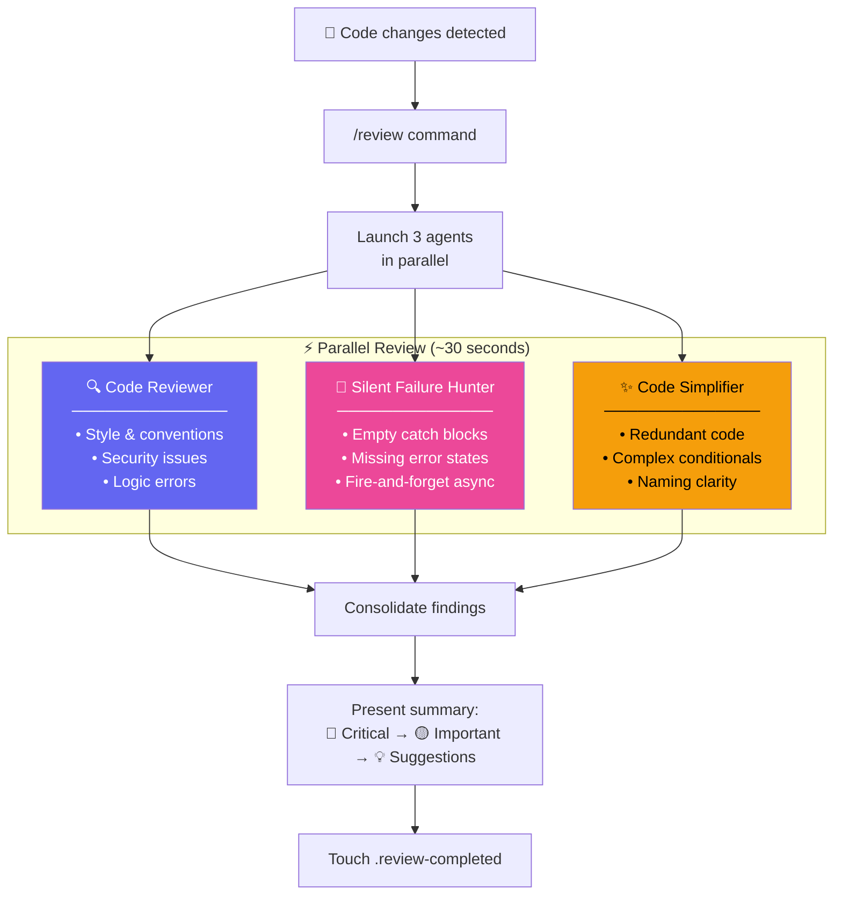
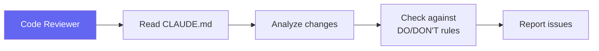
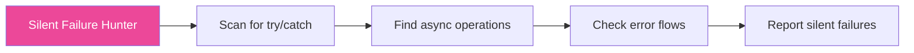
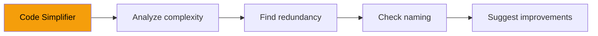
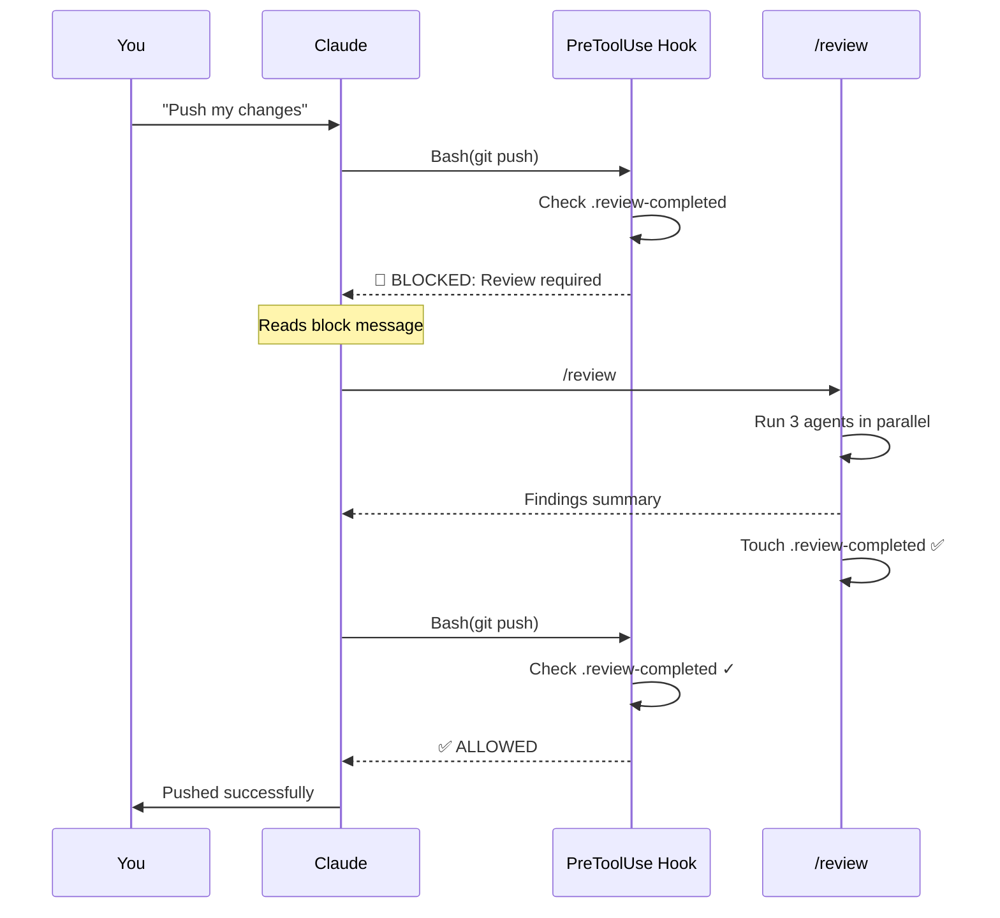
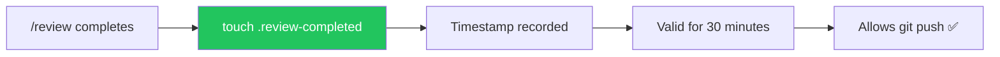
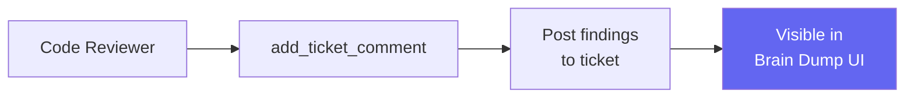
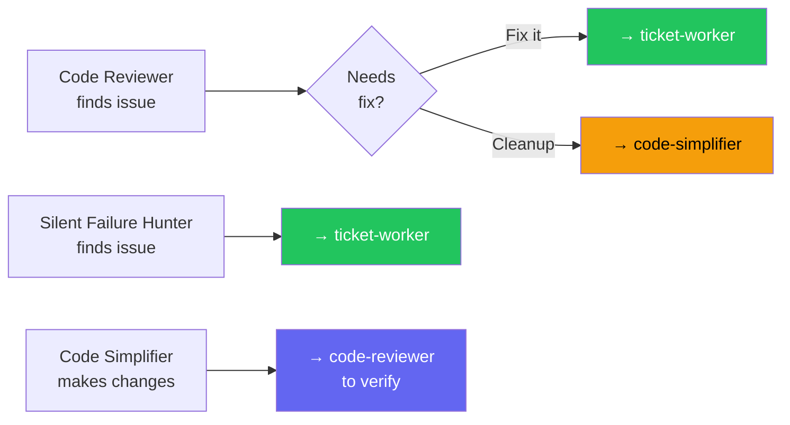

# Code Review Pipeline

> **Three specialized AI reviewers catching what you missed, before you push.**

Never ship code without a second opinion. Brain Dump runs three review agents in parallel—each looking for different issues—so bugs, security holes, and code smells get caught early.

---

## TL;DR — Quick Reference

| Action                      | How                                               |
| --------------------------- | ------------------------------------------------- |
| Run review manually         | `/review` command                                 |
| Check review status         | `ls -la .claude/.review-completed`                |
| Review marker valid for     | 30 minutes (push) or 5 minutes (conversation end) |
| Skip review (minor changes) | Automatic if ≤2 files, <50 lines changed          |

**Three agents run in parallel:**

- **Code Reviewer** — Style, security, logic errors
- **Silent Failure Hunter** — Empty catches, missing error handling
- **Code Simplifier** — Redundancy, complexity, naming

---

## See the Pipeline in Action

```
┌─────────────────────────────────────────────────────────────────────────────┐
│  You: "I finished the login feature, ready to push"                         │
├─────────────────────────────────────────────────────────────────────────────┤
│  Claude: Running /review to check your changes...                           │
│                                                                             │
│  ┌─────────────────────────────────────────────────────┐                   │
│  │  PARALLEL REVIEW IN PROGRESS                        │                   │
│  ├─────────────────────────────────────────────────────┤                   │
│  │  🔍 Code Reviewer................ analyzing         │                   │
│  │  🐛 Silent Failure Hunter........ analyzing         │                   │
│  │  ✨ Code Simplifier.............. analyzing         │                   │
│  └─────────────────────────────────────────────────────┘                   │
│                                                                             │
│  [30 seconds later]                                                        │
│                                                                             │
│  ┌─────────────────────────────────────────────────────┐                   │
│  │  ✅ Code Reviewer: Complete (2 issues)              │                   │
│  │  ✅ Silent Failure Hunter: Complete (1 issue)       │                   │
│  │  ✅ Code Simplifier: Complete (0 suggestions)       │                   │
│  └─────────────────────────────────────────────────────┘                   │
├─────────────────────────────────────────────────────────────────────────────┤
│  ## Review Summary                                                          │
│                                                                             │
│  ### 🔴 Critical (1)                                                        │
│  - `src/api/auth.ts:67` — Password comparison vulnerable to timing attack   │
│    Use crypto.timingSafeEqual() instead of ===                             │
│                                                                             │
│  ### 🟡 Important (2)                                                       │
│  - `src/api/auth.ts:45` — Catch block logs error but doesn't return        │
│    error response to client                                                │
│  - `src/components/LoginForm.tsx:89` — Missing loading state during        │
│    authentication request                                                  │
│                                                                             │
│  Review complete. Fix critical issues before pushing?                      │
└─────────────────────────────────────────────────────────────────────────────┘
```

---

## Pipeline Architecture



---

## The Three Agents

### 🔍 Code Reviewer

**Focus:** Does the code follow project conventions and best practices?



**What it catches:**

- Style inconsistencies (naming, formatting)
- Security vulnerabilities (injection, XSS, OWASP top 10)
- Logic errors (edge cases, race conditions)
- Error handling gaps (async operations, error reporting)
- Comment quality (should explain "why" not "what")

---

### 🐛 Silent Failure Hunter

**Focus:** Are errors being handled properly or silently swallowed?



**Severity Levels:**

| Level           | Pattern                  | Example                              |
| --------------- | ------------------------ | ------------------------------------ |
| 🔴 **CRITICAL** | Empty catch blocks       | `catch (e) {}`                       |
| 🔴 **CRITICAL** | Fire-and-forget async    | `fetch(url)` without `.catch()`      |
| 🟡 **HIGH**     | console.log only         | `catch (e) { console.log(e) }`       |
| 🟡 **HIGH**     | Overly broad catches     | `catch (Error e)` catches everything |
| 🟠 **MEDIUM**   | Missing UI error state   | No error display to user             |
| ⚪ **LOW**      | Fallback hiding failures | Default values masking issues        |

---

### ✨ Code Simplifier

**Focus:** Can the code be clearer and more maintainable?



**What it looks for:**

- Nested ternaries (prefer switch/if-else)
- Duplicate code patterns
- Unclear variable names
- Over-engineered abstractions
- Dead code and unused imports

**Key rule:** Never changes functionality, only clarity.

---

## Hook Enforcement

Brain Dump uses hooks to enforce review before push. You can't accidentally skip review.

### How It Works



### Two Types of Review Checks

| Hook                | When It Runs                       | Marker Age Limit | Purpose                 |
| ------------------- | ---------------------------------- | ---------------- | ----------------------- |
| **Stop Hook**       | Conversation ending                | 5 minutes        | Remind before you leave |
| **PreToolUse Hook** | Before `git push` / `gh pr create` | 30 minutes       | Block unreviewed pushes |

**Why different timeouts?**

- **5 minutes for conversation end:** You might have made changes after review
- **30 minutes for push:** Gives you time to fix issues before pushing

---

## Review Marker

The `.claude/.review-completed` file tracks when review was done:



**Why it expires:**

- Prevents pushing old, unreviewed code
- Encourages re-review after more changes
- Balances convenience and safety

---

## Configuration

### auto-review.config.json

```json
{
  "enabled": true,
  "agents": {
    "code-reviewer": { "enabled": true },
    "silent-failure-hunter": { "enabled": true },
    "code-simplifier": { "enabled": true }
  },
  "triggerOn": {
    "sourceCodeChanges": true,
    "testFileChanges": true,
    "configChanges": false,
    "documentationChanges": false
  },
  "filePatterns": {
    "include": ["**/*.ts", "**/*.tsx", "**/*.js", "**/*.jsx"],
    "exclude": ["**/node_modules/**", "**/dist/**", "**/*.d.ts"]
  }
}
```

### Skip Conditions

Review is **automatically skipped** for:

- Documentation only (`.md` files)
- Config files (`package.json`, `tsconfig.json`)
- Generated files (`*.d.ts`, `dist/`)
- Minor changes (≤2 files, <50 lines)

---

## Integration with Tickets

Review agents can post findings to your tickets:



**Example ticket comment:**

```markdown
## Code Review Summary

### 🔴 Critical Issues (1)

- `src/api/auth.ts:45` - SQL injection vulnerability

### 🟡 Important (2)

- `src/components/Form.tsx:23` - Missing error boundary
- `src/lib/utils.ts:89` - Async operation without error handling

### 💡 Suggestions (1)

- Consider extracting validation logic to separate function
```

---

## Agent Handoffs

Agents can hand off to each other for a complete workflow:



---

## Troubleshooting

### Review keeps blocking push

**Cause:** Review marker expired or was never created

**Fix:**

```bash
# Check if marker exists and its age
ls -la .claude/.review-completed

# Run review again
# (In Claude conversation)
/review
```

### One agent keeps failing

**Cause:** Usually a configuration or permissions issue

**Fix:**

1. Check the agent is enabled in `auto-review.config.json`
2. Try running `/review` with verbose output
3. Check Claude Code logs for errors

### Review takes too long

**Cause:** Large number of changed files

**Fix:**

- Review runs on changed files only
- Break up large PRs into smaller chunks
- Consider reviewing incrementally as you work

### False positives

**Cause:** Agent doesn't understand your codebase context

**Fix:**

- Add exceptions to your CLAUDE.md
- Use `// review-ignore: reason` comments for known issues
- Configure exclusion patterns in `auto-review.config.json`

---

## Ready to Try the Review Pipeline?

1. **Make some code changes** — Edit a few source files
2. **Run `/review`** — Watch the three agents work in parallel
3. **Review the findings** — Critical issues first
4. **Fix and retry** — Review again to confirm fixes
5. **Push with confidence** — You've earned it

**Pro tip:** Run `/review` frequently as you work, not just before pushing. Catching issues early is easier than fixing them later.

---

## Related Documentation

- [Ralph Workflow](./ralph-workflow.md) — Autonomous agent with built-in review
- [CLAUDE.md](../../CLAUDE.md) — Project conventions the reviewer checks
- [Auto Review Hook](../auto-review-hook.md) — Detailed hook documentation
- [Main README](../../README.md) — Quick start
