# Docker Sandbox & Terminal Runtime

> **Full AI power, zero system access. Run Claude in complete isolation.**

Give AI access to your code without giving it access to your system. Docker Sandbox provides security boundaries, resource limits, and automatic cleanup.

---

## TL;DR — Quick Reference

| Action | How |
|--------|-----|
| Enable Docker Sandbox | Check "Use Docker Sandbox" before starting Ralph |
| Check Docker status | `docker info` |
| View running containers | `docker ps \| grep ralph` |
| Stop stuck container | `docker stop ralph-{session-id}` |
| Rebuild sandbox image | `docker build -t brain-dump-ralph-sandbox:latest -f docker/ralph-sandbox.Dockerfile .` |

**Resource limits:** 2GB RAM, 1.5 CPUs, 256 max PIDs

**What's mounted:** Your code (read-write), Claude config (read-only), Git config (read-only), SSH agent

**What's NOT mounted:** SSH keys, system files, other projects

---

## Why Docker Sandbox?

```mermaid
flowchart LR
    subgraph Native["❌ Native Mode"]
        A1["Claude CLI"]
        A2["Your Code"]
        A3["Full System<br/>Access"]
    end

    subgraph Docker["✅ Docker Sandbox"]
        B1["Claude CLI"]
        B2["Your Code<br/>/workspace"]
        B3["Blocked<br/>Access"]
    end

    A1 --> A2
    A1 --> A3
    B1 --> B2
    B1 -.->|"🚫"| B3

    style A3 fill:#ef4444,color:#fff
    style B3 fill:#22c55e,color:#fff
```



| Native Mode | Docker Sandbox |
|-------------|----------------|
| Full filesystem access | Only your project folder |
| Can install system packages | Isolated environment |
| Can access other projects | Can't see other code |
| Uses all system resources | Capped at 2GB RAM, 1.5 CPUs |
| Processes can escape | no-new-privileges enforced |

---

## Container Architecture

```mermaid
flowchart TB
    subgraph Container["🐳 ralph-{session-id}"]
        subgraph Mounts["Volume Mounts"]
            A["📁 /workspace<br/>Your project (read-write)"]
            B["🔐 ~/.claude<br/>API credentials (read-only)"]
            C["👤 ~/.gitconfig<br/>Git identity (read-only)"]
            D["🔑 SSH Agent<br/>For git push"]
        end

        subgraph Limits["Resource Limits"]
            E["💾 2GB RAM max"]
            F["🔧 1.5 CPUs max"]
            G["📊 256 processes max"]
            H["🛡️ No privilege escalation"]
        end

        subgraph Ports["Port Forwarding"]
            I["8100-8110: Frontend"]
            J["8200-8210: Backend"]
            K["8300-8310: Docs"]
            L["8400-8410: Database"]
        end
    end

    style Container fill:#10b981,color:#fff
```



### What Gets Mounted

| Mount | Path in Container | Access | Purpose |
|-------|-------------------|--------|---------|
| Project | `/workspace` | Read-write | Your code |
| Claude config | `~/.claude/` | Read-only | API authentication |
| Git config | `~/.gitconfig` | Read-only | Commit identity |
| SSH agent | `/ssh-agent` | Socket | Git push without keys |
| known_hosts | `~/.ssh/known_hosts` | Read-only | GitHub verification |

### What's Protected

- **SSH private keys** — Never mounted
- **SSH config** — Never mounted
- **Other projects** — Can't access
- **System files** — Isolated
- **Browser data** — Isolated
- **Environment variables** — Only selected ones passed

---

## Docker Runtime Detection

Brain Dump auto-detects your Docker installation:


**Supported Runtimes:**

| Runtime | Platform | Priority |
|---------|----------|----------|
| Lima | macOS | 1 (checked first) |
| Colima | macOS | 2 |
| Rancher Desktop | macOS/Linux | 3 |
| Docker Desktop | All | 4 |
| Podman | Linux | 5 |

---

## Terminal Detection

Brain Dump launches Ralph in your preferred terminal:

```mermaid
flowchart TD
    A["🖥️ Launch Terminal"] --> B{"Platform?"}

    B -->|macOS| C{"Ghostty?"}
    C -->|Yes| D["Ghostty ✅"]
    C -->|No| E{"Warp?"}
    E -->|Yes| F["Warp ✅"]
    E -->|No| G{"iTerm2?"}
    G -->|Yes| H["iTerm2 ✅"]
    G -->|No| I["Terminal.app ✅"]

    B -->|Linux| J{"Ghostty?"}
    J -->|Yes| K["Ghostty ✅"]
    J -->|No| L{"Kitty?"}
    L -->|Yes| M["Kitty ✅"]
    L -->|No| N["GNOME Terminal ✅"]
```



**macOS Priority:** Ghostty → Warp → iTerm2 → Alacritty → Terminal.app

**Linux Priority:** Ghostty → Kitty → GNOME Terminal → Konsole → XTerm

---

## Setup Validation

Before launching, Brain Dump checks everything:

```mermaid
flowchart TD
    A["🔍 Validate Setup"] --> B{"Docker<br/>running?"}
    B -->|No| C["❌ Error: Start Docker"]
    B -->|Yes| D{"ralph-net<br/>network?"}
    D -->|No| E["Create network"]
    D -->|Yes| F{"Sandbox<br/>image?"}
    E --> F
    F -->|No| G["Build image<br/>(~2 min first time)"]
    F -->|Yes| H{"SSH Agent?"}
    G --> H
    H -->|No| I["⚠️ Warning: git push won't work"]
    H -->|Yes| J["✅ Ready to launch"]
    I --> J

    style C fill:#ef4444,color:#fff
    style I fill:#f59e0b,color:#000
    style J fill:#22c55e,color:#fff
```



---

## SSH Agent Forwarding

Git push works from inside the container without exposing your private keys:


**What this means:**
- SSH keys stay on your machine
- Container can still push to GitHub
- Passphrase prompts appear on your host
- No secrets inside container

---

## Resource Limits Explained

### Memory: 2GB max

```bash
--memory=2g --memory-swap=2g
```

- Container can't use more than 2GB
- No swap allowed (prevents OOM affecting host)
- If exceeded: container killed, not host

### CPU: 1.5 cores max

```bash
--cpus=1.5
```

- Won't monopolize your machine
- Good enough for Claude + build tools
- Your other apps stay responsive

### Processes: 256 max

```bash
--pids-limit=256
```

- Prevents fork bombs
- Stops runaway processes
- Enough for normal development

### Security: No privilege escalation

```bash
--security-opt=no-new-privileges:true
```

- Processes can't gain root
- Can't escape container
- Defense in depth

---

## Port Forwarding

When your project runs dev servers, access them from your host:

| Container Port | Host Port | Purpose |
|----------------|-----------|---------|
| 8100-8110 | 8100-8110 | Frontend (Vite, Next.js) |
| 8200-8210 | 8200-8210 | Backend (Express, Fastify) |
| 8300-8310 | 8300-8310 | Docs (Storybook) |
| 8400-8410 | 8400-8410 | Database tools |

**Access dev server:**
```bash
# If Ralph starts Vite on 8100 inside container
open http://localhost:8100
```

---

## Timeout Handling

Ralph has a 1-hour safety timeout:

```mermaid
flowchart TD
    A["⏱️ Script starts"] --> B["Set 1-hour timeout"]
    B --> C["Run Claude iterations"]
    C --> D{"Timeout?"}
    D -->|No| E{"Work complete?"}
    E -->|No| C
    E -->|Yes| F["✅ Exit: Success"]
    D -->|Yes| G["⏰ SIGALRM received"]
    G --> H["Log to progress.txt"]
    H --> I["docker stop (30s grace)"]
    I --> J["Cleanup state files"]
    J --> K["Exit code 124"]

    style F fill:#22c55e,color:#fff
    style K fill:#f59e0b,color:#000
```



**What happens on timeout:**
1. `SIGALRM` signal received
2. Logged to `plans/progress.txt`
3. Container stopped with 30-second grace period
4. `.ralph-services.json` removed (cleanup)
5. Exit with code 124

---

## Troubleshooting

### Docker not detected

**Symptoms:** "Docker not found" error when starting Ralph

**Fix:**
```bash
# Check if Docker is running
docker info

# If using Lima
limactl list
limactl start docker

# If using Colima
colima status
colima start
```

### SSH agent issues

**Symptoms:** "git push" fails with authentication error

**Fix:**
```bash
# Check if agent is running
echo $SSH_AUTH_SOCK

# Start agent if needed
eval $(ssh-agent)
ssh-add ~/.ssh/id_ed25519

# Verify keys loaded
ssh-add -l
```

### Container won't start

**Symptoms:** "Container already exists" or "Port in use" errors

**Fix:**
```bash
# Find stuck containers
docker ps -a | grep ralph

# Remove stuck container
docker rm -f ralph-old-session-id

# Check port conflicts
lsof -i :8100
```

### Container keeps crashing

**Symptoms:** Container exits immediately or restarts repeatedly

**Fix:**
```bash
# Check container logs
docker logs ralph-session-id

# Rebuild image (might be corrupted)
docker rmi brain-dump-ralph-sandbox:latest
docker build -t brain-dump-ralph-sandbox:latest -f docker/ralph-sandbox.Dockerfile .
```

### Network issues inside container

**Symptoms:** Can't reach npm registry, GitHub, etc.

**Fix:**
```bash
# Check network exists
docker network ls | grep ralph-net

# Recreate if needed
docker network rm ralph-net
docker network create ralph-net

# Test connectivity
docker run --rm --network ralph-net alpine ping -c 3 github.com
```

### Recovery after failed session

**Symptoms:** Stale state files, orphaned containers

**Fix:**
```bash
# Clean up everything
rm -f .claude/ralph-state.json
rm -f .ralph-services.json
docker stop $(docker ps -q --filter "name=ralph-")
docker rm $(docker ps -aq --filter "name=ralph-")
```

---

## Ready to Try Docker Sandbox?

1. **Make sure Docker is running** — `docker info` should work
2. **Check "Use Docker Sandbox"** — In the Ralph launch dialog
3. **First launch takes ~2 minutes** — Building the sandbox image
4. **Subsequent launches are fast** — Image is cached

**Pro tip:** Docker Sandbox is great for overnight Ralph runs. Even if something goes wrong, your system is protected.

---

## Related Documentation

- [Ralph Workflow](./ralph-workflow.md) — Autonomous agent details
- [Docker Sandbox Guide](../docker-sandbox-guide.md) — Full setup instructions
- [Docker Isolation Architecture](../docker-isolation-architecture.md) — Security deep-dive
- [Main README](../../README.md) — Quick start
