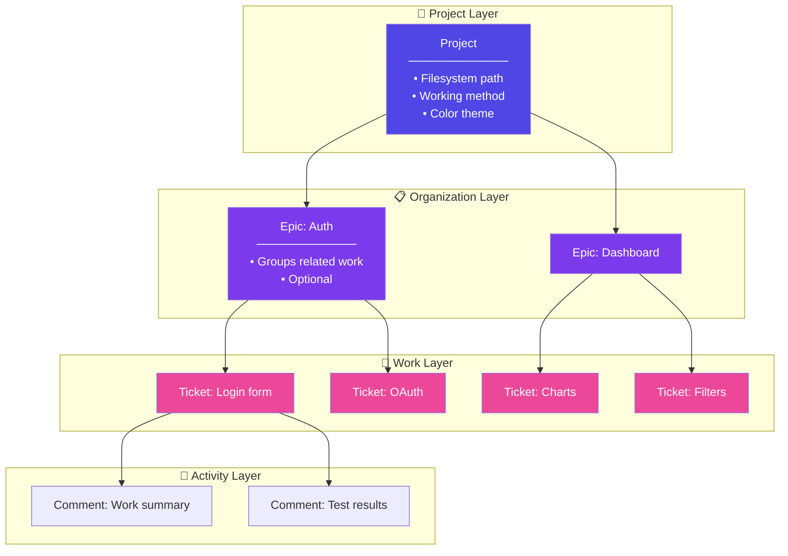
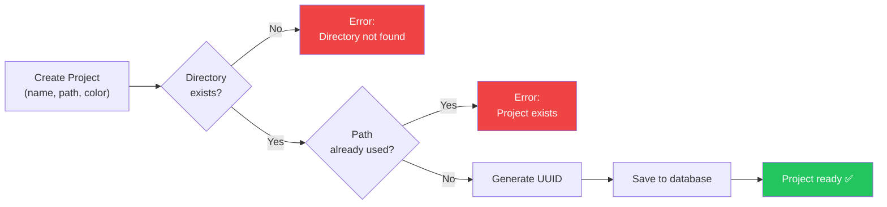
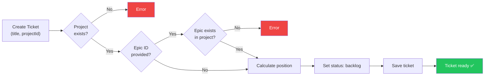
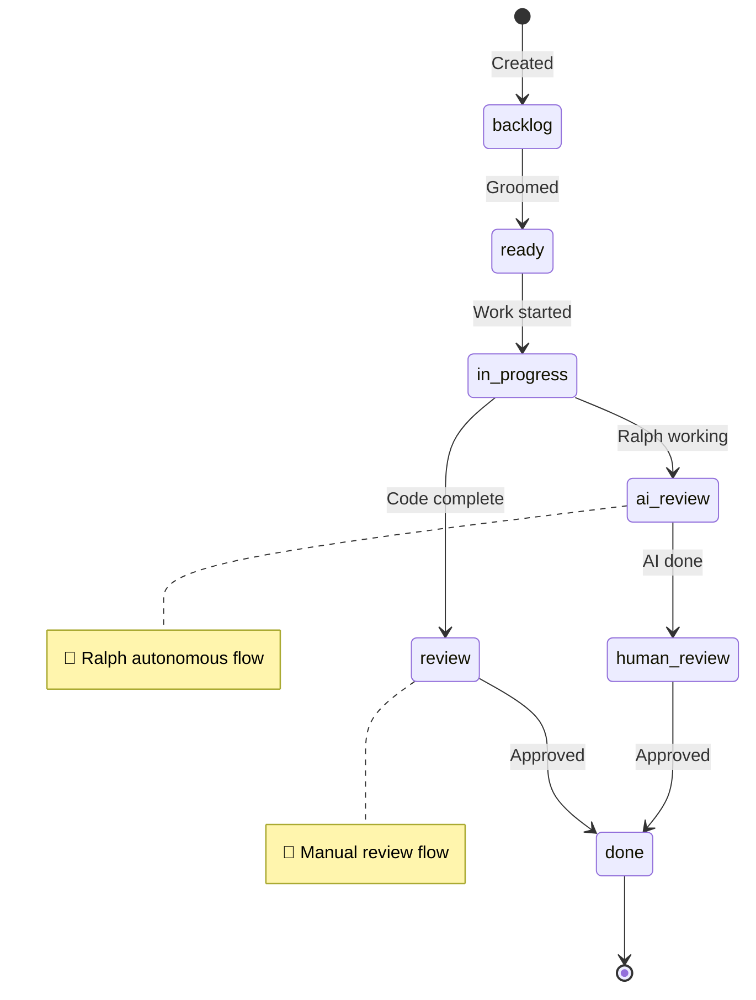
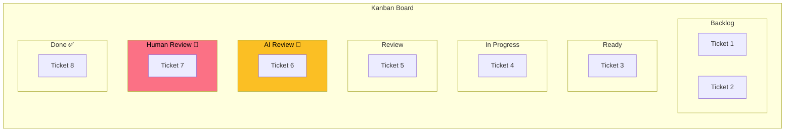
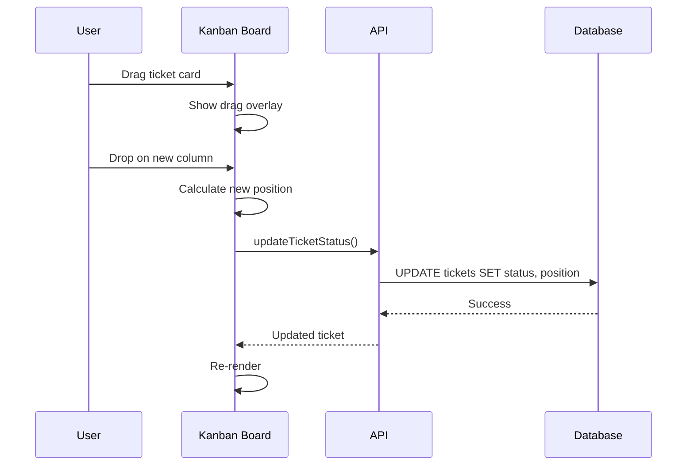
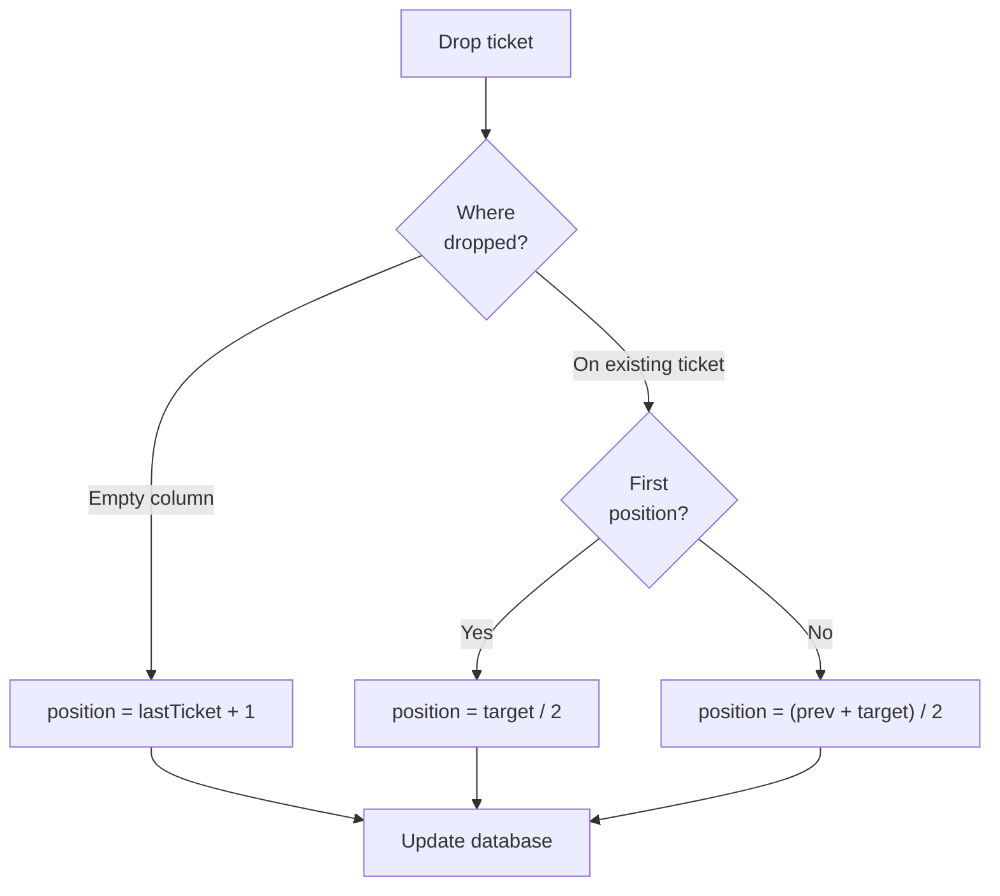
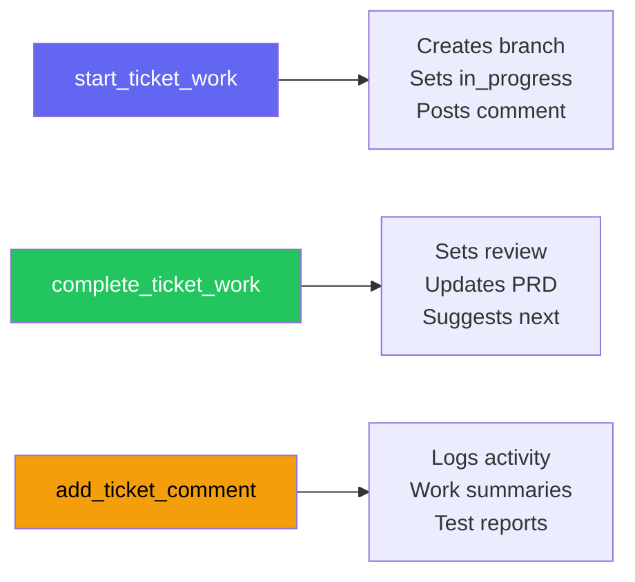
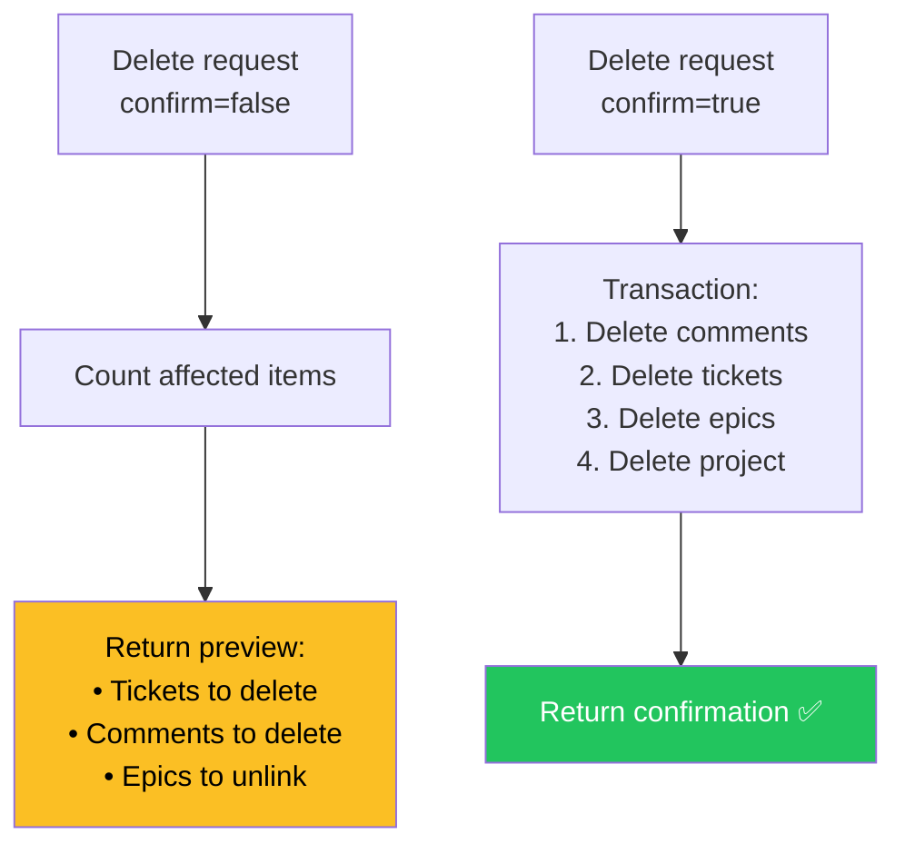

# Kanban & Ticket Workflow

> **Track every ticket from idea to deployed, with full AI activity history.**

Your kanban board is the single source of truth. Every ticket, every status change, every AI work session—all tracked automatically.

---

## TL;DR — Quick Reference

| Action | How |
|--------|-----|
| Create project | Settings → "Add Project" → Select folder |
| Create ticket | Click "+" in any column |
| Start work | Click "Start with Claude" on ticket |
| Move ticket | Drag to new column |
| Complete work | `complete_ticket_work(ticketId)` or drag to Done |

**Status flow:** `backlog` → `ready` → `in_progress` → `review` → `done`

**AI flow:** `in_progress` → `ai_review` → `human_review` → `done`

---

## See a Ticket's Full Journey

Here's what happens when you work a ticket from start to finish:

```
┌─────────────────────────────────────────────────────────────────────────────┐
│  1. CREATE TICKET                                                           │
│     └─ "Add user authentication"                                            │
│     └─ Status: backlog, Position: 1.0                                       │
│     └─ Tags: ["auth", "security"], Priority: high                           │
├─────────────────────────────────────────────────────────────────────────────┤
│  2. GROOM & READY                                                           │
│     └─ Add acceptance criteria, link reference files                        │
│     └─ Drag to "Ready" column                                               │
│     └─ Status: ready                                                        │
├─────────────────────────────────────────────────────────────────────────────┤
│  3. START WORK                                                              │
│     └─ Click "Start with Claude"                                            │
│     └─ MCP: start_ticket_work("ticket-id")                                  │
│     └─ Branch created: feature/abc-user-auth                                │
│     └─ Status: in_progress                                                  │
│     └─ Comment auto-added: "Starting work on: Add user authentication"      │
├─────────────────────────────────────────────────────────────────────────────┤
│  4. IMPLEMENT                                                               │
│     └─ Claude writes AuthService.ts, LoginForm.tsx                          │
│     └─ Tests added and passing                                              │
│     └─ Commits linked to ticket automatically                               │
├─────────────────────────────────────────────────────────────────────────────┤
│  5. COMPLETE                                                                │
│     └─ MCP: complete_ticket_work("ticket-id", "Added OAuth + email login")  │
│     └─ Status: review                                                       │
│     └─ Work summary comment added                                           │
│     └─ PRD updated: passes = true                                           │
├─────────────────────────────────────────────────────────────────────────────┤
│  6. REVIEW & DONE                                                           │
│     └─ Human reviews PR                                                     │
│     └─ Drag to "Done" column                                                │
│     └─ Status: done, completedAt: timestamp                                 │
└─────────────────────────────────────────────────────────────────────────────┘
```

**Result:** Full audit trail of who did what, when, and why.

---

## Data Hierarchy

Brain Dump uses a simple hierarchy:

```
Project → Epic (optional) → Ticket → Comments
```



---

## Creating Projects



**Project Fields:**

| Field | Purpose |
|-------|---------|
| `path` | Links project to filesystem (must be unique) |
| `workingMethod` | `auto`, `claude-code`, `vscode`, `opencode` |
| `color` | UI theme color for visual distinction |

---

## Creating Tickets



**Ticket Fields:**

| Field | Type | Purpose |
|-------|------|---------|
| `title` | string | Short description (shown on card) |
| `description` | markdown | Full context for AI (acceptance criteria, etc.) |
| `status` | enum | Kanban column |
| `priority` | enum | `high`, `medium`, `low` |
| `tags` | array | Categorization (filterable) |
| `subtasks` | array | Checklist items |
| `linkedFiles` | array | Reference paths for AI context |
| `position` | float | Sort order within column |

---

## Ticket Status Flow

Tickets flow through seven possible statuses:



**Status Descriptions:**

| Status | Meaning | Who's Working | Column Color |
|--------|---------|---------------|--------------|
| `backlog` | Not yet ready | Nobody | Slate |
| `ready` | Groomed and ready | Nobody | Slate |
| `in_progress` | Active development | Human or AI | Slate |
| `review` | Manual code review | Human reviewer | Slate |
| `ai_review` | Ralph completed work | Awaiting human | **Amber** |
| `human_review` | Human verifying AI | Human reviewer | **Rose** |
| `done` | Complete | Nobody | Slate |

---

## Kanban Board

### 7 Columns



### Drag and Drop



### Position Calculation

Positions are floating-point numbers, allowing infinite insertions:



**Example:**
```
Existing positions: [1.0, 2.0, 3.0]
Drop between 1.0 and 2.0 → position = 1.5
Drop before 1.0 → position = 0.5
Drop after 3.0 → position = 4.0
```

---

## MCP Tools

### Creating Tickets

```typescript
create_ticket({
  projectId: "uuid",
  title: "Add login form",
  description: "## Overview\n...",
  priority: "high",
  epicId: "optional-uuid",
  tags: ["auth", "frontend"]
})
```

### Workflow Tools



### Querying

```typescript
// List tickets with filters
list_tickets({
  projectId: "uuid",
  status: "in_progress",
  limit: 20
})

// Find tickets linked to a file
get_tickets_for_file({
  filePath: "src/api/auth.ts"
})
```

---

## Deletion Safety

All delete operations use **dry-run by default**:



**Cascade Rules:**

| Delete | What Happens |
|--------|--------------|
| Project | All epics, tickets, and comments deleted |
| Epic | Tickets **unlinked** (not deleted) |
| Ticket | All comments deleted |

---

## Troubleshooting

### Ticket not showing on board

**Cause:** Ticket might be in a different project or have a filter applied

**Fix:**
1. Check the project selector in the sidebar
2. Clear any status filters
3. Search by ticket title: `list_tickets({ title: "your search" })`

### Drag and drop not working

**Cause:** Usually a stale UI state

**Fix:**
1. Refresh the page
2. Check browser console for errors
3. Ensure you're dragging from the ticket card, not buttons

### Ticket stuck in wrong status

**Cause:** MCP tool might have failed mid-operation

**Fix:**
```typescript
// Manually update status
update_ticket_status({
  ticketId: "your-ticket-id",
  status: "ready"  // or desired status
})
```

### Comments not appearing

**Cause:** TanStack Query cache might be stale

**Fix:**
1. Refresh the page
2. Click on another ticket and back
3. Check that the comment was actually created: `get_ticket_comments({ ticketId: "..." })`

---

## Ready to Start Working?

1. **Create a project** — Link a folder from your filesystem
2. **Add some tickets** — Describe what you want built
3. **Click "Start with Claude"** — AI gets full context automatically
4. **Watch the magic** — Status updates, commits linked, work tracked

**Pro tip:** Write detailed acceptance criteria in the ticket description. The AI will use them to know when the work is complete.

---

## Related Documentation

- [Ralph Workflow](./ralph-workflow.md) — Autonomous ticket processing
- [MCP Tools Reference](../mcp-tools.md) — Full API documentation
- [Main README](../../README.md) — Quick start guide
