# Ralph Autonomous Agent Workflow

> **Your AI teammate that works tickets while you sleep.**

Start Ralph, walk away, come back to completed PRs. No babysitting required.

---

## TL;DR — Quick Reference

| Action | Command/Tool |
|--------|--------------|
| Start Ralph on ticket | Click "Start with Ralph" in UI |
| Start Ralph on epic | Click "Start with Ralph" on epic card |
| Check Ralph's progress | View `plans/progress.txt` |
| Stop Ralph safely | Close terminal or `Ctrl+C` |
| Cancel mid-ticket | `complete_ralph_session(sessionId, "cancelled")` |

**States that allow writing code:** `implementing`, `testing`, `committing`

**States that block writing:** `idle`, `analyzing`, `reviewing`, `done`

---

## See Ralph Work a 3-Ticket Epic

Here's exactly what happens when you click "Start Ralph" and walk away:

```
┌─────────────────────────────────────────────────────────────────────────────┐
│  T0: 6:00 PM — You click "Start Ralph" on Auth epic                         │
│                                                                              │
│      Brain Dump generates PRD with 3 tickets (all passes: false)            │
│      Terminal opens, Ralph begins working                                   │
├─────────────────────────────────────────────────────────────────────────────┤
│  T1: 6:05 PM — Iteration 1: "Add login form" (high priority)                │
│                                                                              │
│      ✓ create_ralph_session → state: idle                                   │
│      ✓ start_ticket_work → branch: feature/abc-login-form                   │
│      ✓ update_session_state → analyzing (reading specs)                     │
│      ✓ update_session_state → implementing (writing code)                   │
│      ✓ Write LoginForm.tsx, auth.ts                                         │
│      ✓ update_session_state → testing                                       │
│      ✓ Run pnpm test → All tests pass                                       │
│      ✓ update_session_state → committing                                    │
│      ✓ git commit -m "feat(abc): add login form with validation"            │
│      ✓ complete_ticket_work → PRD updated (1/3 passes: true)                │
│      ✓ complete_ralph_session → state file deleted                          │
├─────────────────────────────────────────────────────────────────────────────┤
│  T2: 6:25 PM — Iteration 2: "Add logout button" (medium priority)           │
│                                                                              │
│      ✓ Same workflow as above                                               │
│      ✓ PRD updated (2/3 passes: true)                                       │
├─────────────────────────────────────────────────────────────────────────────┤
│  T3: 6:45 PM — Iteration 3: "Session timeout handling" (low priority)       │
│                                                                              │
│      ✓ Same workflow as above                                               │
│      ✓ PRD updated (3/3 passes: true)                                       │
├─────────────────────────────────────────────────────────────────────────────┤
│  T4: 6:50 PM — All tickets complete                                         │
│                                                                              │
│      Ralph checks PRD: all passes: true                                     │
│      Output: "PRD_COMPLETE"                                                 │
│      Script exits 0                                                         │
│                                                                              │
│      Result: 3 branches, 3 commits, ready for PR                            │
└─────────────────────────────────────────────────────────────────────────────┘
```

**You come back from dinner to find:** 3 tickets implemented, tested, and committed.

---

## What is Ralph?

Ralph is Brain Dump's autonomous agent mode. Instead of working interactively with AI, you start Ralph and walk away. Ralph will:

1. **Pick tickets** from your backlog (highest priority first)
2. **Create branches** and write code
3. **Run tests** and fix failures
4. **Commit changes** with proper messages
5. **Move to the next ticket** automatically
6. **Continue until done** or timeout

---

## The Ralph Loop

```mermaid
flowchart TB
    subgraph Launch["🚀 Launch Phase"]
        A["Click 'Start with Ralph'"] --> B["Generate PRD<br/>from tickets"]
        B --> C["Create bash script"]
        C --> D["Open terminal"]
    end

    subgraph Loop["🔄 Iteration Loop"]
        E["Read plans/prd.json"] --> F{"Any tickets<br/>with passes: false?"}
        F -->|Yes| G["Pick highest priority"]
        F -->|No| H["All done! 🎉"]

        G --> I["start_ticket_work<br/>→ Create branch"]
        I --> J["create_ralph_session<br/>→ Track state"]
        J --> K["Implement & test"]
        K --> L["Commit changes"]
        L --> M["complete_ticket_work<br/>→ Update PRD"]
        M --> N["complete_ralph_session"]
        N --> E
    end

    D --> E
    H --> O["Exit successfully"]

    style A fill:#f59e0b,color:#000
    style H fill:#22c55e,color:#fff
    style O fill:#22c55e,color:#fff
```



---

## State Machine

Ralph tracks state to ensure proper workflow order. This prevents the AI from skipping steps like "read the spec before writing code."

```mermaid
stateDiagram-v2
    [*] --> idle: create_ralph_session
    idle --> analyzing: Read spec
    analyzing --> implementing: Start coding
    implementing --> testing: Run tests
    testing --> implementing: Tests failed
    testing --> committing: Tests passed
    committing --> reviewing: Self-review
    reviewing --> done: complete_ralph_session
    done --> [*]

    note right of implementing: ✅ Can write code
    note right of analyzing: 🚫 Cannot write code
```



**State Permissions:**

| State | Can Write Code? | What's Happening |
|-------|-----------------|------------------|
| `idle` | 🚫 No | Session just created |
| `analyzing` | 🚫 No | Reading specs, planning approach |
| `implementing` | ✅ **Yes** | Writing code |
| `testing` | ✅ **Yes** | Running tests, fixing failures |
| `committing` | ✅ **Yes** | Git operations |
| `reviewing` | 🚫 No | Final self-review |
| `done` | 🚫 No | Session complete |

---

## Hook Enforcement

Claude Code hooks ensure Ralph follows the proper workflow. If Ralph tries to write code in the wrong state, it gets blocked with a helpful message:

```mermaid
sequenceDiagram
    participant Claude as Claude AI
    participant Hook as PreToolUse Hook
    participant State as ralph-state.json
    participant MCP as MCP Server

    Claude->>Hook: Write tool call
    Hook->>State: Check current state
    State-->>Hook: state = "analyzing"
    Hook-->>Claude: 🚫 BLOCKED: Wrong state

    Note over Claude: Reads helpful error message

    Claude->>MCP: update_session_state("implementing")
    MCP->>State: Update state file
    State-->>MCP: Updated

    Claude->>Hook: Write tool call (retry)
    Hook->>State: Check current state
    State-->>Hook: state = "implementing"
    Hook-->>Claude: ✅ ALLOWED
```



**When blocked, Claude sees:**
```
STATE ENFORCEMENT: You are in 'analyzing' state but tried to write code.

Call this MCP tool first:
  update_session_state({
    sessionId: "abc-123",
    state: "implementing"
  })

Then retry your Write operation.
```

This isn't a bug—it's a feature. It prevents the AI from skipping the planning phase.

---

## Launch Modes

### Single Ticket Mode


**Use when:** You want one specific ticket done and want to limit scope.

### Epic Mode


**Use when:** You want an entire feature area completed autonomously.

---

## Stopping and Canceling Ralph

### Safe Ways to Stop

| Method | When to Use | What Happens |
|--------|-------------|--------------|
| **Close terminal** | Anytime | Script terminates, partial work preserved |
| **Ctrl+C** | Anytime | Graceful shutdown, current work saved |
| **Let it timeout** | After 1 hour | Auto-stops, logs timeout to progress.txt |

### Cancel Mid-Ticket

If Ralph is in the middle of a ticket and you want to cancel cleanly:

```typescript
// Get the current session ID
get_session_state({ ticketId: "your-ticket-id" })
// Returns: { sessionId: "abc-123", currentState: "implementing", ... }

// Cancel the session
complete_ralph_session({
  sessionId: "abc-123",
  outcome: "cancelled"
})
```

This marks the session as cancelled and removes the state file, so hooks stop enforcing.

### What Happens to Partial Work?

| Scenario | Uncommitted Code | Ticket Status | PRD |
|----------|------------------|---------------|-----|
| Close terminal | Preserved in working directory | Stays `in_progress` | Not updated |
| Ctrl+C | Preserved in working directory | Stays `in_progress` | Not updated |
| Timeout | Preserved in working directory | Stays `in_progress` | Not updated |
| Cancel via MCP | Preserved in working directory | Stays `in_progress` | Not updated |

**To resume:** Just start Ralph again. It will pick up incomplete tickets.

### Clean Up Stale State

If Ralph crashed and left a stale state file:

```bash
# Remove the state file manually
rm .claude/ralph-state.json

# Or check if a session is stuck
cat .claude/ralph-state.json
```

---

## PRD Structure

Ralph uses `plans/prd.json` as its single source of truth:

```json
{
  "projectName": "My App",
  "projectPath": "/path/to/project",
  "epicTitle": "Authentication Epic",
  "userStories": [
    {
      "id": "ticket-uuid-1",
      "title": "Add login form",
      "passes": false,
      "priority": "high",
      "overview": "Users need to authenticate...",
      "acceptanceCriteria": [
        "Email/password fields exist",
        "Validation shows errors",
        "Successful login redirects"
      ],
      "implementationGuide": [
        "Create LoginForm component",
        "Add form validation",
        "Connect to auth API"
      ]
    },
    {
      "id": "ticket-uuid-2",
      "title": "Add logout button",
      "passes": true,
      "priority": "medium"
    }
  ]
}
```

**Key Field: `passes`**
- `false` = Ticket needs work (Ralph will pick it)
- `true` = Ticket is done (Ralph skips it)
- Ralph iterates until all are `true`

---

## Ticket Selection Algorithm

```mermaid
flowchart TD
    A["Read plans/prd.json"] --> B["Filter: passes = false"]
    B --> C{"Any<br/>remaining?"}
    C -->|No| D["All complete! 🎉"]
    C -->|Yes| E["Sort by priority"]
    E --> F["high → medium → low"]
    F --> G["Pick first ticket"]
    G --> H["Start work"]

    style D fill:#22c55e,color:#fff
    style H fill:#6366f1,color:#fff
```



---

## MCP Tools Reference

### Session Management

```typescript
// Start tracking work
create_ralph_session({ ticketId: "uuid" })
// Returns: { sessionId: "abc", state: "idle" }

// Transition state (required before writing code)
update_session_state({
  sessionId: "abc",
  state: "implementing",
  metadata: { message: "Starting LoginForm component" }
})

// Complete session
complete_ralph_session({
  sessionId: "abc",
  outcome: "success"  // or "failure", "timeout", "cancelled"
})
```

### Workflow Tools

```typescript
// Start working on ticket (creates branch, sets status)
start_ticket_work({ ticketId: "uuid" })
// Creates branch: feature/abc-login-form
// Sets status: in_progress
// Returns: acceptance criteria, linked files

// Complete ticket (updates PRD, suggests next)
complete_ticket_work({
  ticketId: "uuid",
  summary: "Implemented login form with validation"
})
// Sets status: review
// Updates PRD: passes = true
// Suggests next ticket
```

---

## Progress Tracking

### Real-time Events

Ralph emits events for UI display:

```typescript
emit_ralph_event({
  sessionId: "abc",
  type: "state_change",
  data: {
    state: "implementing",
    message: "Writing LoginForm component"
  }
})
```

**Event Types:**

| Type | When |
|------|------|
| `thinking` | Analyzing/planning |
| `tool_start` | Before tool call |
| `tool_end` | After tool call |
| `file_change` | File modified |
| `state_change` | State transition |
| `error` | Error occurred |

### Progress File

All work is logged to `plans/progress.txt`:

```markdown
### 2026-01-17 - Add login form (abc-123)
- **Task:** Implement login form with validation
- **Success:** true
- **Files:** src/components/LoginForm.tsx, src/api/auth.ts
- **Notes:** Added email regex validation, connected to OAuth
```

---

## Timeout Handling

Ralph has a 1-hour safety timeout:

```mermaid
flowchart TD
    A["Script starts"] --> B["Set 1-hour timeout"]
    B --> C["Run iterations"]
    C --> D{"Time<br/>remaining?"}
    D -->|Yes| E{"More<br/>tickets?"}
    E -->|Yes| C
    E -->|No| F["Exit: Success ✅"]
    D -->|No| G["Timeout signal ⏰"]
    G --> H["Log to progress.txt"]
    H --> I["Stop Docker container"]
    I --> J["Exit code 124"]

    style F fill:#22c55e,color:#fff
    style J fill:#f59e0b,color:#000
```



---

## Docker Sandbox Mode

For isolated execution, Ralph can run in a container:

```mermaid
flowchart TB
    subgraph Host["Your Machine"]
        A["Brain Dump UI"]
        B["Launch Ralph"]
    end

    subgraph Docker["Docker Container 🐳"]
        C["Claude CLI"]
        D["Your Code<br/>/workspace"]
        E["Git Config"]
        F["SSH Agent"]
    end

    B --> C
    A -.->|"MCP"| C
    C --> D

    style Docker fill:#10b981,color:#fff
```



**Benefits:**
- 🔒 Network isolation
- 💾 Resource limits (2GB RAM, 1.5 CPUs)
- 🛡️ Can't affect host system
- 🧹 Automatic cleanup

**Enable:** Check "Use Docker Sandbox" before starting Ralph.

See [Docker Runtime](./docker-runtime.md) for details.

---

## Auto-Spawn Next Ticket

Optional feature for continuous workflow across terminal sessions:


**Enable with:**
```bash
export AUTO_SPAWN_NEXT_TICKET=1
```

This spawns a fresh terminal for each ticket, avoiding context pollution.

---

## Troubleshooting

### Ralph keeps working on the same ticket

**Cause:** The PRD isn't being updated (passes: true not set)

**Fix:**
1. Check if `complete_ticket_work` was called: `cat plans/prd.json | grep passes`
2. If not, manually update: Edit `plans/prd.json` and set `passes: true`
3. Restart Ralph

### State enforcement keeps blocking me

**Cause:** You're trying to write code in the wrong state

**Fix:**
1. Check current state: `cat .claude/ralph-state.json`
2. Call `update_session_state` with the correct state
3. Retry your operation

### Ralph crashed and left stale state

**Cause:** Terminal was closed unexpectedly

**Fix:**
```bash
# Remove the state file
rm .claude/ralph-state.json

# Restart Ralph - it will pick up where it left off
```

### PRD shows all passes: true but tickets aren't done

**Cause:** PRD was updated but ticket status wasn't

**Fix:**
1. Check ticket status in Brain Dump UI
2. Manually move tickets to "Review" or "Done" status
3. Or run `complete_ticket_work` for each ticket

### Docker container won't start

See [Docker Runtime Troubleshooting](./docker-runtime.md#troubleshooting)

---

## Ready to Try Ralph?

1. **Create some tickets** in Brain Dump for a feature you want built
2. **Click "Start with Ralph"** on the epic or a single ticket
3. **Walk away** — check `plans/progress.txt` to see what Ralph did
4. **Review the PRs** when you come back

**Pro tip:** Start with a small, well-defined ticket to see how Ralph works before letting it loose on a whole epic.

---

## Related Documentation

- [Docker Runtime](./docker-runtime.md) — Sandboxed execution details
- [Code Review Pipeline](./code-review-pipeline.md) — Review before merge
- [Kanban Workflow](./kanban-workflow.md) — Ticket data model
- [Main README](../../README.md) — Quick start
