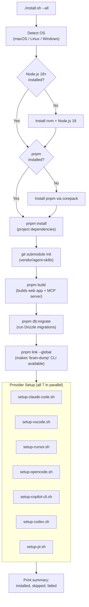
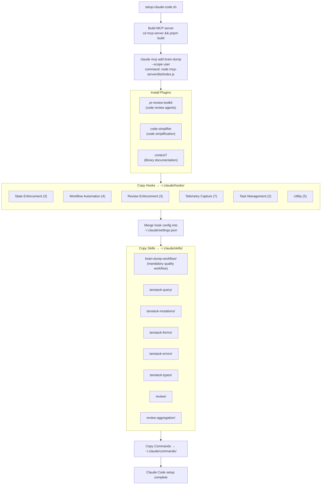
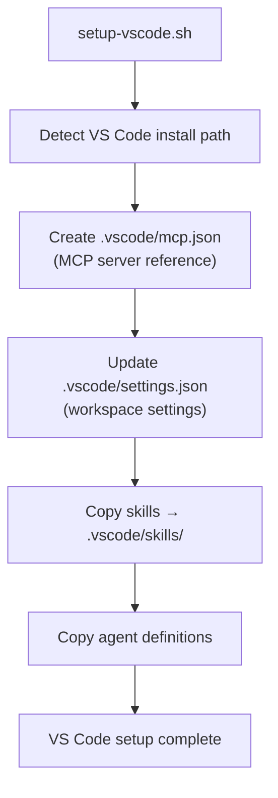
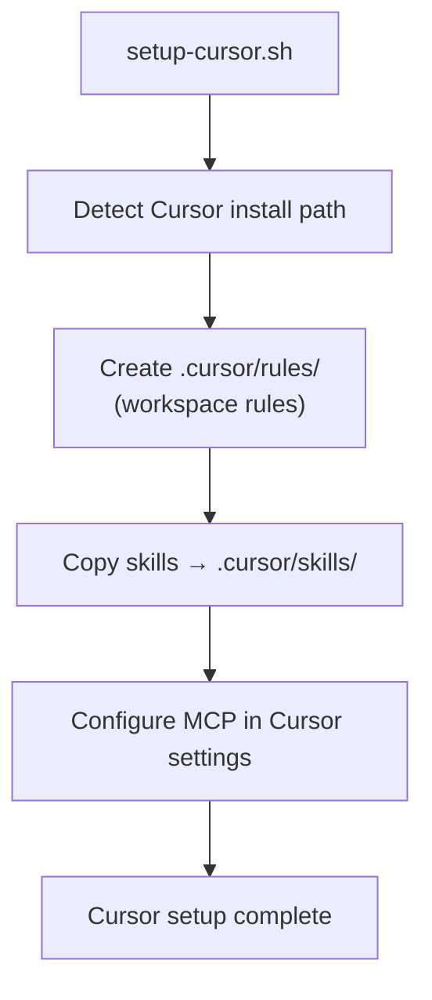
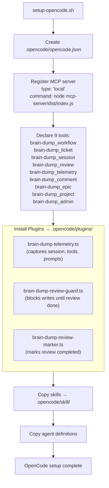
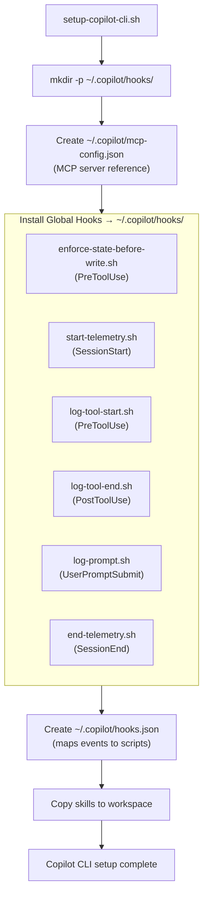
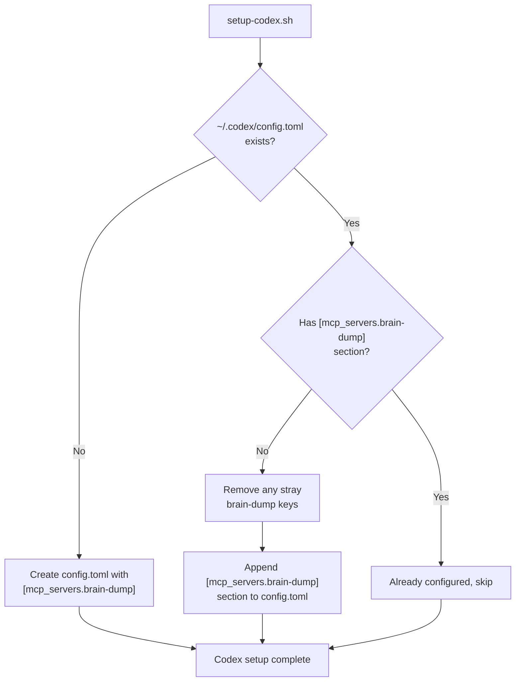
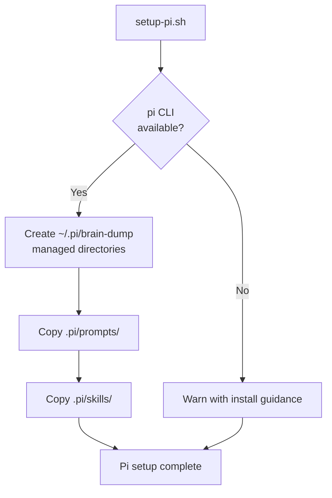
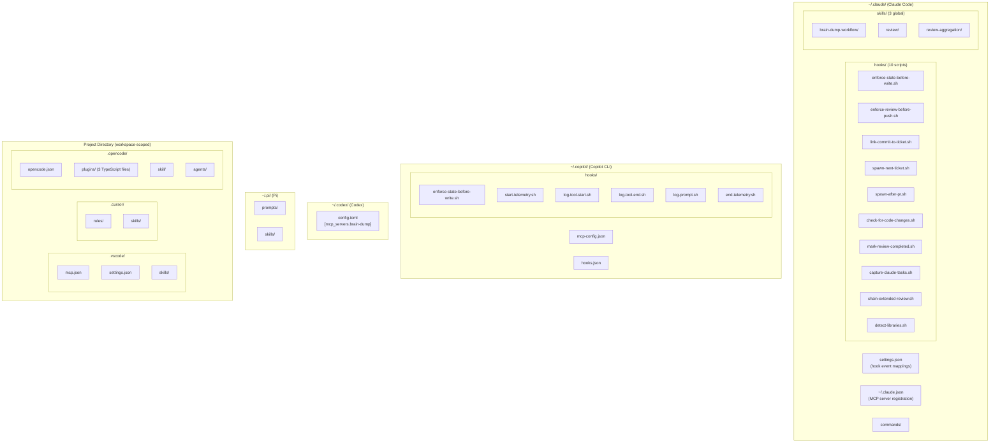
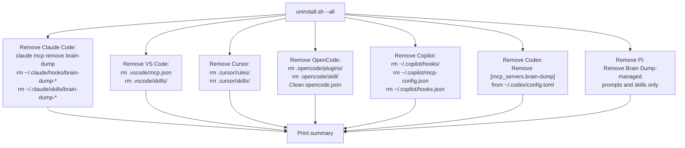

# Brain Dump - Installation Architecture

What happens when you run `./install.sh --all`.

## Overview

## Prerequisites Check

| Check         | Action if Missing                  | Required By          |
| ------------- | ---------------------------------- | -------------------- |
| Node.js >= 18 | Install via nvm                    | All                  |
| pnpm          | Enable via `corepack enable pnpm`  | All                  |
| Git           | Error and exit                     | All                  |
| `gh` CLI      | Warn (optional, for PR features)   | Claude Code, Copilot |
| Docker        | Warn (optional, for Ralph sandbox) | Ralph sandbox only   |

## Per-IDE Setup Detail

### Claude Code (`scripts/setup-claude-code.sh`)

The most comprehensive setup. Claude Code gets hooks, skills, agents, commands, and plugins.

**Files created/modified:**

| Location                  | File(s)                    | Purpose                                         |
| ------------------------- | -------------------------- | ----------------------------------------------- |
| `~/.claude.json`          | MCP server registration    | Tells Claude where the MCP server is            |
| `~/.claude/settings.json` | Hook configuration         | Maps hooks to tool events                       |
| `~/.claude/hooks/`        | 10 shell scripts + helpers | State enforcement, review gating, automation    |
| `~/.claude/skills/`       | 3 skill directories        | brain-dump-workflow, review, review-aggregation |
| `~/.claude/commands/`     | Slash commands             | /next-task, /review-ticket, /demo, etc.         |

**Note:** Agent personas are inlined into commands (no separate `~/.claude/agents/` directory). Project-specific skills (react-best-practices, tanstack-\*, web-design-guidelines) live in each project's `.claude/skills/` directory. Telemetry is handled by MCP self-instrumentation (no telemetry hooks).

### VS Code (`scripts/setup-vscode.sh`)

**Files created/modified:**

| Location                | File(s)            | Purpose                              |
| ----------------------- | ------------------ | ------------------------------------ |
| `.vscode/mcp.json`      | MCP server config  | Points to `mcp-server/dist/index.js` |
| `.vscode/settings.json` | Workspace settings | Editor preferences                   |
| `.vscode/skills/`       | Skill files        | brain-dump-workflow, tanstack-\*     |

**Note:** No hooks in VS Code. MCP tool preconditions enforce workflow (returns error messages guiding the user to correct state).

### Cursor (`scripts/setup-cursor.sh`)

**Files created/modified:**

| Location          | File(s)          | Purpose               |
| ----------------- | ---------------- | --------------------- |
| `.cursor/rules/`  | Rule files       | Workspace conventions |
| `.cursor/skills/` | Skill files      | brain-dump-workflow   |
| Cursor settings   | MCP registration | Points to MCP server  |

### OpenCode (`scripts/setup-opencode.sh`)

OpenCode is unique — it uses **TypeScript plugins** instead of shell hooks.

**Files created/modified:**

| Location                  | File(s)              | Purpose                                            |
| ------------------------- | -------------------- | -------------------------------------------------- |
| `.opencode/opencode.json` | Main config          | MCP server + tool declarations                     |
| `.opencode/plugins/`      | 3 TypeScript plugins | Telemetry, review guard, review marker             |
| `.opencode/skill/`        | Skill files          | brain-dump-workflow, ralph-autonomous, tanstack-\* |
| `.opencode/agents/`       | Agent definitions    | Review agents                                      |

### Copilot CLI (`scripts/setup-copilot-cli.sh`)

Copilot CLI uses **global hooks** similar to Claude Code, but stored in `~/.copilot/`.

**Files created/modified:**

| Location                     | File(s)            | Purpose                                        |
| ---------------------------- | ------------------ | ---------------------------------------------- |
| `~/.copilot/mcp-config.json` | MCP server config  | Points to `mcp-server/dist/index.js`           |
| `~/.copilot/hooks.json`      | Hook event mapping | Maps SessionStart, PreToolUse, etc. to scripts |
| `~/.copilot/hooks/`          | 6 shell scripts    | State enforcement, telemetry                   |

**Note:** Copilot hooks use `permissionDecision` format (not Claude Code's `decision` format).

### Codex (`scripts/setup-codex.sh`)

The simplest setup — just MCP server registration in a TOML config.

**Files created/modified:**

| Location               | File(s)                            | Purpose                              |
| ---------------------- | ---------------------------------- | ------------------------------------ |
| `~/.codex/config.toml` | `[mcp_servers.brain-dump]` section | Points to `mcp-server/dist/index.js` |

### Pi (`scripts/setup-pi.sh`)

Pi setup is CLI-only. It copies Brain Dump-managed prompts and skills for Pi launches, but does not configure MCP or change Pi credentials/settings.

**Files created/modified:**

| Location       | File(s)               | Purpose                                      |
| -------------- | --------------------- | -------------------------------------------- |
| `~/.pi/`       | Brain Dump prompts    | Ticket start, review, demo, completion flows |
| `~/.pi/`       | Brain Dump skills     | Workflow, ticket selection, review guidance  |
| Project `.pi/` | Source prompts/skills | Local workflow source copied by setup        |

**Note:** Pi intentionally has no MCP server registration. Launches use the Pi CLI with Brain Dump-generated context files and environment markers for attribution.

## Post-Install: What the System Looks Like

After `./install.sh --all` completes, here is every file that was created or modified outside the project directory:

## IDE Capability Comparison

| Capability             |  Claude Code  |  VS Code   |   Cursor   |  OpenCode  |  Copilot CLI  |     Codex     |        Pi         |
| ---------------------- | :-----------: | :--------: | :--------: | :--------: | :-----------: | :-----------: | :---------------: |
| MCP Tools (9 tools)    |      Yes      |    Yes     |    Yes     |    Yes     |      Yes      |      Yes      |  CLI launch only  |
| State Enforcement      |  Shell hooks  | MCP errors | MCP errors | TS plugins |  Shell hooks  |  MCP errors   | Server-side start |
| Telemetry Capture      |  Shell hooks  |    MCP     |    MCP     | TS plugins |  Shell hooks  |      --       |    Env markers    |
| Auto PR Creation       |     Hook      |     --     |     --     |     --     |      --       |      --       |        --         |
| Commit Linking         |     Hook      |     --     |     --     |     --     |      --       |      --       |        --         |
| Review Enforcement     |     Hook      |     --     |     --     |   Plugin   |     Hook      |      --       |  Prompt workflow  |
| Auto-Spawn Next Ticket | Hook (opt-in) |     --     |     --     |     --     |      --       |      --       |        --         |
| Skills                 |       8       |     8      |     1      |     8+     |      --       |      --       |         3         |
| Agent Definitions      |      Yes      |    Yes     |     --     |    Yes     |      --       |      --       |        --         |
| Slash Commands         |      Yes      |     --     |     --     |     --     |      --       |      --       |        --         |
| Config Scope           | Global (`~/`) | Workspace  | Workspace  | Workspace  | Global (`~/`) | Global (`~/`) |   Global (`~/`)   |

## Uninstallation

`./uninstall.sh --all` reverses the process:

