# Universal Quality Workflow Per Provider Diagrams

This is the visual companion to `docs/universal-quality-workflow-per-provider.md`.

It gives you multiple diagram variations so you can understand the system at different zoom levels:

- high-level architecture
- shared workflow state machine
- start-work launch variations
- full ticket lifecycle
- provider-by-provider enforcement differences
- review/demo gate loop
- comment creation flow
- state enforcement model

## Existing Diagram Docs In This Repo

If you want even more visuals, these existing pages are the most relevant:

- `docs/architecture.md`
  High-level system architecture, data flow, and ERD.

- `docs/claude-flow-ticket-lifecycle.md`
  Deep, step-by-step ticket lifecycle with sequences and state transitions.

- `docs/uqw-multi-environment.md`
  Cross-environment explanation of hooks/plugins/enforcement.

- `docs/flows/ralph-workflow.md`
  Ralph autonomous loop and state machine.

- `docs/flows/code-review-pipeline.md`
  Review agent pipeline and review marker flow.

- `docs/flows/kanban-workflow.md`
  Broader ticket and board workflow visuals.

## Diagram 1: The Big Picture

This is the simplest architecture view.

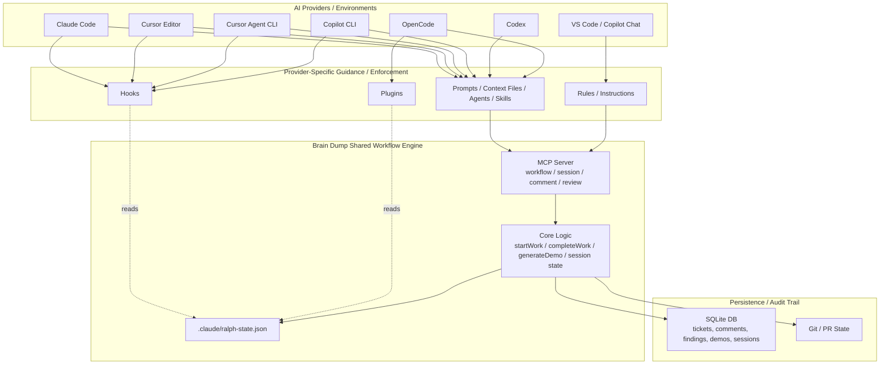

## Diagram 2: Universal Ticket State Machine

This is the shared lifecycle regardless of provider.

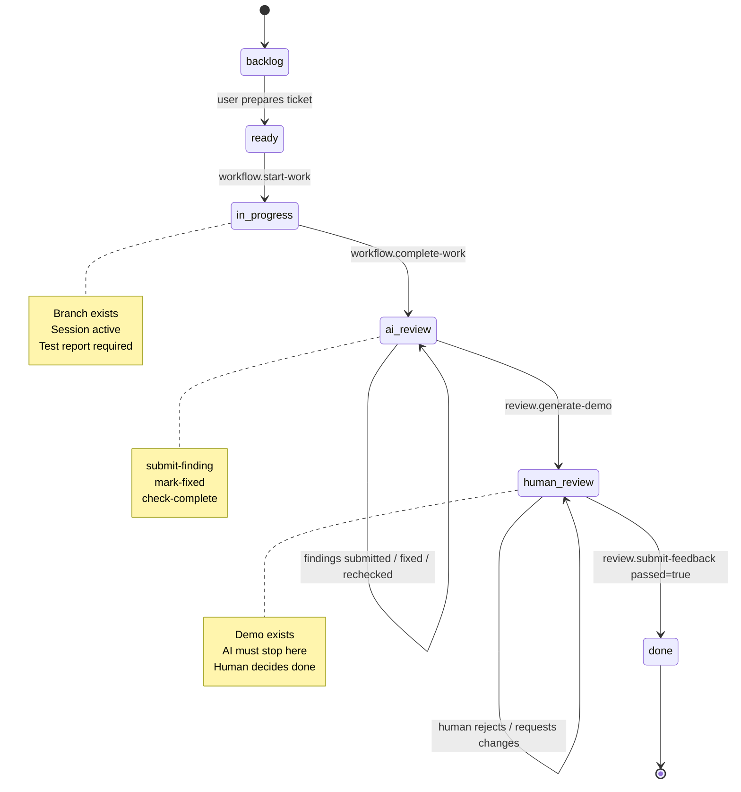

## Diagram 3: Who Actually Moves The Ticket?

This is the best “explain it to people” diagram.

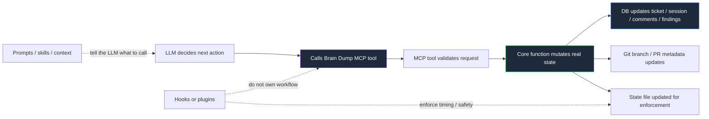

## Diagram 4: Two Start Paths

This shows the important nuance that some launch modes bootstrap start-work server-side before the LLM begins.

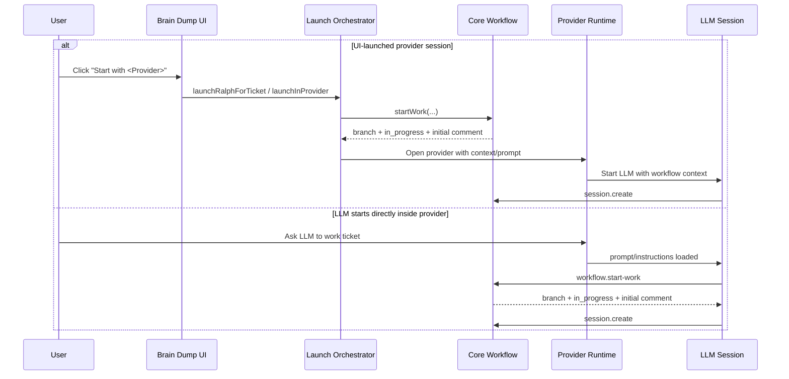

## Diagram 5: Full Generic Ticket Journey

This is the end-to-end diagram that works for every provider.

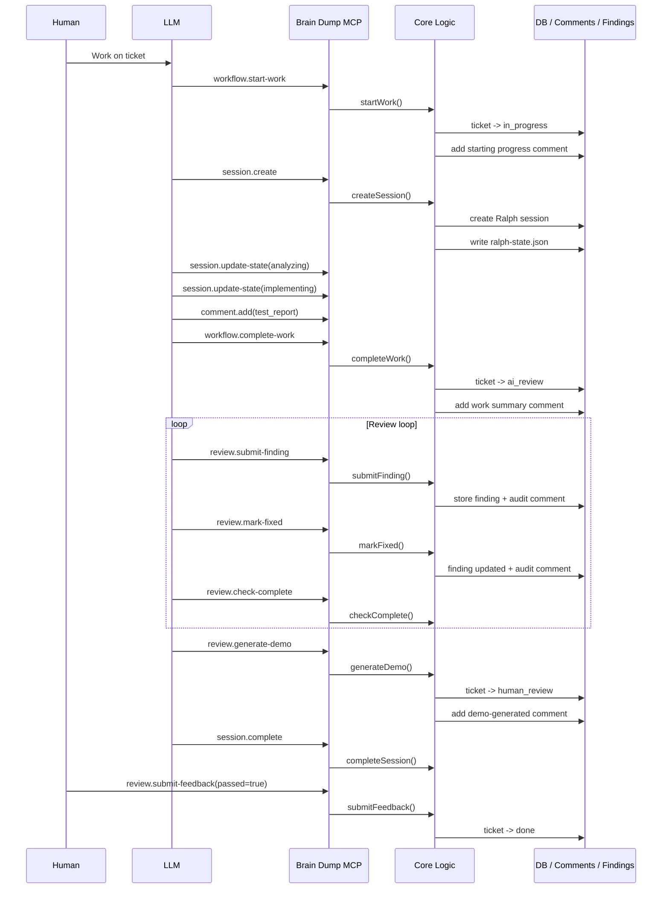

## Diagram 6: Provider Variations At A Glance

This one is useful when you want to compare providers side-by-side.

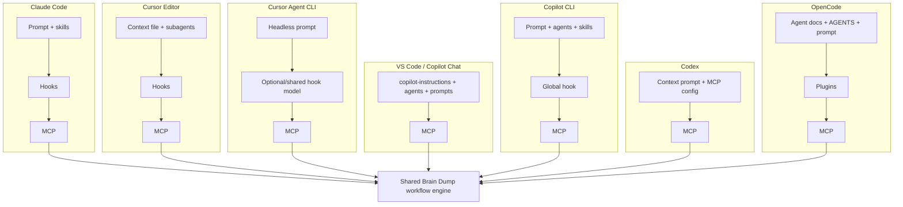

## Diagram 7: State Enforcement Model

This zooms in on the write-blocking behavior.

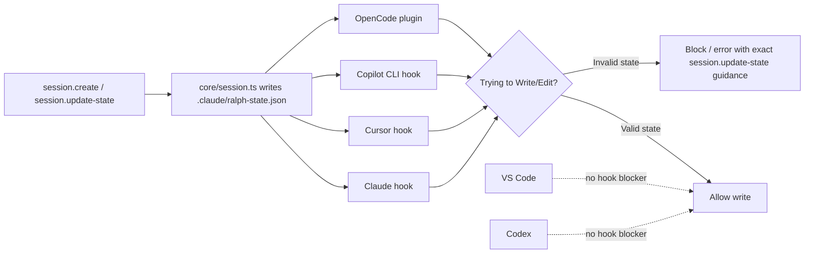

## Diagram 8: Review And Demo Gate Loop

This is the most important “quality” diagram.

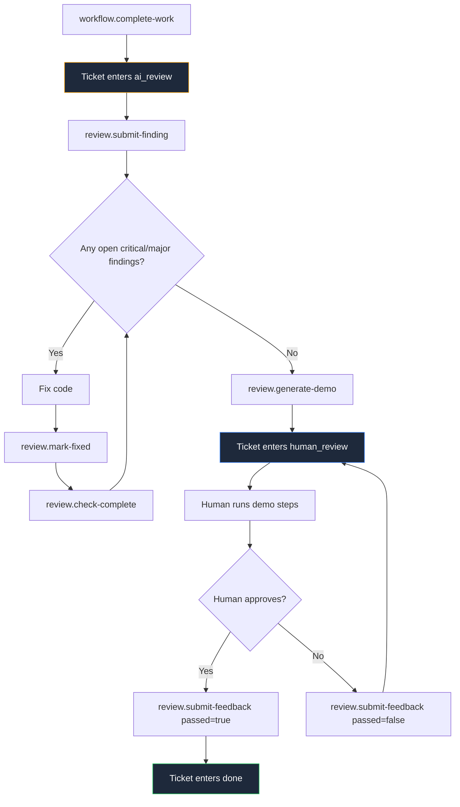

## Diagram 9: Who Creates Which Comment?

This is a good “audit trail” diagram.

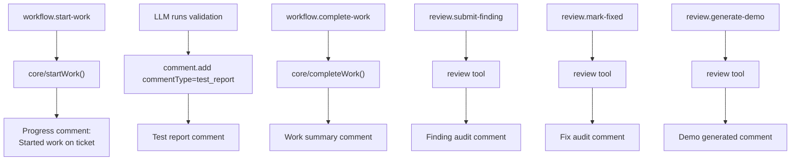

## Diagram 10: Where Provider Identity Comes From

This helps explain how Brain Dump knows whether a comment should look like `claude`, `copilot`, `codex`, `cursor-agent`, and so on.

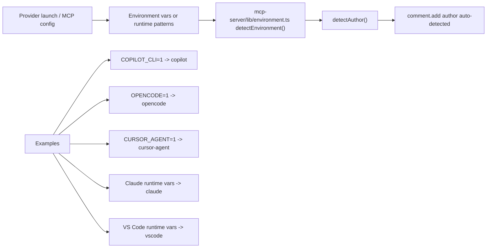

## Diagram 11: High-Level Provider Buckets

This is the simplest mental model.

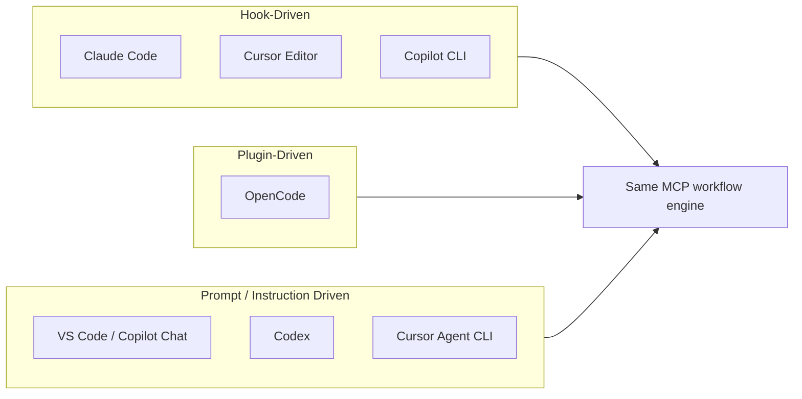

## Diagram 12: Zoomed-In Start Work Internals

This is the “what really happens when start-work runs” close-up.

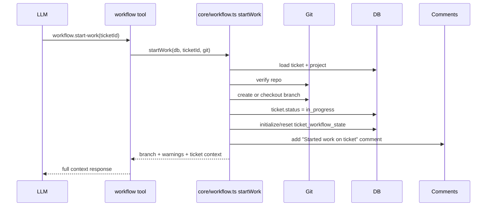

## Diagram 13: Zoomed-In Complete Work Internals

This is the close-up for the handoff into AI review.

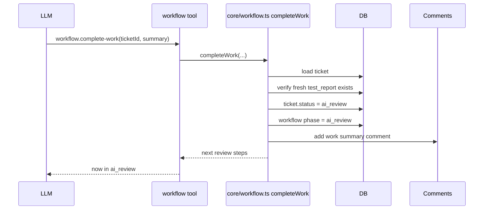

## Diagram 14: Human-Friendly Summary

If you only show one “storyboard” to someone, use this one.

```mermaid
flowchart LR
    A["Provider opens with context"] --> B["LLM calls start-work"]
    B --> C["Brain Dump creates branch + in_progress + start comment"]
    C --> D["LLM creates session and writes code"]
    D --> E["LLM adds test_report comment"]
    E --> F["LLM calls complete-work"]
    F --> G["Brain Dump moves ticket to ai_review"]
    G --> H["LLM submits/fixes findings"]
    H --> I["LLM generates demo"]
    I --> J["Brain Dump moves ticket to human_review"]
    J --> K["Human approves"]
    K --> L["Ticket becomes done"]
```

## Best Pages To Open Next

If you want more depth after this file, open these in order:

1. `docs/universal-quality-workflow-per-provider.md`
2. `docs/claude-flow-ticket-lifecycle.md`
3. `docs/uqw-multi-environment.md`
4. `docs/architecture.md`
5. `docs/flows/code-review-pipeline.md`
