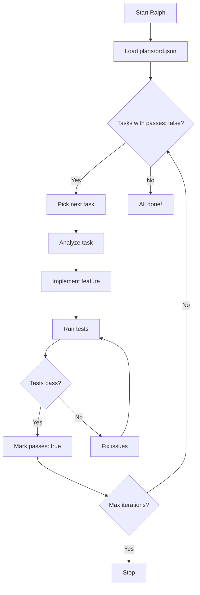
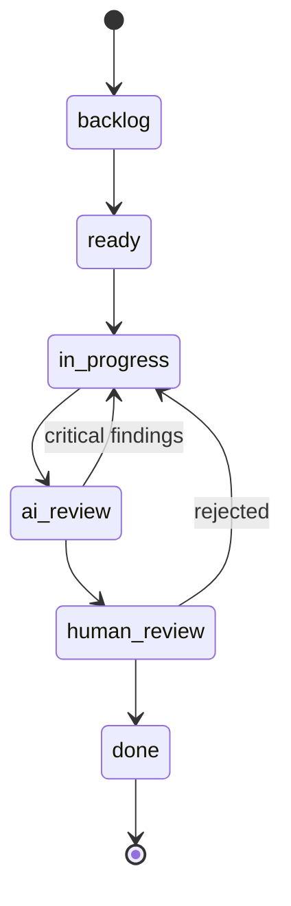
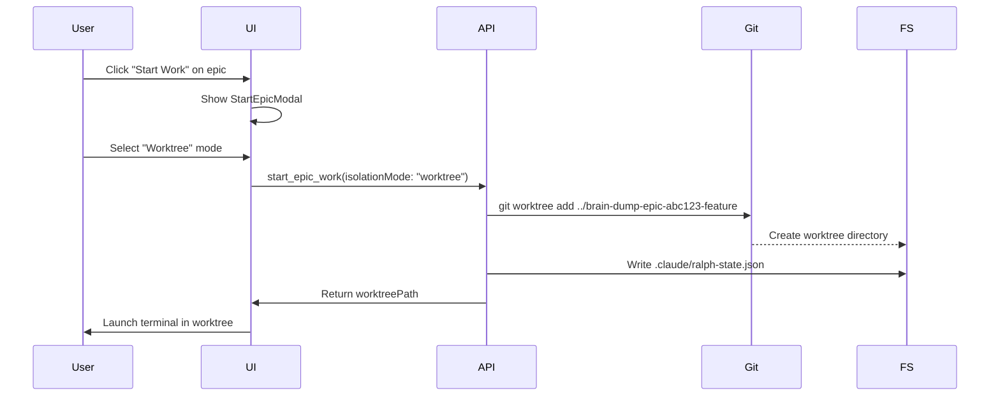
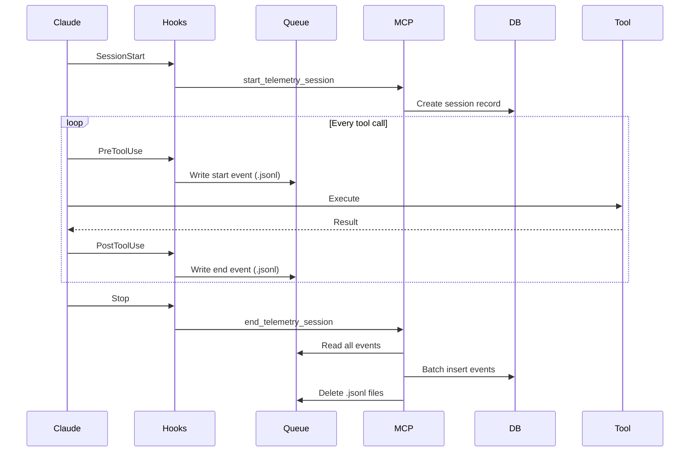

# Workflows Guide

Complete reference for Brain Dump workflows: Ralph, Quality Pipeline, Git Worktrees, and Hooks.

[← Back to CLAUDE.md](../CLAUDE.md)

---

## Table of Contents

- [Ralph Workflow](#ralph-workflow)
- [Universal Quality Workflow](#universal-quality-workflow)
- [Git Worktree Workflow](#git-worktree-workflow)
- [Hook-Based State Enforcement](#hook-based-state-enforcement)
- [Telemetry Hooks](#telemetry-hooks)
- [CLI Commands](#cli-commands)

---

## Ralph Workflow

Ralph is an autonomous agent mode that iterates through ticket backlogs, implementing features, running tests, and updating status until all tasks pass or max iterations are reached.

### How Ralph Works



### PRD File Format

```json
{
  "project": "brain-dump",
  "epic": "Add worktree support",
  "tasks": [
    {
      "id": "1",
      "title": "Add isolation_mode field to epics table",
      "description": "Create migration to add isolation_mode ENUM field...",
      "passes": true,
      "dependencies": [],
      "tests": ["Migration runs without errors", "Field is queryable"]
    },
    {
      "id": "2",
      "title": "Update launchRalphForEpic to read isolation_mode",
      "description": "Modify src/api/ralph.ts to query isolation_mode...",
      "passes": false,
      "dependencies": ["1"],
      "tests": ["Creates worktree when mode is 'worktree'", "Uses branch when mode is 'branch'"]
    }
  ]
}
```

### Starting Ralph

1. **Create epic with tickets**
2. **Generate PRD**: Ralph auto-generates `plans/prd.json` from tickets
3. **Start Ralph session**: Call `start_ralph_session` MCP tool
4. **Ralph iterates**: Picks tasks, implements, tests, marks complete
5. **End session**: Call `complete_ralph_session` when done

### Ralph States

Ralph transitions through states during work:

- `idle` - Not working
- `analyzing` - Reading code, understanding task
- `implementing` - Writing code
- `testing` - Running tests
- `committing` - Creating commits
- `reviewing` - Analyzing test results

**See also**: [Hook-Based State Enforcement](#hook-based-state-enforcement)

---

## Universal Quality Workflow

Structured progression through quality gates ensuring consistent code quality.

### Status Flow



### Status Definitions

- **backlog**: Not yet ready to work on (needs refinement, blocked, etc.)
- **ready**: Ready to be picked up by AI or human
- **in_progress**: Active development (code being written)
- **ai_review**: Automated quality review by code review agents
- **human_review**: Demo approval by human reviewer
- **done**: Complete and approved

### Detailed Workflow Steps

#### 1. Start Work

```typescript
// MCP tool call
start_ticket_work({ ticketId: "abc-123" });

// What happens:
// - Creates git branch: "ticket/abc-123-feature-name"
// - Sets ticket status to "in_progress"
// - Creates telemetry session
// - Adds ticket comment: "Started work on ticket. Branch: ticket/abc-123-feature-name"
```

#### 2. Implementation

- AI writes code following project guidelines
- Runs `pnpm type-check`, `pnpm lint` continuously
- Creates commits as logical units of work
- Uses `.claude/ralph-state.json` to track progress

#### 3. Complete Implementation

```typescript
// MCP tool call
complete_ticket_work({
  ticketId: "abc-123",
  summary: "Implemented feature X with tests",
});

// What happens:
// - Runs validation: pnpm type-check, pnpm lint, pnpm test
// - If validation fails: Throws error, stays in "in_progress"
// - If validation passes:
//   - Sets ticket status to "ai_review"
//   - Adds ticket comment with work summary
//   - Triggers review agents
```

#### 4. AI Review

Three review agents run in parallel:

1. **code-reviewer**: Reviews against project guidelines (CLAUDE.md)
2. **silent-failure-hunter**: Identifies silent failures and error handling issues
3. **code-simplifier**: Simplifies and refines code for clarity

```typescript
// Findings submitted via
submit_review_finding({
  ticketId: "abc-123",
  severity: "critical", // critical, major, minor
  category: "security",
  title: "SQL injection vulnerability",
  description: "User input not sanitized...",
  location: "src/api/tickets.ts:45",
  recommendation: "Use Drizzle ORM parameterized queries",
});
```

**Review iteration counter**: Tracks how many review cycles occurred

**Critical/major findings block demo generation**: Must fix before proceeding

#### 5. Generate Demo

```typescript
// MCP tool call (only allowed after fixing critical/major findings)
generate_demo_script({ ticketId: "abc-123" });

// What happens:
// - Generates step-by-step manual test instructions
// - Sets ticket status to "human_review"
// - Adds ticket comment with demo script
```

**Example demo script**:

```markdown
## Demo Script

### Prerequisites

- Local dev server running on port 4242
- Database has test project "brain-dump"

### Steps

1. Navigate to http://localhost:4242
2. Click "New Ticket" button
3. Fill in title: "Test worktree mode"
4. Select epic: "Worktree support"
5. Click "Create"
6. Verify ticket appears in "Ready" column
7. Click "Start Work" on the ticket
8. In the modal, select "Worktree" isolation mode
9. Click "Start"
10. Verify new terminal opens in worktree directory

### Expected Results

- Ticket moves to "In Progress"
- New terminal opens with path ending in "-epic-abc123-worktree-support"
- `.claude/ralph-state.json` exists in worktree with isolationMode: "worktree"
```

#### 6. Human Review

Human reviewer (or user) runs through demo steps:

```typescript
// If approved
submit_demo_feedback({
  ticketId: "abc-123",
  approved: true,
  feedback: "Works as expected! Worktree created successfully.",
});
// Ticket moves to "done"

// If rejected
submit_demo_feedback({
  ticketId: "abc-123",
  approved: false,
  feedback: "Terminal opens but in wrong directory. Should be in worktree, not main repo.",
});
// Ticket stays in "human_review", AI reads feedback and fixes
```

#### 7. Reconcile Learnings

After completion, extract learnings:

```typescript
reconcile_learnings({ ticketId: "abc-123" });

// What happens:
// - Analyzes ticket comments, findings, demo feedback
// - Extracts patterns, anti-patterns, insights
// - Proposes updates to CLAUDE.md, specs, or new docs
// - AI reviews and applies learnings
```

**Example learning**:

> "When adding a user-selectable setting, always verify the setting is read and used in the code path, not just stored in the database. Add to End-to-End Feature Implementation checklist."

### Skills (Workflow Shortcuts)

**`/next-task`**: Intelligently select next ticket

- Considers priority (high → low)
- Respects dependencies (blockers)
- Filters by epic if Ralph is working on one
- Returns ticket ready to start

**`/review-ticket`**: Run all AI review agents

- Launches 3 agents in parallel
- Aggregates findings
- Submits to ticket comments

**`/review-epic`**: Run Tracer Review on entire epic

- Reviews all tickets in epic
- Identifies cross-cutting concerns
- Generates epic-level findings

**`/demo`**: Generate demo script

- Alias for `generate_demo_script`
- Checks for blocking findings first

**`/reconcile-learnings`**: Extract and apply learnings

- Alias for `reconcile_learnings`
- Updates project docs with insights

### Multi-Environment Support

| Feature                | Claude Code | Cursor     | OpenCode    | VS Code  |
| ---------------------- | ----------- | ---------- | ----------- | -------- |
| MCP Tools              | ✅          | ✅         | ✅          | ✅       |
| State Tracking         | ✅          | ✅         | ✅          | ✅       |
| Hook Enforcement       | ✅          | ✅         | ❌          | ❌       |
| Telemetry Capture      | ✅ (Hooks)  | ✅ (Hooks) | ✅ (Plugin) | ✅ (MCP) |
| Auto-spawn next ticket | ✅          | ✅         | ❌          | ❌       |

**Installation**: Run `./scripts/install.sh` to configure all environments

---

## Git Worktree Workflow

Git worktrees enable parallel work on multiple epics without checkout conflicts.

### Branch vs Worktree Mode

| Aspect                | Branch Mode                     | Worktree Mode                      |
| --------------------- | ------------------------------- | ---------------------------------- |
| **Location**          | Main repo directory             | Separate sibling directory         |
| **Isolation**         | None (shared working directory) | Complete (own directory)           |
| **Parallel work**     | ❌ (must clean checkout first)  | ✅ (multiple epics simultaneously) |
| **Complexity**        | Simple                          | Moderate                           |
| **`.claude/` folder** | Shared                          | Per-worktree                       |
| **Setup**             | None                            | Opt-in via settings                |

### Enabling Worktree Support

**Option 1: Global setting**

1. Open Settings modal
2. Toggle "Enable Worktree Support"
3. All projects now support worktrees

**Option 2: Per-project setting**

1. Edit project settings
2. Set "Default Isolation Mode":
   - "Branch" - Always use branch mode
   - "Worktree" - Always use worktree mode
   - "Ask each time" - Modal appears when starting epic

### Worktree Lifecycle



### Worktree Path Formats

**Sibling (default)**:

```
/Users/dev/
├── brain-dump/           # Main repo
└── brain-dump-epic-abc123-feature-name/  # Worktree
```

**Subfolder**:

```
/Users/dev/brain-dump/
├── src/
├── .worktrees/
│   └── epic-abc123-feature-name/  # Worktree
└── ...
```

**Custom base path**:
Set in project settings: `/path/to/custom/worktrees/`

### Worktree Cleanup

**Automatic cleanup triggers**:

- Epic status changes to "done"
- PR linked to epic is merged
- Worktree has no uncommitted changes

**Manual cleanup**:

```bash
# Dry-run (list stale worktrees)
pnpm brain-dump cleanup

# Remove stale worktrees
pnpm brain-dump cleanup --force
```

**MCP tool**:

```typescript
cleanup_worktrees({
  projectId: "abc-123",
  dryRun: false, // true for dry-run
});
```

**Safety rules**:

- Never removes worktrees with uncommitted changes (unless `--force`)
- Only removes if epic is done AND PR is merged
- Logs all actions for audit trail

### Worktree Troubleshooting

See [Troubleshooting Guide - Git Worktree Issues](troubleshooting.md#git-worktree-issues)

---

## Hook-Based State Enforcement

Hooks provide guidance through feedback loops rather than hard blocking.

### How It Works

```
User Action → PreToolUse Hook → Check State → Block or Allow → PostToolUse Hook → Record
```

**Example**:

```
Claude: "I'll write the file now"
           ↓
PreToolUse Hook: Check .claude/ralph-state.json
           ↓
currentState = "analyzing" (not allowed to write)
           ↓
Hook: BLOCKED - "You are in 'analyzing' state but tried to write code.
                 Call update_session_state('implementing') FIRST."
           ↓
Claude: Calls update_session_state({ state: "implementing" })
           ↓
Claude: Retries Write tool
           ↓
PreToolUse Hook: currentState = "implementing" (allowed)
           ↓
Write succeeds ✅
           ↓
PostToolUse Hook: Logs "State: implementing → Write tool succeeded"
```

### State File Format

**`.claude/ralph-state.json`**:

```json
{
  "sessionId": "abc-123",
  "ticketId": "def-456",
  "currentState": "implementing",
  "stateHistory": ["idle", "analyzing", "implementing"],
  "isolationMode": "worktree",
  "worktreePath": "/Users/dev/brain-dump-epic-abc123-feature",
  "mainRepoPath": "/Users/dev/brain-dump",
  "startedAt": "2026-01-16T10:00:00Z",
  "updatedAt": "2026-01-16T10:15:00Z"
}
```

### Hook Scripts

| Hook                            | Type               | Purpose                                      |
| ------------------------------- | ------------------ | -------------------------------------------- |
| `enforce-state-before-write.sh` | PreToolUse         | Must be in implementing/testing/committing   |
| `record-state-change.sh`        | PostToolUse        | Logs state transitions                       |
| `create-pr-on-ticket-start.sh`  | PostToolUse        | Auto-creates draft PR                        |
| `link-commit-to-ticket.sh`      | PostToolUse        | Outputs MCP commands to link commits         |
| `enforce-review-before-push.sh` | PreToolUse         | Blocks push until review completed           |
| `spawn-after-pr.sh`             | PostToolUse        | Spawns next ticket after PR creation         |
| `start-telemetry-session.sh`    | SessionStart       | Detects active ticket, prompts session start |
| `end-telemetry-session.sh`      | Stop               | Flushes telemetry queue                      |
| `log-tool-start.sh`             | PreToolUse         | Records tool start event                     |
| `log-tool-end.sh`               | PostToolUse        | Records tool completion (success)            |
| `log-tool-failure.sh`           | PostToolUseFailure | Records tool completion (failed)             |
| `log-prompt.sh`                 | UserPromptSubmit   | Records user prompts                         |

### Cross-Environment Support

**Hook enforcement**: Claude Code and Cursor only

- Other environments rely on MCP preconditions

**State tracking**: All environments

- `.claude/ralph-state.json` written by MCP tools
- Works identically regardless of client

**How to check if hooks are active**:

```bash
# Check settings.json
cat ~/.claude/settings.json | jq .hooks

# Test hook script
bash ~/.claude/hooks/enforce-state-before-write.sh
```

---

## Telemetry Hooks

Automatic capture of AI work sessions for observability and audit trails.

### How Telemetry Works



### Queue Files

**`.claude/telemetry-queue.jsonl`**: Events pending flush

```jsonl
{"type":"tool_start","toolName":"Read","timestamp":"2026-01-16T10:00:00Z","correlationId":"abc-123"}
{"type":"tool_end","toolName":"Read","timestamp":"2026-01-16T10:00:01Z","correlationId":"abc-123","duration":1000}
```

**`.claude/telemetry-session.json`**: Current session metadata

```json
{
  "sessionId": "def-456",
  "ticketId": "ghi-789",
  "startedAt": "2026-01-16T10:00:00Z"
}
```

**`.claude/tool-correlation-*.txt`**: Correlation IDs for pairing start/end events

- Created by PreToolUse hook
- Read by PostToolUse hook
- Auto-deleted after pairing

### Privacy

- **No file contents**: Only parameters summary (e.g., "Read file: src/api/tickets.ts")
- **Prompts hashed**: Can enable `redact: true` to hash prompts
- **Local only**: No external transmission

### Telemetry MCP Tools

- `start_telemetry_session({ ticketId })` - Begin capturing
- `end_telemetry_session()` - Flush queue to database
- `get_telemetry_stats({ ticketId })` - Query stats

### Viewing Telemetry

In Brain Dump UI:

1. Open ticket detail
2. Click "Telemetry" tab
3. See graphs:
   - Tool usage over time
   - Token counts per tool
   - Error rates
   - Time spent in each state

---

## CLI Commands

### Database Commands

```bash
# Backup
pnpm brain-dump backup                # Create timestamped backup
pnpm brain-dump backup --list         # List available backups

# Restore
pnpm brain-dump restore               # Interactive: select backup
pnpm brain-dump restore --file backup.db  # Restore specific backup

# Health Check
pnpm brain-dump check                 # Quick integrity check
pnpm brain-dump check --full          # Full health check (tables, indexes, constraints)
```

### Worktree Commands

```bash
# Cleanup
pnpm brain-dump cleanup               # Dry-run: list stale worktrees
pnpm brain-dump cleanup --force       # Remove stale worktrees

# List
pnpm brain-dump worktrees             # List all worktrees for all projects
```

### Diagnostic Commands

```bash
# Doctor
pnpm brain-dump doctor                # Diagnose configuration issues
                                      # - Database connectivity
                                      # - Hook configuration
                                      # - MCP server registration
                                      # - File permissions
                                      # - Worktree health
```

---

## Related Documentation

- [CLAUDE.md](../CLAUDE.md) - Main documentation
- [Architecture](architecture.md) - System architecture
- [Testing](testing.md) - Testing philosophy
- [Troubleshooting](troubleshooting.md) - Common issues
- [Glossary](glossary.md) - Terminology
