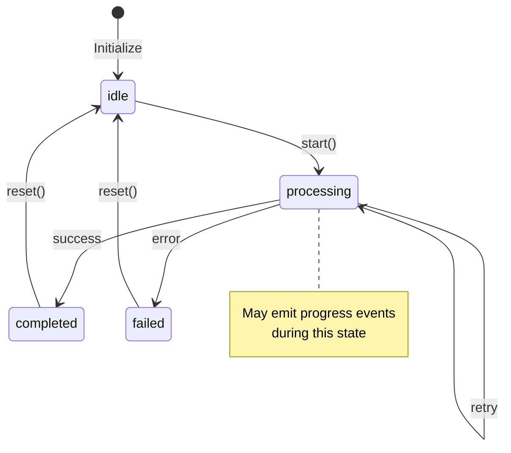

# [Feature Name] Spec

> **Ticket**: [ID from Brain Dump]
> **Epic**: [Epic Name]
> **Author**: [Name or "Claude"]
> **Status**: Draft | Review | Approved

---

## 1. Overview

**What is this?**
[2-3 paragraphs explaining WHY this feature exists, not just WHAT it does]

- **Problem being solved**: [Clear statement of the user pain point]
- **User value delivered**: [What users gain from this feature]
- **How it fits into the system**: [Where this connects to existing architecture]

### Key Insight

> [A memorable quote or principle that guides this feature's design]

---

## 2. Reference Tables

### Configuration Options

| Field         | Type      | Default     | Description               |
| ------------- | --------- | ----------- | ------------------------- |
| `option_name` | `string`  | `"default"` | What this option controls |
| `enabled`     | `boolean` | `true`      | Whether feature is active |
| `max_retries` | `number`  | `3`         | Maximum retry attempts    |

### States / Events (if applicable)

| State          | Valid Transitions            | Description                        |
| -------------- | ---------------------------- | ---------------------------------- |
| `idle`         | `analyzing`                  | Initial state, waiting for work    |
| `analyzing`    | `implementing`, `failed`     | Reading and understanding the spec |
| `implementing` | `testing`, `failed`          | Writing or editing code            |
| `testing`      | `committing`, `implementing` | Running tests, may loop back       |
| `committing`   | `done`                       | Creating commits and PR            |

### Error Codes (if applicable)

| Code   | Name           | Retryable | Description             |
| ------ | -------------- | --------- | ----------------------- |
| `E001` | `NOT_FOUND`    | No        | Resource does not exist |
| `E002` | `RATE_LIMITED` | Yes       | Too many requests       |
| `E003` | `TIMEOUT`      | Yes       | Operation timed out     |

---

## 3. Type Definitions

```typescript
/**
 * [FeatureName] - [Brief description]
 *
 * @example
 * const feature = createFeature({
 *   option: "value",
 *   enabled: true,
 * });
 */
export interface FeatureName {
  /** Unique identifier for this instance */
  id: string;

  /** Human-readable name shown in UI */
  name: string;

  /** Configuration options */
  options: FeatureOptions;

  /** Current state in the lifecycle */
  state: FeatureState;

  /** Timestamp when created */
  createdAt: Date;

  /** Timestamp of last update */
  updatedAt: Date;
}

/**
 * Configuration options for [FeatureName]
 */
export interface FeatureOptions {
  /** Whether the feature is enabled */
  enabled: boolean;

  /** Maximum number of retries on failure */
  maxRetries: number;

  /** Timeout in milliseconds */
  timeoutMs: number;
}

/**
 * Possible states for [FeatureName]
 */
export type FeatureState = "idle" | "processing" | "completed" | "failed";

/**
 * Events emitted by [FeatureName]
 */
export type FeatureEvent =
  | { type: "started"; data: { id: string } }
  | { type: "progress"; data: { percent: number; message: string } }
  | { type: "completed"; data: { result: unknown } }
  | { type: "failed"; data: { error: Error } };
```

---

## 4. State Machine (if applicable)



### State Transition Rules

1. **idle → processing**: Only when `start()` is called with valid input
2. **processing → completed**: When operation succeeds
3. **processing → failed**: When max retries exceeded or non-retryable error
4. **failed/completed → idle**: Only via explicit `reset()` call

---

## 5. Design Decisions

### Why [Approach X] vs [Approach Y]?

1. **Performance**: X is O(n) while Y is O(n²) for our typical data size
2. **Simplicity**: X has fewer edge cases and is easier to test
3. **Compatibility**: X works with our existing error hierarchy
4. **Trade-offs**: X uses more memory but is faster; acceptable given our constraints

### Why NOT [Alternative Approach]?

1. **Complexity**: Would require significant refactoring of existing code
2. **Dependencies**: Would add a new dependency we want to avoid
3. **Overkill**: Our needs are specific and don't require the full power of [Alternative]

### Why MCP Tools Instead of [Other Pattern]?

> **Brain Dump specific**: We use MCP tools for Claude to report data instead of parsing stdout. This is more reliable and subscription-compatible.

1. **Stability**: MCP tool interface is under our control
2. **Structured Data**: Returns JSON, not text to parse
3. **Subscription Model**: Works without direct API access

---

## 6. Implementation Guide

### Step 1: Create the Schema

**File**: `src/lib/schema.ts`

```typescript
// Add to existing schema
export const featureTable = sqliteTable("feature_table", {
  id: text("id").primaryKey(),
  name: text("name").notNull(),
  state: text("state").notNull().default("idle"),
  options: text("options"), // JSON string
  created_at: text("created_at").notNull(),
  updated_at: text("updated_at").notNull(),
});
```

### Step 2: Create the Server Function

**File**: `src/api/feature.ts`

```typescript
import { createServerFn } from "@tanstack/react-start/server";
import { db } from "../lib/database";
import { featureTable } from "../lib/schema";
import { eq } from "drizzle-orm";

export const getFeature = createServerFn()
  .validator((id: string) => id)
  .handler(async ({ data: id }) => {
    return db.select().from(featureTable).where(eq(featureTable.id, id)).get();
  });

export const createFeature = createServerFn()
  .validator((data: { name: string; options?: FeatureOptions }) => data)
  .handler(async ({ data }) => {
    const id = crypto.randomUUID();
    const now = new Date().toISOString();

    await db.insert(featureTable).values({
      id,
      name: data.name,
      state: "idle",
      options: JSON.stringify(data.options ?? {}),
      created_at: now,
      updated_at: now,
    });

    return { id };
  });
```

### Step 3: Add MCP Tool (if applicable)

**File**: `mcp-server/tools/feature.js`

```javascript
export function registerFeatureTools(server, db) {
  server.tool(
    "update_feature_state",
    {
      description: "Update the state of a feature for progress tracking",
      inputSchema: {
        type: "object",
        properties: {
          featureId: { type: "string", description: "Feature ID" },
          state: {
            type: "string",
            enum: ["idle", "processing", "completed", "failed"],
          },
          metadata: { type: "object", description: "Optional context" },
        },
        required: ["featureId", "state"],
      },
    },
    async ({ featureId, state, metadata }) => {
      // Implementation here
      return { success: true, previousState: "idle", newState: state };
    }
  );
}
```

### Step 4: Create the UI Component

**File**: `src/components/FeatureCard.tsx`

```tsx
import { useSuspenseQuery } from "@tanstack/react-query";
import { getFeature } from "../api/feature";

export function FeatureCard({ id }: { id: string }) {
  const { data: feature } = useSuspenseQuery({
    queryKey: ["feature", id],
    queryFn: () => getFeature({ data: id }),
  });

  return (
    <div className="rounded-lg border p-4">
      <h3 className="font-semibold">{feature.name}</h3>
      <StatusBadge state={feature.state} />
    </div>
  );
}
```

### Integration Points

- **Database**: Add migration via `pnpm db:generate`
- **API**: Export from `src/api/index.ts`
- **Routes**: Add route in `src/routes/`
- **MCP**: Register in `mcp-server/index.js`

### Testing Requirements

**Unit Tests** (`src/lib/feature.test.ts`):

- State transition validation
- Options parsing and defaults
- Error handling

**Integration Tests** (`src/api/feature.integration.test.ts`):

- Full lifecycle: create → process → complete
- Database persistence
- MCP tool interaction (if applicable)

---

## Acceptance Criteria

- [ ] Schema added with migration created
- [ ] Server functions implemented with validation
- [ ] MCP tool implemented (if applicable)
- [ ] UI component created with proper loading states
- [ ] Unit tests for core logic
- [ ] Integration test for full workflow
- [ ] TypeScript types exported
- [ ] No type errors (`pnpm type-check`)
- [ ] No lint errors (`pnpm lint`)
- [ ] All tests pass (`pnpm test`)

---

## Out of Scope

- [ ] Feature X (will be added in future ticket)
- [ ] Edge case Y (acceptable limitation)
- [ ] Integration with Z (requires separate work)

---

## References

- **Related Code**: `src/lib/existing-feature.ts`
- **Design Document**: `plans/compared-to-loom.md`
- **Ticket**: `Brain Dump ticket ID`
- **External**: [Link to relevant documentation]

---

## Appendix: Usage Examples

### Example 1: Basic Usage

```typescript
// Create a new feature
const { id } = await createFeature({
  data: {
    name: "My Feature",
    options: { enabled: true },
  },
});

// Update state
await updateFeatureState({ featureId: id, state: "processing" });
```

### Example 2: MCP Tool Usage (for Ralph)

```markdown
When working on this feature, Claude should:

1. Call `create_feature` to initialize
2. Call `update_feature_state('processing')` before writing code
3. Call `update_feature_state('completed')` when done
```

### Example 3: Error Handling

```typescript
try {
  await processFeature(id);
} catch (error) {
  if (error instanceof FeatureError && error.isRetryable()) {
    await retryWithBackoff(() => processFeature(id));
  } else {
    await updateFeatureState({ featureId: id, state: "failed" });
    throw error;
  }
}
```
