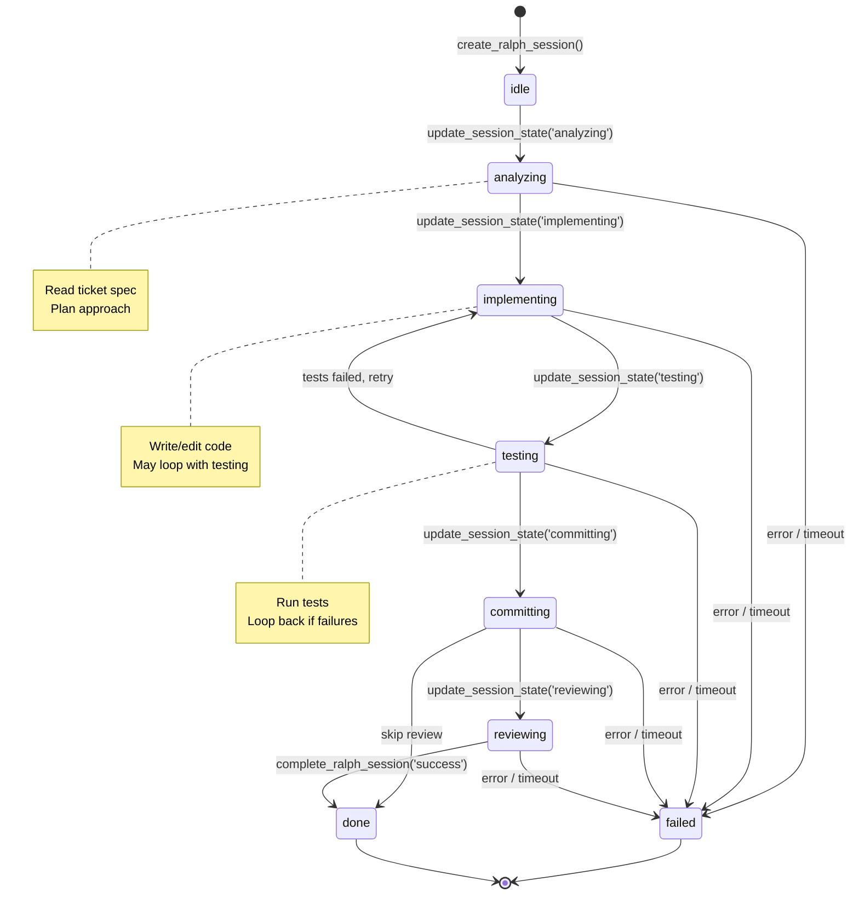

# State Machine Observability MCP Tool Spec

> **Ticket**: 7.11 (`628130e7-ecfb-4405-a947-126f54ba095a`)
> **Epic**: Infrastructure & Feedback Loops
> **Author**: Claude
> **Status**: Draft

---

## 1. Overview

**What is this?**

This feature implements state machine **observability** for Ralph sessions, replacing the originally planned **control** approach from ticket 6.10. The key insight from `plans/compared-to-loom.md`: with Brain Dump's subscription model, we cannot control Claude's internal loop, but we **can** observe state transitions via MCP tools that Claude calls at transition points.

- **Problem being solved**: The UI cannot show Ralph's current phase (analyzing, implementing, testing). Users have no visibility into session progress, and debugging failed sessions is difficult without knowing where Ralph got stuck.

- **User value delivered**: Real-time progress visibility in the Brain Dump UI. Users can see exactly what phase Ralph is in, how long each phase takes, and where failures occur.

- **How it fits into the system**: This is the subscription-compatible adaptation of Loom's state machine pattern. Instead of programmatically controlling state transitions, Ralph self-reports state via MCP tools. The UI reads state from the database and can display progress indicators.

### Key Insight

> **"Change from control to observability"** - We can't enforce state transitions with the subscription model, but we can observe them reliably via MCP tools. Claude reports its own state, and we record it.

---

## 2. Reference Tables

### Session States

| State          | Description                       | Typical Duration | UI Indicator  |
| -------------- | --------------------------------- | ---------------- | ------------- |
| `idle`         | Session created, not yet started  | Seconds          | Gray dot      |
| `analyzing`    | Reading spec, planning approach   | 30s - 2min       | Blue spinner  |
| `implementing` | Writing or editing code           | 2 - 10min        | Yellow pulse  |
| `testing`      | Running tests, verifying behavior | 30s - 5min       | Cyan spinner  |
| `committing`   | Creating commits and PR           | 30s - 1min       | Green spinner |
| `reviewing`    | Self-review before completion     | 30s - 2min       | Purple dot    |
| `done`         | Session completed successfully    | Terminal         | Green check   |
| `failed`       | Session failed with error         | Terminal         | Red X         |

### State Transitions

| From           | To             | Trigger                            | Notes                      |
| -------------- | -------------- | ---------------------------------- | -------------------------- |
| `idle`         | `analyzing`    | Ralph calls `update_session_state` | First state after creation |
| `analyzing`    | `implementing` | Ralph ready to write code          | Must analyze first         |
| `implementing` | `testing`      | Code written, running tests        | May loop back              |
| `testing`      | `implementing` | Tests failed, fixing               | Loop until pass            |
| `testing`      | `committing`   | Tests passed                       | Ready to commit            |
| `committing`   | `reviewing`    | Commits created                    | Optional self-review       |
| `reviewing`    | `done`         | Ralph satisfied                    | Session complete           |
| Any            | `failed`       | Error or timeout                   | Terminal state             |

### MCP Tool Parameters

| Parameter   | Type           | Required | Description                                    |
| ----------- | -------------- | -------- | ---------------------------------------------- |
| `sessionId` | `string`       | Yes      | The Ralph session ID                           |
| `state`     | `SessionState` | Yes      | New state to transition to                     |
| `metadata`  | `object`       | No       | Optional context (files changed, test results) |

---

## 3. Type Definitions

```typescript
/**
 * Possible states for a Ralph session.
 * These represent phases of autonomous work.
 */
export type SessionState =
  | "idle"
  | "analyzing"
  | "implementing"
  | "testing"
  | "committing"
  | "reviewing"
  | "done"
  | "failed";

/**
 * A single state transition record.
 * Stored in state_history for audit/debugging.
 */
export interface StateTransition {
  /** State that was entered */
  state: SessionState;

  /** When this transition occurred */
  timestamp: string; // ISO 8601

  /** Optional context about the transition */
  metadata?: {
    /** Files modified in this state */
    files?: string[];

    /** Test results if in testing state */
    testResults?: {
      passed: number;
      failed: number;
      skipped: number;
    };

    /** Error message if transitioning to failed */
    error?: string;

    /** Any additional context */
    [key: string]: unknown;
  };
}

/**
 * Extended session schema with state tracking.
 * Adds to existing ralph_sessions table.
 */
export interface RalphSessionWithState {
  id: string;
  ticket_id: string;
  outcome: "success" | "failure" | "timeout" | null;

  /** Current state in the lifecycle */
  current_state: SessionState;

  /** JSON array of StateTransition objects */
  state_history: string; // JSON serialized StateTransition[]

  started_at: string;
  completed_at: string | null;
}

/**
 * Input schema for update_session_state MCP tool.
 */
export interface UpdateSessionStateInput {
  /** Session ID to update */
  sessionId: string;

  /** New state to transition to */
  state: SessionState;

  /** Optional metadata about the transition */
  metadata?: StateTransition["metadata"];
}

/**
 * Response from update_session_state MCP tool.
 */
export interface UpdateSessionStateResponse {
  success: boolean;
  previousState: SessionState;
  newState: SessionState;
  transitionedAt: string;
}
```

---

## 4. State Machine



### State Transition Rules

1. **idle → analyzing**: Automatic after session creation when Ralph starts reading the spec
2. **analyzing → implementing**: When Ralph has understood the task and is ready to write code
3. **implementing ↔ testing**: May loop multiple times until tests pass
4. **testing → committing**: Only when tests pass
5. **Any → failed**: Can happen from any non-terminal state on error or timeout
6. **reviewing → done**: Session completes successfully

---

## 5. Design Decisions

### Why Observability Instead of Control?

1. **Subscription Model Compatibility**: With Claude Code subscription, we can't intercept Claude's internal loop. We can only control the prompt and observe outputs.

2. **Simplicity**: Claude calls MCP tools at natural transition points. No complex hook orchestration needed.

3. **Reliability**: MCP tool calls are guaranteed to reach us. Unlike stdout parsing, which can break with CLI updates.

4. **Trade-off Accepted**: Claude might skip calling `update_session_state`. We accept this because:
   - The prompt strongly instructs Ralph to report state
   - Future ticket 7.13 adds hooks to enforce state reporting
   - Even without enforcement, we get valuable observability

### Why Store State History in JSON?

1. **Audit Trail**: Know exactly what happened during a session
2. **Debugging**: "Where did Ralph get stuck?" is easily answerable
3. **Metrics**: Can calculate time spent in each phase
4. **Simplicity**: Single column vs. separate transitions table

### Why NOT a Separate Transitions Table?

1. **Overkill**: Sessions typically have 5-8 transitions max
2. **Query Complexity**: Would need joins for simple state queries
3. **JSON Works**: SQLite handles JSON extraction well

---

## 6. Implementation Guide

### Step 1: Update Schema

**File**: `src/lib/schema.ts`

```typescript
// Update existing ralph_sessions table
export const ralphSessions = sqliteTable("ralph_sessions", {
  id: text("id").primaryKey(),
  ticket_id: text("ticket_id")
    .notNull()
    .references(() => tickets.id),
  outcome: text("outcome"), // 'success' | 'failure' | 'timeout' | null

  // NEW: State tracking columns
  current_state: text("current_state").notNull().default("idle"),
  state_history: text("state_history").notNull().default("[]"), // JSON array

  started_at: text("started_at").notNull(),
  completed_at: text("completed_at"),
  // ... existing columns
});
```

### Step 2: Create Migration

```bash
pnpm db:generate
```

This will create a migration file in `drizzle/` to add the new columns.

### Step 3: Add MCP Tool

**File**: `mcp-server/tools/sessions.js`

```javascript
export function registerSessionTools(server, db) {
  // ... existing tools ...

  server.tool(
    "update_session_state",
    {
      description:
        "Update the current state of a Ralph session for UI progress tracking. " +
        "Call this at each phase transition: analyzing → implementing → testing → committing → reviewing.",
      inputSchema: {
        type: "object",
        properties: {
          sessionId: {
            type: "string",
            description: "The Ralph session ID",
          },
          state: {
            type: "string",
            enum: ["analyzing", "implementing", "testing", "committing", "reviewing"],
            description: "The new state to transition to",
          },
          metadata: {
            type: "object",
            description: "Optional context about the transition",
            properties: {
              files: {
                type: "array",
                items: { type: "string" },
                description: "Files modified in this state",
              },
              testResults: {
                type: "object",
                properties: {
                  passed: { type: "number" },
                  failed: { type: "number" },
                  skipped: { type: "number" },
                },
              },
              error: {
                type: "string",
                description: "Error message if transitioning to failed",
              },
            },
          },
        },
        required: ["sessionId", "state"],
      },
    },
    async ({ sessionId, state, metadata }) => {
      // 1. Validate session exists and is active
      const session = db.prepare("SELECT * FROM ralph_sessions WHERE id = ?").get(sessionId);

      if (!session) {
        return {
          content: [{ type: "text", text: `Error: Session ${sessionId} not found` }],
          isError: true,
        };
      }

      if (session.completed_at) {
        return {
          content: [{ type: "text", text: `Error: Session ${sessionId} is already completed` }],
          isError: true,
        };
      }

      // 2. Parse existing state history
      const previousState = session.current_state;
      const stateHistory = JSON.parse(session.state_history || "[]");

      // 3. Add new transition
      const transition = {
        state,
        timestamp: new Date().toISOString(),
        metadata: metadata || {},
      };
      stateHistory.push(transition);

      // 4. Update database
      db.prepare(
        `UPDATE ralph_sessions
         SET current_state = ?, state_history = ?, updated_at = ?
         WHERE id = ?`
      ).run(state, JSON.stringify(stateHistory), transition.timestamp, sessionId);

      // 5. Return success
      return {
        content: [
          {
            type: "text",
            text: JSON.stringify(
              {
                success: true,
                previousState,
                newState: state,
                transitionedAt: transition.timestamp,
              },
              null,
              2
            ),
          },
        ],
      };
    }
  );
}
```

### Step 4: Update create_ralph_session

Ensure `current_state` is set to `"idle"` and `state_history` is initialized:

```javascript
// In create_ralph_session handler
const session = {
  id: crypto.randomUUID(),
  ticket_id: ticketId,
  current_state: "idle",
  state_history: JSON.stringify([
    {
      state: "idle",
      timestamp: new Date().toISOString(),
      metadata: { action: "session_created" },
    },
  ]),
  started_at: new Date().toISOString(),
  // ...
};
```

### Step 5: Create UI Component

**File**: `src/components/RalphProgress.tsx`

```tsx
import { useSuspenseQuery } from "@tanstack/react-query";
import { getRalphSession } from "../api/ralph";

const STATE_CONFIG: Record<string, { label: string; color: string; icon: string }> = {
  idle: { label: "Idle", color: "gray", icon: "○" },
  analyzing: { label: "Analyzing", color: "blue", icon: "◐" },
  implementing: { label: "Implementing", color: "yellow", icon: "◑" },
  testing: { label: "Testing", color: "cyan", icon: "◒" },
  committing: { label: "Committing", color: "green", icon: "◓" },
  reviewing: { label: "Reviewing", color: "purple", icon: "◔" },
  done: { label: "Done", color: "green", icon: "●" },
  failed: { label: "Failed", color: "red", icon: "✕" },
};

export function RalphProgress({ sessionId }: { sessionId: string }) {
  const { data: session } = useSuspenseQuery({
    queryKey: ["ralph-session", sessionId],
    queryFn: () => getRalphSession({ data: sessionId }),
    refetchInterval: 2000, // Poll for updates
  });

  const config = STATE_CONFIG[session.current_state] || STATE_CONFIG.idle;

  return (
    <div className="flex items-center gap-2">
      <span className={`text-${config.color}-500`}>{config.icon}</span>
      <span className="text-sm font-medium">{config.label}</span>
    </div>
  );
}
```

### Step 6: Update Ralph Prompt

Add to Ralph's system prompt (in `src/api/ralph.ts` or wherever the prompt is defined):

```markdown
## Progress Reporting

As you work, call `update_session_state` to report your progress. This enables
real-time visibility in the Brain Dump UI.

| Phase          | When to Call                                |
| -------------- | ------------------------------------------- |
| `analyzing`    | After reading the spec, before writing code |
| `implementing` | When you start writing/editing code         |
| `testing`      | When you run tests or verify behavior       |
| `committing`   | When you're about to commit changes         |
| `reviewing`    | When you self-review before completing      |

**Example:**
After reading the ticket spec:
```

I'll update my state to show I'm analyzing the requirements.
<call update_session_state with state="analyzing">

```

After understanding the task and ready to code:
```

Now I understand the task. Moving to implementation.
<call update_session_state with state="implementing">

```

```

### Integration Points

- **Database**: Migration adds `current_state` and `state_history` columns
- **MCP Server**: Register `update_session_state` in `mcp-server/index.js`
- **UI**: Add `RalphProgress` component to ticket modal and session views
- **Ralph Prompt**: Update system prompt with state reporting instructions

### Testing Requirements

**Unit Tests** (`mcp-server/tools/sessions.test.js`):

- Valid state transition updates database
- Invalid session ID returns error
- Completed session rejects updates
- State history accumulates correctly

**Integration Tests** (`src/api/ralph.integration.test.ts`):

- Full session lifecycle: idle → analyzing → implementing → testing → committing → done
- State history contains all transitions
- UI component renders correct state

---

## Acceptance Criteria

- [ ] `current_state` column added to ralph_sessions
- [ ] `state_history` column added to ralph_sessions
- [ ] Migration created and tested
- [ ] `update_session_state` MCP tool implemented
- [ ] Tool validates session exists and is active
- [ ] Tool rejects updates to completed sessions
- [ ] State history records all transitions with timestamps
- [ ] `RalphProgress` UI component created
- [ ] Ralph prompt updated with state reporting instructions
- [ ] Unit tests for MCP tool
- [ ] Integration test for full lifecycle
- [ ] No type errors (`pnpm type-check`)
- [ ] No lint errors (`pnpm lint`)
- [ ] All tests pass (`pnpm test`)

---

## Out of Scope

- **State enforcement via hooks** - Will be implemented in ticket 7.13
- **Real-time SSE streaming** - Depends on ticket 7.7
- **Time-in-state metrics** - Future enhancement

---

## References

- **Design Document**: `plans/compared-to-loom.md` lines 660-745
- **Related Ticket**: 6.10 (superseded by this subscription-compatible approach)
- **Depends On**: 6.3 Session Persistence (done)
- **Enables**: 7.13 Hook-Based State Enforcement, 7.12 Ralph Status Display

---

## Appendix: Ralph Usage Example

### Complete Session Flow

```markdown
Ralph receives ticket context and begins work:

1. Session created by Brain Dump UI → state: idle

2. Ralph: "I'll read the ticket spec to understand the requirements."
   <calls update_session_state({ sessionId: "...", state: "analyzing" })>

3. Ralph: "I understand the task. I need to add a new API endpoint."
   <calls update_session_state({ sessionId: "...", state: "implementing" })>

4. Ralph: [writes code using Edit tool]

5. Ralph: "Let me run the tests to verify."
   <calls update_session_state({ sessionId: "...", state: "testing" })>

6. Ralph: [runs pnpm test]

7. Ralph: "Tests passed. Creating commits."
   <calls update_session_state({ sessionId: "...", state: "committing" })>

8. Ralph: [creates commit]

9. Ralph: "Let me review my changes before completing."
   <calls update_session_state({ sessionId: "...", state: "reviewing" })>

10. Ralph: "Everything looks good. Completing the session."
    <calls complete_ralph_session({ sessionId: "...", outcome: "success" })>
```

### Debugging Failed Sessions

When a session fails, check `state_history` to see where it got stuck:

```sql
SELECT
  id,
  current_state,
  json_extract(state_history, '$[#-1].state') as last_state,
  json_extract(state_history, '$[#-1].metadata.error') as error
FROM ralph_sessions
WHERE outcome = 'failure'
ORDER BY completed_at DESC
LIMIT 10;
```
