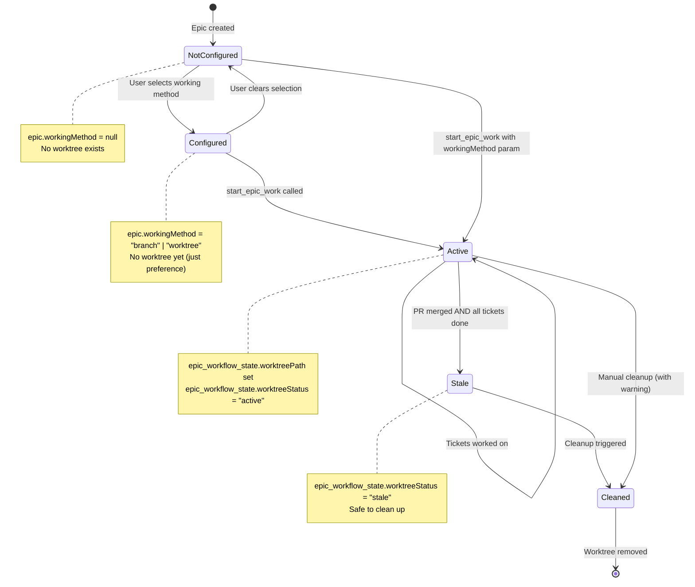
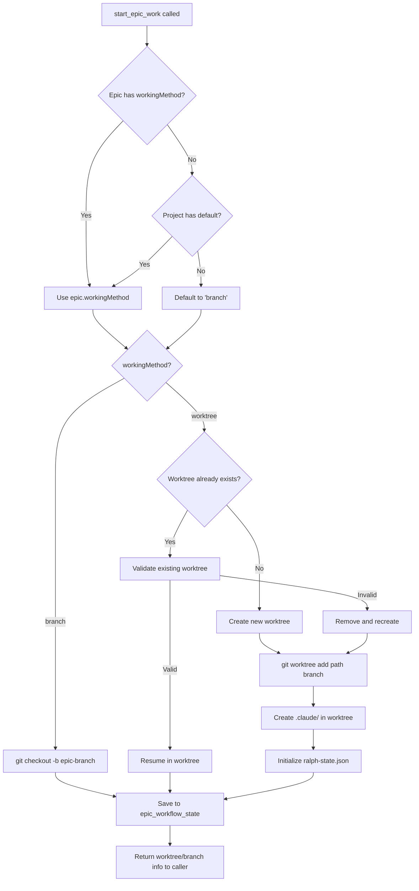
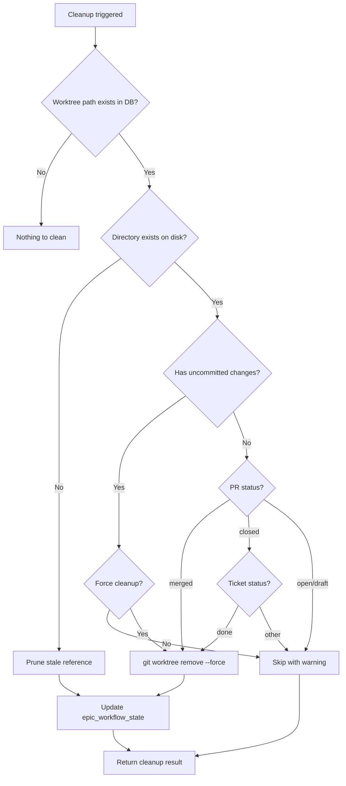

# Git Worktree Integration

## 1. Overview

### Why This Feature Exists

Currently, Brain Dump uses git branches for epic/ticket work. When you call `start_ticket_work`, it runs `git checkout -b feature/...` in your main project directory. This has limitations:

| Problem                        | Impact                                           |
| ------------------------------ | ------------------------------------------------ |
| **Single active context**      | Can only work on one ticket at a time            |
| **Checkout conflicts**         | Uncommitted changes block starting new tickets   |
| **Context switching friction** | Switching tickets may require stash/commit dance |
| **No parallel AI sessions**    | Can't run multiple Ralphs on different tickets   |

**Git worktrees solve this** by creating separate directories for each epic/ticket, all sharing the same `.git` database. Each worktree is isolated - you can have multiple IDEs open, multiple AI sessions running, with no interference.

### The User's Choice

Rather than forcing worktrees on everyone, this feature gives users a **per-epic choice**:

- **Small epic, quick work?** → Use main directory (branches)
- **Large epic, parallel AI work?** → Create a worktree

The choice is made in the Brain Dump UI before starting AI work, stored on the epic record, and inherited by all tickets in that epic.

---

## 2. Reference Tables

### Working Methods

| Method     | Directory         | Git Command                        | Best For                                         |
| ---------- | ----------------- | ---------------------------------- | ------------------------------------------------ |
| `branch`   | Main project dir  | `git checkout -b <branch>`         | Quick fixes, sequential work, limited disk space |
| `worktree` | Sibling directory | `git worktree add <path> <branch>` | Large epics, parallel AI, long-running work      |

### Worktree Lifecycle States

| State            | Description                                | Visual Indicator |
| ---------------- | ------------------------------------------ | ---------------- |
| `not_configured` | Epic has no working method set             | No badge         |
| `configured`     | Working method chosen, not yet started     | 🔧 badge         |
| `active`         | Worktree exists, work in progress          | 📂 green         |
| `stale`          | PR merged, worktree can be cleaned up      | 📂 yellow        |
| `orphaned`       | Worktree exists but epic deleted/abandoned | 📂 red           |

### Worktree Location Options

| Option              | Path Pattern               | Example                                  |
| ------------------- | -------------------------- | ---------------------------------------- |
| `sibling` (default) | `../<project>-<epic-slug>` | `~/code/brain-dump-epic-auth`            |
| `subfolder`         | `./.worktrees/<epic-slug>` | `~/code/brain-dump/.worktrees/epic-auth` |
| `custom`            | User-specified base path   | `~/worktrees/brain-dump-epic-auth`       |

### Cleanup Triggers

| Trigger                       | Action                      | Safety Check                                |
| ----------------------------- | --------------------------- | ------------------------------------------- |
| Manual cleanup button         | Remove worktree             | Warn if uncommitted changes                 |
| `start_ticket_work` (lazy)    | Clean stale worktrees first | Only if `status=done` AND `prStatus=merged` |
| `pnpm brain-dump cleanup`     | CLI cleanup command         | Dry-run by default                          |
| Project setting: auto-cleanup | Remove when PR merged       | Configurable per-project                    |

---

## 3. Type Definitions

### Database Schema Changes

```typescript
// src/lib/schema.ts

// Add to epics table
export const epics = sqliteTable("epics", {
  id: text("id").primaryKey(),
  title: text("title").notNull(),
  description: text("description"),
  projectId: text("project_id")
    .notNull()
    .references(() => projects.id),
  color: text("color"),
  createdAt: text("created_at").default(sql`CURRENT_TIMESTAMP`),

  // NEW: Isolation mode preference (NOT "workingMethod" - that's used for environment detection)
  isolationMode: text("isolation_mode"), // "branch" | "worktree" | null
});

// Add to epic_workflow_state table
export const epicWorkflowState = sqliteTable("epic_workflow_state", {
  epicId: text("epic_id")
    .primaryKey()
    .references(() => epics.id),

  // Existing fields
  epicBranchName: text("epic_branch_name"),
  epicBranchCreatedAt: text("epic_branch_created_at"),
  currentTicketId: text("current_ticket_id"),
  prNumber: integer("pr_number"),
  prUrl: text("pr_url"),
  prStatus: text("pr_status"),

  // NEW: Worktree tracking
  worktreePath: text("worktree_path"), // Absolute path to worktree
  worktreeCreatedAt: text("worktree_created_at"),
  worktreeStatus: text("worktree_status"), // "active" | "stale" | "orphaned"
});

// Add to projects table (optional defaults)
export const projects = sqliteTable("projects", {
  // ... existing fields ...

  // NEW: Default working method for new epics
  defaultWorkingMethod: text("default_working_method"), // "branch" | "worktree" | "ask"
  worktreeLocation: text("worktree_location"), // "sibling" | "subfolder" | "custom"
  worktreeBasePath: text("worktree_base_path"), // Only if location = "custom"
  autoCleanupWorktrees: integer("auto_cleanup_worktrees").default(0), // boolean
});
```

### TypeScript Interfaces

```typescript
// mcp-server/types.ts

export type IsolationMode = "branch" | "worktree";
export type WorktreeStatus = "active" | "stale" | "orphaned";
export type WorktreeLocation = "sibling" | "subfolder" | "custom";

export interface EpicWorkflowState {
  epicId: string;
  epicBranchName: string | null;
  epicBranchCreatedAt: string | null;
  currentTicketId: string | null;
  prNumber: number | null;
  prUrl: string | null;
  prStatus: "draft" | "open" | "merged" | "closed" | null;

  // Worktree fields
  worktreePath: string | null;
  worktreeCreatedAt: string | null;
  worktreeStatus: WorktreeStatus | null;
}

export interface WorktreeInfo {
  path: string;
  branch: string;
  isMainWorktree: boolean;
  hasUncommittedChanges: boolean;
  aheadBehind: { ahead: number; behind: number };
}

export interface WorktreeValidation {
  status: "valid" | "missing_directory" | "corrupted" | "wrong_branch";
  branch?: string;
  hasUncommittedChanges?: boolean;
  error?: string;
}

export interface CleanupResult {
  worktreesRemoved: Array<{
    path: string;
    branch: string;
    reason: "merged" | "done" | "orphaned" | "manual";
  }>;
  worktreesSkipped: Array<{
    path: string;
    reason: string;
  }>;
  spaceRecovered: number; // bytes
}

export interface StartEpicOptions {
  epicId: string;
  workingMethod?: WorkingMethod; // Override epic.workingMethod
}

export interface StartTicketOptions {
  ticketId: string;
  workingMethod?: WorkingMethod; // Only for tickets not in an epic
}
```

### Ralph State Extension

```typescript
// .claude/ralph-state.json schema
export interface RalphState {
  sessionId: string;
  ticketId: string;
  currentState:
    | "idle"
    | "analyzing"
    | "implementing"
    | "testing"
    | "committing"
    | "reviewing"
    | "done";
  stateHistory: string[];
  startedAt: string; // ISO timestamp
  updatedAt: string; // ISO timestamp

  // NEW: Worktree awareness
  worktreePath?: string; // Path to worktree (if using worktree)
  mainRepoPath?: string; // Path to main repo (for hooks that need it)
  workingMethod?: WorkingMethod;
}
```

---

## 4. State Machine

### Epic Working Method Lifecycle



### Worktree Creation Flow



### Cleanup Decision Flow



---

## 5. Design Decisions

### D1: Per-Epic Choice vs Project-Wide Setting

**Decision**: Per-epic choice stored on `epics.workingMethod`, with optional project default.

**Why**:

1. Different epics have different scopes - a 2-ticket hotfix doesn't need worktree isolation
2. Users can mix approaches in the same project based on actual needs
3. The decision is made at the natural boundary (epic) rather than artificially (project)
4. Project default reduces friction while preserving flexibility

**Rejected Alternative**: Project-wide setting only

- Too inflexible
- Would force worktree overhead on small fixes

### D2: Choice Timing - UI Before AI Start

**Decision**: User selects working method in Brain Dump UI before launching AI session.

**Why**:

1. Keeps AI focused on implementation, not setup questions
2. User makes decision with full context (seeing epic details in UI)
3. Choice is persisted, can be changed before starting
4. Clear separation: UI for configuration, AI for execution

**Rejected Alternative**: AI prompts for choice during `start_ticket_work`

- Interrupts AI workflow
- Harder to change mind after selection
- Mixes configuration with execution

### D3: Worktree Location - Sibling Directories Default

**Decision**: Default to sibling directories (`~/code/project-epic-name`).

**Why**:

1. Easy to see in file explorer - worktrees are visible alongside projects
2. IDE can open each as separate project/workspace
3. No hidden directories to forget about
4. Clear naming shows what each directory is for

**Rejected Alternatives**:

- `.worktrees/` subfolder: Hidden, easy to forget, clutters project
- Centralized `~/.worktrees/`: Disconnected from project, hard to find

### D4: `.claude/` Per-Worktree, Not Shared

**Decision**: Each worktree gets its own `.claude/` folder with isolated state.

**Why**:

1. Hooks already use `$PROJECT_DIR/.claude/` pattern - no changes needed
2. Parallel AI sessions need separate state (ralph-state.json)
3. Matches worktree isolation philosophy
4. No race conditions between sessions

**What's shared**: Global hooks in `~/.claude/hooks/` (already the case)
**What's isolated**: Session state in `<worktree>/.claude/`

### D5: Cleanup Strategy - Lazy + Manual

**Decision**: Clean stale worktrees lazily on next `start_ticket_work`, plus manual cleanup option.

**Why**:

1. No background processes or cron jobs needed
2. User in control of when cleanup happens
3. Natural timing - cleanup old before starting new
4. CLI command for explicit cleanup when desired

**Rejected Alternative**: Automatic cleanup on PR merge

- Requires webhook server (Brain Dump is local-first)
- Could delete worktree user still wants to reference

### D6: Resumption - Validate and Reuse

**Decision**: When starting a ticket in an epic that has a worktree, validate and reuse it.

**Why**:

1. Don't create duplicate worktrees for same epic
2. Preserve uncommitted work from previous sessions
3. Fast - no setup time for returning to work
4. User expects to continue where they left off

**Validation checks**:

- Directory exists
- Is a valid git worktree
- Branch matches expected
- Report uncommitted changes to AI for awareness

---

## 6. Implementation Guide

### Phase 1: Database Schema

**Migration file**: `drizzle/migrations/XXXX_add_worktree_support.sql`

```sql
-- Add isolation mode to epics (NOT "working_method" - that's used elsewhere for environment detection)
ALTER TABLE epics ADD COLUMN isolation_mode TEXT;

-- Add worktree fields to epic_workflow_state
ALTER TABLE epic_workflow_state ADD COLUMN worktree_path TEXT;
ALTER TABLE epic_workflow_state ADD COLUMN worktree_created_at TEXT;
ALTER TABLE epic_workflow_state ADD COLUMN worktree_status TEXT;

-- Add project defaults
ALTER TABLE projects ADD COLUMN default_working_method TEXT;
ALTER TABLE projects ADD COLUMN worktree_location TEXT DEFAULT 'sibling';
ALTER TABLE projects ADD COLUMN worktree_base_path TEXT;
ALTER TABLE projects ADD COLUMN auto_cleanup_worktrees INTEGER DEFAULT 0;
```

**Update schema.ts** with new fields (see Type Definitions section).

### Phase 2: Git Utilities

**File**: `mcp-server/lib/git-utils.js`

> **SECURITY NOTE**: All git commands MUST use argument arrays with `execFileSync`,
> NOT string interpolation with shell execution. This prevents command injection.

```javascript
import path from "path";
import fs from "fs";
import { execFileSync } from "child_process";

/**
 * SAFE git command execution using argument arrays
 * NEVER use string interpolation for git commands
 */
export function runGitCommandSafe(args, cwd) {
  return execFileSync("git", args, {
    cwd,
    encoding: "utf-8",
    maxBuffer: 10 * 1024 * 1024, // 10MB
  });
}

/**
 * Validate project path to prevent path traversal attacks
 */
function validateProjectPath(inputPath) {
  if (!path.isAbsolute(inputPath)) {
    throw new Error("Security: Project path must be absolute");
  }
  if (!fs.existsSync(inputPath)) {
    throw new Error("Security: Project path does not exist");
  }
  // Resolve symlinks and check for traversal
  const resolved = fs.realpathSync(inputPath);
  if (inputPath.includes("..")) {
    throw new Error("Security: Path traversal detected");
  }
  return resolved;
}

/**
 * Validate worktree path is safe (sibling or child of project)
 */
function validateWorktreePath(worktreePath, projectPath) {
  if (!path.isAbsolute(worktreePath)) {
    throw new Error("Security: Worktree path must be absolute");
  }
  // Worktree must be sibling or within project directory
  const projectParent = path.dirname(projectPath);
  const worktreeParent = path.dirname(worktreePath);
  if (worktreeParent !== projectParent && !worktreePath.startsWith(projectPath)) {
    throw new Error("Security: Worktree path must be sibling or within project");
  }
}

/**
 * Generate worktree path based on project settings
 */
export function generateWorktreePath(projectPath, epicId, epicTitle, location = "sibling") {
  const slug = epicTitle
    .toLowerCase()
    .replace(/[^a-z0-9]+/g, "-")
    .substring(0, 30);
  const shortId = epicId.substring(0, 8);
  const worktreeName = `${path.basename(projectPath)}-epic-${shortId}-${slug}`;

  switch (location) {
    case "sibling":
      return path.join(path.dirname(projectPath), worktreeName);
    case "subfolder":
      return path.join(projectPath, ".worktrees", `epic-${shortId}-${slug}`);
    case "custom":
      // Caller must provide base path
      throw new Error("Custom location requires basePath parameter");
    default:
      return path.join(path.dirname(projectPath), worktreeName);
  }
}

/**
 * Create a new worktree for an epic
 * SECURITY: Uses execFileSync with argument arrays to prevent command injection
 */
export function createWorktree(projectPath, worktreePath, branchName) {
  // Validate inputs (see Security Review section)
  validateProjectPath(projectPath);
  validateWorktreePath(worktreePath, projectPath);

  // Ensure parent directory exists
  fs.mkdirSync(path.dirname(worktreePath), { recursive: true, mode: 0o755 });

  // Create the worktree using SAFE argument array (not string interpolation)
  runGitCommandSafe(["worktree", "add", worktreePath, "-b", branchName], projectPath);

  // Create .claude directory with restricted permissions
  const claudeDir = path.join(worktreePath, ".claude");

  // Security: Check for symlink attacks before creating
  try {
    const stats = fs.lstatSync(claudeDir);
    if (stats.isSymbolicLink()) {
      throw new Error("Security: .claude path is a symlink - refusing to create");
    }
  } catch (e) {
    if (e.code !== "ENOENT") throw e;
  }

  fs.mkdirSync(claudeDir, { recursive: true, mode: 0o700 });

  return { worktreePath, branchName };
}

/**
 * Validate an existing worktree
 */
export function validateWorktree(worktreePath, projectPath, expectedBranch = null) {
  // Check directory exists
  if (!fs.existsSync(worktreePath)) {
    return { status: "missing_directory" };
  }

  // Check it's a valid worktree
  try {
    // SAFE: Using argument array
    const worktreeList = runGitCommandSafe(["worktree", "list", "--porcelain"], projectPath);
    if (!worktreeList.includes(worktreePath)) {
      return { status: "corrupted", error: "Not in worktree list" };
    }

    // Get current branch - SAFE: Using argument array
    const branch = runGitCommandSafe(["branch", "--show-current"], worktreePath).trim();

    // Check for uncommitted changes - SAFE: Using argument array
    const status = runGitCommandSafe(["status", "--porcelain"], worktreePath);
    const hasUncommittedChanges = status.trim().length > 0;

    // Validate branch if expected
    if (expectedBranch && branch !== expectedBranch) {
      return {
        status: "wrong_branch",
        branch,
        expectedBranch,
        hasUncommittedChanges,
      };
    }

    return {
      status: "valid",
      branch,
      hasUncommittedChanges,
    };
  } catch (error) {
    return { status: "corrupted", error: error.message };
  }
}

/**
 * Remove a worktree
 * SECURITY: Uses argument arrays, validates path
 */
export function removeWorktree(worktreePath, projectPath, force = false) {
  validateWorktreePath(worktreePath, projectPath);

  // SAFE: Using argument array (not string interpolation)
  const args = ["worktree", "remove"];
  if (force) args.push("--force");
  args.push(worktreePath);

  runGitCommandSafe(args, projectPath);

  // Prune any stale references - SAFE: Using argument array
  runGitCommandSafe(["worktree", "prune"], projectPath);
}

/**
 * List all worktrees for a project
 */
export function listWorktrees(projectPath) {
  // SAFE: Using argument array
  const output = runGitCommandSafe(["worktree", "list", "--porcelain"], projectPath);
  const worktrees = [];
  let current = {};

  for (const line of output.split("\n")) {
    if (line.startsWith("worktree ")) {
      if (current.path) worktrees.push(current);
      current = { path: line.substring(9) };
    } else if (line.startsWith("HEAD ")) {
      current.head = line.substring(5);
    } else if (line.startsWith("branch ")) {
      current.branch = line.substring(7).replace("refs/heads/", "");
    } else if (line === "bare") {
      current.bare = true;
    }
  }
  if (current.path) worktrees.push(current);

  return worktrees.map((wt) => ({
    ...wt,
    isMainWorktree: wt.path === projectPath,
  }));
}
```

### Phase 3: MCP Tool Updates

**File**: `mcp-server/tools/workflow.js`

Update `start_epic_work`:

```javascript
export const startEpicWork = createTool({
  name: "start_epic_work",
  description: "Start working on an epic. Creates branch or worktree based on epic settings.",
  input: z.object({
    epicId: z.string(),
    workingMethod: z.enum(["branch", "worktree"]).optional(),
  }),
  handler: async ({ epicId, workingMethod: overrideMethod }) => {
    const epic = await getEpic(epicId);
    const project = await getProject(epic.projectId);

    // Determine working method: param > epic setting > project default > "branch"
    const workingMethod =
      overrideMethod || epic.workingMethod || project.defaultWorkingMethod || "branch";

    // Update epic if method was overridden
    if (overrideMethod && overrideMethod !== epic.workingMethod) {
      await updateEpic(epicId, { workingMethod: overrideMethod });
    }

    // Check for existing workflow state
    let epicState = await getEpicWorkflowState(epicId);

    if (workingMethod === "worktree") {
      return await startEpicWithWorktree(epic, project, epicState);
    } else {
      return await startEpicWithBranch(epic, project, epicState);
    }
  },
});

async function startEpicWithWorktree(epic, project, existingState) {
  const branchName = generateEpicBranchName(epic.id, epic.title);

  // Check if worktree already exists
  if (existingState?.worktreePath) {
    const validation = validateWorktree(
      existingState.worktreePath,
      project.path,
      existingState.epicBranchName
    );

    if (validation.status === "valid") {
      // Resume existing worktree
      return {
        type: "resumed",
        epicId: epic.id,
        branchName: existingState.epicBranchName,
        worktreePath: existingState.worktreePath,
        hasUncommittedChanges: validation.hasUncommittedChanges,
        message: validation.hasUncommittedChanges
          ? "Resumed worktree with uncommitted changes from previous session"
          : "Resumed existing worktree",
      };
    }

    // Invalid worktree - clean up and recreate
    if (validation.status !== "missing_directory") {
      try {
        removeWorktree(existingState.worktreePath, project.path, true);
      } catch (e) {
        // Ignore removal errors
      }
    }
  }

  // Create new worktree
  const worktreePath = generateWorktreePath(
    project.path,
    epic.id,
    epic.title,
    project.worktreeLocation || "sibling"
  );

  createWorktree(project.path, worktreePath, branchName);

  // Initialize ralph-state.json in worktree
  const ralphState = {
    sessionId: generateId(),
    ticketId: null, // Will be set when ticket work starts
    currentState: "idle",
    worktreePath,
    mainRepoPath: project.path,
    workingMethod: "worktree",
    startedAt: new Date().toISOString(),
    updatedAt: new Date().toISOString(),
  };

  fs.writeFileSync(
    path.join(worktreePath, ".claude", "ralph-state.json"),
    JSON.stringify(ralphState, null, 2)
  );

  // Save to database
  await upsertEpicWorkflowState({
    epicId: epic.id,
    epicBranchName: branchName,
    epicBranchCreatedAt: new Date().toISOString(),
    worktreePath,
    worktreeCreatedAt: new Date().toISOString(),
    worktreeStatus: "active",
  });

  return {
    type: "created",
    epicId: epic.id,
    branchName,
    worktreePath,
    message: `Created worktree at ${worktreePath}`,
  };
}
```

### Phase 4: Cleanup Tool

**File**: `mcp-server/tools/workflow.js`

```javascript
export const cleanupWorktrees = createTool({
  name: "cleanup_worktrees",
  description: "Remove stale worktrees for completed epics",
  input: z.object({
    projectId: z.string().optional(),
    force: z.boolean().default(false),
    dryRun: z.boolean().default(true),
  }),
  handler: async ({ projectId, force, dryRun }) => {
    const projects = projectId ? [await getProject(projectId)] : await getAllProjects();

    const results = {
      removed: [],
      skipped: [],
      errors: [],
    };

    for (const project of projects) {
      const worktrees = listWorktrees(project.path);

      for (const wt of worktrees) {
        if (wt.isMainWorktree) continue;

        // Find epic for this worktree
        const epicState = await findEpicByWorktreePath(wt.path);

        if (!epicState) {
          // Orphaned worktree
          if (!dryRun) {
            removeWorktree(wt.path, project.path, force);
          }
          results.removed.push({ path: wt.path, reason: "orphaned" });
          continue;
        }

        // Check if safe to remove
        const epic = await getEpic(epicState.epicId);
        const allTicketsDone = await checkAllTicketsDone(epicState.epicId);
        const prMerged = epicState.prStatus === "merged";

        if (allTicketsDone && prMerged) {
          if (!dryRun) {
            removeWorktree(wt.path, project.path, force);
            await updateEpicWorkflowState(epicState.epicId, {
              worktreeStatus: null,
              worktreePath: null,
            });
          }
          results.removed.push({ path: wt.path, reason: "merged", epic: epic.title });
        } else {
          results.skipped.push({
            path: wt.path,
            reason: !allTicketsDone ? "tickets_incomplete" : "pr_not_merged",
            epic: epic.title,
          });
        }
      }
    }

    return {
      dryRun,
      ...results,
      message: dryRun
        ? `Would remove ${results.removed.length} worktrees. Run with dryRun: false to delete.`
        : `Removed ${results.removed.length} worktrees.`,
    };
  },
});
```

### Phase 5: UI Components

**File**: `src/components/epics/StartEpicModal.tsx`

```tsx
import { useState } from "react";
import { useMutation, useQueryClient } from "@tanstack/react-query";
import { startEpicWork } from "../../api/epics";

interface StartEpicModalProps {
  epic: Epic;
  onClose: () => void;
}

export function StartEpicModal({ epic, onClose }: StartEpicModalProps) {
  const [workingMethod, setWorkingMethod] = useState<"branch" | "worktree">(
    epic.workingMethod || "branch"
  );
  const [aiEnvironment, setAiEnvironment] = useState<string>("claude-code");

  const queryClient = useQueryClient();

  const startMutation = useMutation({
    mutationFn: async () => {
      // Update epic with working method choice
      await updateEpic(epic.id, { workingMethod });

      // Start epic work (creates branch/worktree)
      const result = await startEpicWork({ epicId: epic.id, workingMethod });

      // Launch AI environment
      await launchAiEnvironment(aiEnvironment, result.worktreePath || epic.project.path);

      return result;
    },
    onSuccess: () => {
      queryClient.invalidateQueries({ queryKey: ["epics"] });
      onClose();
    },
  });

  return (
    <div className="modal">
      <h2>Start Epic: {epic.title}</h2>
      <p>{epic.tickets.length} tickets</p>

      <div className="section">
        <h3>Working Method</h3>

        <label className="option">
          <input
            type="radio"
            name="workingMethod"
            value="branch"
            checked={workingMethod === "branch"}
            onChange={() => setWorkingMethod("branch")}
          />
          <div>
            <strong>Main directory</strong>
            <p>Work in {epic.project.path}</p>
            <p className="hint">Switches branches in your main project folder</p>
          </div>
        </label>

        <label className="option">
          <input
            type="radio"
            name="workingMethod"
            value="worktree"
            checked={workingMethod === "worktree"}
            onChange={() => setWorkingMethod("worktree")}
          />
          <div>
            <strong>Worktree (isolated)</strong>
            <p>
              Create {epic.project.path}-epic-{epic.id.substring(0, 8)}
            </p>
            <p className="hint">Separate folder, can run parallel AI sessions</p>
          </div>
        </label>
      </div>

      <div className="section">
        <h3>AI Environment</h3>
        <select value={aiEnvironment} onChange={(e) => setAiEnvironment(e.target.value)}>
          <option value="claude-code">Claude Code</option>
          <option value="cursor">Cursor</option>
          <option value="vscode">VS Code</option>
        </select>
      </div>

      <div className="actions">
        <button onClick={onClose}>Cancel</button>
        <button onClick={() => startMutation.mutate()} disabled={startMutation.isPending}>
          {startMutation.isPending ? "Starting..." : "Start Epic"}
        </button>
      </div>
    </div>
  );
}
```

**File**: `src/components/epics/WorktreeBadge.tsx`

```tsx
interface WorktreeBadgeProps {
  workingMethod: "branch" | "worktree" | null;
  worktreeStatus?: "active" | "stale" | "orphaned" | null;
  worktreePath?: string | null;
}

export function WorktreeBadge({ workingMethod, worktreeStatus, worktreePath }: WorktreeBadgeProps) {
  if (!workingMethod) return null;

  if (workingMethod === "branch") {
    return (
      <span className="badge badge-branch" title="Using branch in main directory">
        🌿 branch
      </span>
    );
  }

  const statusColors = {
    active: "green",
    stale: "yellow",
    orphaned: "red",
  };

  const statusColor = worktreeStatus ? statusColors[worktreeStatus] : "gray";

  return (
    <span
      className={`badge badge-worktree badge-${statusColor}`}
      title={worktreePath || "Worktree not yet created"}
    >
      📂 worktree {worktreeStatus && `(${worktreeStatus})`}
    </span>
  );
}
```

### Phase 6: Hook Updates

Only one hook needs awareness of worktree vs main repo:

**File**: `~/.claude/hooks/spawn-after-pr.sh`

```bash
#!/bin/bash
# spawn-after-pr.sh - Updated for worktree support

# ... existing code ...

# Use CLAUDE_PROJECT_DIR for current working directory
PROJECT_DIR="${CLAUDE_PROJECT_DIR:-$(pwd)}"

# Check ralph-state for main repo path (if in worktree)
RALPH_STATE="$PROJECT_DIR/.claude/ralph-state.json"
MAIN_REPO="$PROJECT_DIR"

if [[ -f "$RALPH_STATE" ]]; then
  MAIN_REPO_FROM_STATE=$(jq -r '.mainRepoPath // ""' "$RALPH_STATE" 2>/dev/null || echo "")
  if [[ -n "$MAIN_REPO_FROM_STATE" ]]; then
    MAIN_REPO="$MAIN_REPO_FROM_STATE"
  fi
fi

# PRD is always in main repo
PRD_FILE="$MAIN_REPO/plans/prd.json"

# ... rest of script uses $MAIN_REPO for spawning next session ...
```

---

## 7. Testing Checklist

### Unit Tests

- [ ] `generateWorktreePath` generates correct paths for each location option
- [ ] `validateWorktree` returns correct status for each scenario
- [ ] `createWorktree` creates directory with `.claude/` folder
- [ ] `removeWorktree` cleans up properly
- [ ] `listWorktrees` parses porcelain output correctly

### Integration Tests

- [ ] `start_epic_work` with `workingMethod: "branch"` creates branch
- [ ] `start_epic_work` with `workingMethod: "worktree"` creates worktree
- [ ] `start_ticket_work` inherits epic's working method
- [ ] Resuming existing worktree detects and reports uncommitted changes
- [ ] Cleanup removes only stale worktrees
- [ ] Cleanup respects `dryRun` flag

### UI Tests

- [ ] StartEpicModal displays working method options
- [ ] WorktreeBadge shows correct status
- [ ] Epic sidebar shows worktree indicator
- [ ] Ticket cards show worktree badge when applicable

### Hook Tests

- [ ] Hooks work in worktree directory (find `.claude/`)
- [ ] `spawn-after-pr.sh` spawns in main repo, not worktree
- [ ] Telemetry hooks capture worktree path

---

## 8. Rollout Plan

### Phase 1: Backend (No UI)

1. Add database migrations
2. Implement git-utils functions
3. Update MCP tools to support worktrees
4. Update `spawn-after-pr.sh` hook
5. Test via direct MCP calls

### Phase 2: UI - Read Only

1. Add WorktreeBadge component
2. Display worktree status on epics/tickets
3. No creation UI yet - just visibility

### Phase 3: UI - Full

1. Add StartEpicModal with working method choice
2. Add "Start with AI" buttons to sidebar
3. Add cleanup UI in project settings
4. Add project default settings

### Phase 4: Polish

1. Add CLI `brain-dump cleanup` command
2. Add lazy cleanup in `start_ticket_work`
3. Documentation updates
4. CLAUDE.md updates

---

## 9. Considerations & Edge Cases

### Disk Space

- Each worktree duplicates `node_modules` (~500MB+ per worktree)
- Consider warning users when multiple worktrees exist
- Show disk usage in cleanup UI

### Environment Files

- `.env` files aren't committed and won't exist in new worktrees
- Option: Auto-copy `.env*` files when creating worktree
- Add setting: `copyEnvFiles: boolean`

### Port Conflicts

- Running `pnpm dev` in multiple worktrees causes port conflicts
- Document: "Only run dev server in one worktree at a time"
- Future: Could add per-worktree port configuration

### Dependencies

- New worktrees need `pnpm install` before use
- Option: Auto-run install after worktree creation
- Add setting: `autoInstallDeps: boolean`

---

## 10. Review Findings

### Principal Engineer Review

#### Naming Collision (MUST FIX)

The spec proposes `workingMethod` on the `epics` table, but `projects.workingMethod` already exists with different semantics (`"auto" | "claude-code" | "vscode"` for environment detection).

**Resolution**: Rename the new field to `isolationMode` or `workspaceMode`:

```typescript
// epics table
isolationMode: text("isolation_mode"),  // "branch" | "worktree" | null
```

#### Schema Mismatch (MUST FIX)

The existing `epic_workflow_state` table (schema.ts:576-607) has `id` as primary key, not `epicId`. The spec's schema definition is inconsistent.

**Resolution**: Match existing structure - add columns to existing table:

```sql
-- Migration must ADD to existing table, not redefine
ALTER TABLE epic_workflow_state ADD COLUMN worktree_path TEXT;
ALTER TABLE epic_workflow_state ADD COLUMN worktree_created_at TEXT;
ALTER TABLE epic_workflow_state ADD COLUMN worktree_status TEXT;
```

#### Missing Rollback on Failure (MUST FIX)

If database update fails after worktree creation, the worktree is orphaned.

**Resolution**: Add rollback logic:

```javascript
try {
  createWorktree(projectPath, worktreePath, branchName);
  await upsertEpicWorkflowState({ ... });  // DB update
} catch (dbError) {
  // Rollback: remove the worktree we just created
  try {
    removeWorktree(worktreePath, projectPath, true);
  } catch (cleanupError) {
    log.error("Failed to rollback worktree creation", cleanupError);
  }
  throw dbError;
}
```

#### Edge Cases to Handle

| Edge Case                                         | Resolution                                                                                  |
| ------------------------------------------------- | ------------------------------------------------------------------------------------------- |
| **Worktree path already exists (not a worktree)** | Check with `fs.existsSync` before creation, return clear error or generate alternative path |
| **Race condition on parallel epic starts**        | Use atomic `git worktree add -b <branch> <path> <base>` syntax                              |
| **Epic deleted while worktree active**            | Add `onDelete` hook to trigger worktree cleanup prompt                                      |
| **Disk full mid-operation**                       | Wrap in try/catch, clean up partial directories                                             |
| **Symlinks in project path**                      | Use `fs.realpathSync` to resolve before generating paths                                    |

#### Missing Feature Flag

**Resolution**: Add to settings table:

```typescript
// In settings or projects table
enableWorktreeSupport: integer("enable_worktree_support").default(0),
```

Check this flag in `start_epic_work` and gracefully fall back to branch mode if disabled.

#### API Response Consistency

The new worktree functions return different structures than existing MCP tools.

**Resolution**: Wrap returns in standard MCP format:

```javascript
return {
  content: [
    {
      type: "text",
      text: JSON.stringify(
        {
          type: "created",
          epicId: epic.id,
          branchName,
          worktreePath,
          message: `Created worktree at ${worktreePath}`,
        },
        null,
        2
      ),
    },
  ],
};
```

---

### Security Engineer Review

#### CRITICAL: Command Injection

The spec's implementation uses string interpolation into shell commands:

```javascript
// VULNERABLE
runGitCommand(`git worktree add "${worktreePath}" -b ${branchName}`, projectPath);
```

**Resolution**: Replace with argument array pattern using `execFileSync`:

```javascript
// SAFE - in git-utils.js
import { execFileSync } from "child_process";

export function runGitCommandSafe(args, cwd) {
  return execFileSync("git", args, { cwd, encoding: "utf-8" });
}

// Usage
runGitCommandSafe(["worktree", "add", worktreePath, "-b", branchName], projectPath);
```

This prevents shell interpretation entirely.

#### HIGH: Path Traversal Validation

`projectPath` is trusted implicitly. Attacker-controlled database entries could create worktrees in sensitive locations.

**Resolution**: Add validation layer:

```javascript
function validateProjectPath(inputPath) {
  // Must be absolute
  if (!path.isAbsolute(inputPath)) {
    throw new SecurityError("Project path must be absolute");
  }

  // Must exist
  if (!fs.existsSync(inputPath)) {
    throw new SecurityError("Project path does not exist");
  }

  // No traversal in resolved path
  const resolved = fs.realpathSync(inputPath);
  if (resolved !== inputPath && inputPath.includes("..")) {
    throw new SecurityError("Path traversal detected");
  }

  return resolved;
}
```

#### HIGH: Symlink Attack Prevention

`.claude/` directory creation could follow symlinks.

**Resolution**: Check for symlinks before creating:

```javascript
function createClaudeDir(worktreePath) {
  const claudeDir = path.join(worktreePath, ".claude");

  // Check if path exists as symlink
  try {
    const stats = fs.lstatSync(claudeDir);
    if (stats.isSymbolicLink()) {
      throw new SecurityError(".claude path is a symlink - refusing to create");
    }
  } catch (e) {
    if (e.code !== "ENOENT") throw e;
    // Path doesn't exist - safe to create
  }

  fs.mkdirSync(claudeDir, { recursive: true, mode: 0o700 });
}
```

#### HIGH: TOCTOU Race Condition

Validation and use are separate operations.

**Resolution**: Use file locking or immediate revalidation:

```javascript
async function withWorktreeLock(worktreePath, fn) {
  const lockFile = path.join(worktreePath, ".claude", ".lock");
  // Use proper-lockfile or similar
  await lockfile.lock(lockFile, { retries: 3 });
  try {
    return await fn();
  } finally {
    await lockfile.unlock(lockFile);
  }
}
```

#### ~~MEDIUM: State File Integrity~~ (REMOVED)

**Decision**: After implementation and security review, this was deemed over-engineered for the threat model:

- The attack requires malicious code already running on the user's machine
- If malicious code is running in a worktree, there are bigger security concerns
- The hooks are a workflow convenience, not a security boundary
- Most users won't be running untrusted code in worktrees

**Conclusion**: Removed HMAC verification. If needed in the future for enterprise/high-security environments, it can be added back as an opt-in feature.

#### MEDIUM: Worktree Limit

No limit on worktree creation allows disk exhaustion.

**Resolution**: Add configurable limit:

```typescript
// projects table
maxWorktrees: integer("max_worktrees").default(5),
```

```javascript
// In createWorktree
const existingCount = listWorktrees(projectPath).filter((w) => !w.isMainWorktree).length;
if (existingCount >= project.maxWorktrees) {
  throw new Error(
    `Worktree limit reached (${project.maxWorktrees}). Clean up old worktrees first.`
  );
}
```

#### MEDIUM: File Permissions

State files should have restricted permissions.

**Resolution**: Set mode on creation:

```javascript
fs.writeFileSync(statePath, JSON.stringify(state), { mode: 0o600 });
fs.mkdirSync(claudeDir, { recursive: true, mode: 0o700 });
```

---

### Updated Rollout Plan (Post-Review)

| Phase     | Description                                        | Security Gate             |
| --------- | -------------------------------------------------- | ------------------------- |
| **0**     | Rename field, fix schema alignment                 | -                         |
| **1a**    | Implement safe `runGitCommandSafe` with arg arrays | Security review           |
| **1b**    | Add path validation layer                          | Security review           |
| **1c**    | Database migration with existing data test         | -                         |
| **2**     | Implement worktree support behind feature flag     | -                         |
| **3**     | Add worktree limit and disk space checks           | -                         |
| **4**     | UI for visibility (read-only)                      | -                         |
| **5**     | UI for creation (with modal)                       | -                         |
| ~~**6**~~ | ~~State file integrity (HMAC)~~                    | REMOVED - over-engineered |
| **7**     | Hook audit and updates                             | -                         |
| **8**     | Remove feature flag, enable by default             | -                         |

---

### Action Items Checklist

**Must Fix Before Implementation:**

- [ ] Rename `workingMethod` → `isolationMode` on epics table
- [ ] Align schema with existing `epic_workflow_state` structure
- [ ] Replace `runGitCommand` string interpolation with `execFileSync` argument arrays
- [ ] Add path validation for `projectPath` inputs
- [ ] Add symlink check before `.claude/` creation
- [ ] Add rollback logic for worktree creation failures
- [ ] Add worktree count limit (default: 5)

**Should Fix Before Production:**

- [ ] Add feature flag for gradual rollout
- [x] ~~Add state file HMAC integrity~~ (REMOVED - over-engineered)
- [ ] Set restrictive file permissions (0o600/0o700)
- [ ] Add worktree operations to telemetry/audit log
- [ ] Document `pnpm install` requirement prominently
- [ ] Audit all hooks for worktree compatibility

**Nice to Have:**

- [ ] Disk space estimation before worktree creation
- [ ] Auto-cleanup stale worktrees on low disk
- [ ] Machine-specific worktree path handling for synced databases
