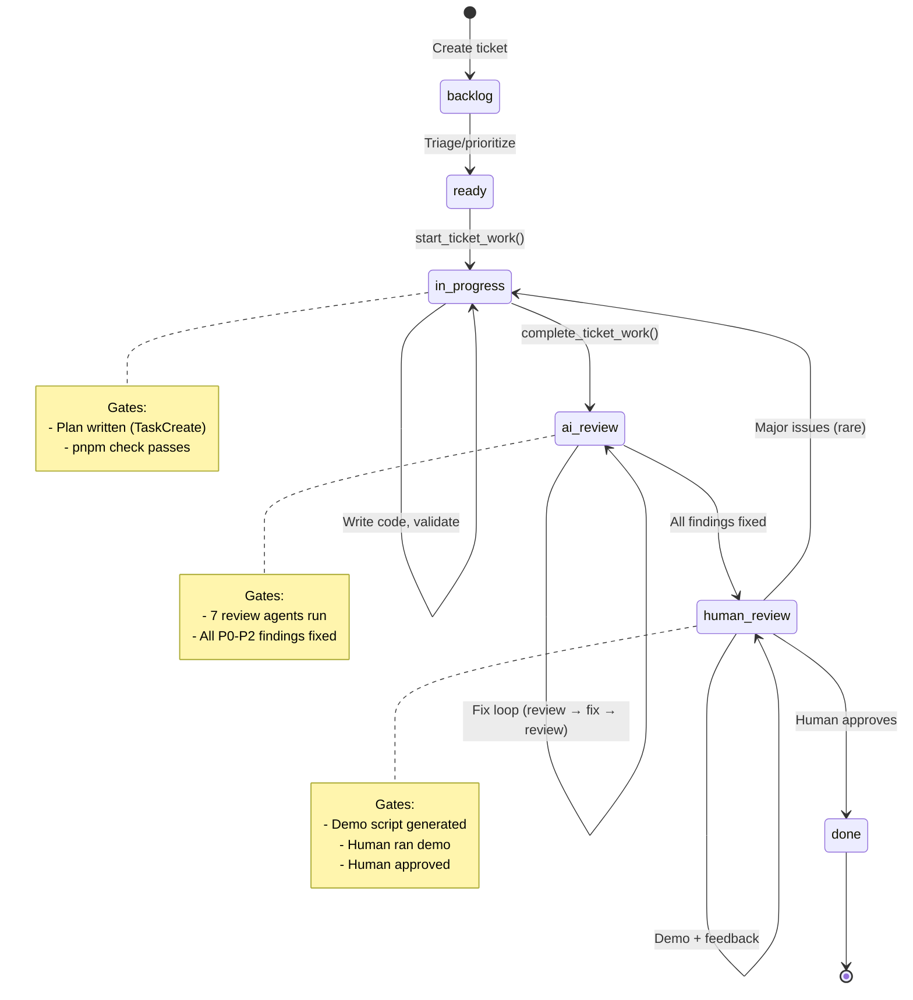
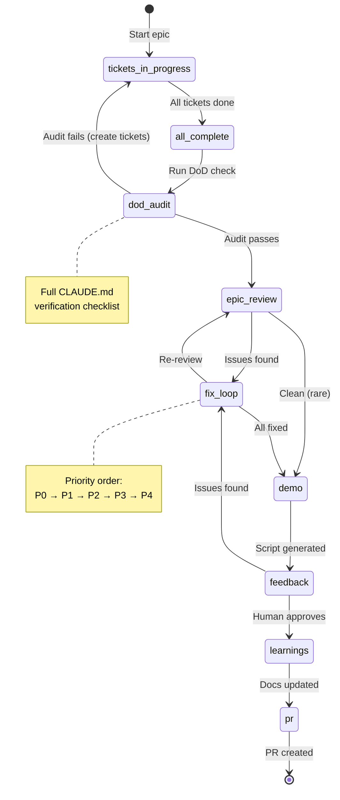

## 4. State Machine

### Ticket Workflow

```mermaid
stateDiagram-v2
    [*] --> backlog: Create ticket

    backlog --> ready: Triage/prioritize
    ready --> in_progress: start_ticket_work()

    in_progress --> in_progress: Write code, validate
    in_progress --> ai_review: complete_ticket_work()

    ai_review --> ai_review: Fix loop (review → fix → review)
    ai_review --> human_review: All findings fixed

    human_review --> human_review: Demo + feedback
    human_review --> done: Human approves
    human_review --> in_progress: Major issues (rare)

    done --> [*]

    note right of in_progress
        Gates:
        - Plan written (TaskCreate)
        - pnpm check passes
    end note

    note right of ai_review
        Gates:
        - 7 review agents run
        - All P0-P2 findings fixed
    end note

    note right of human_review
        Gates:
        - Demo script generated
        - Human ran demo
        - Human approved
    end note
```

### Epic Workflow

```mermaid
stateDiagram-v2
    [*] --> tickets_in_progress: Start epic

    tickets_in_progress --> all_complete: All tickets done

    all_complete --> dod_audit: Run DoD check

    dod_audit --> epic_review: Audit passes
    dod_audit --> tickets_in_progress: Audit fails (create tickets)

    epic_review --> fix_loop: Issues found
    epic_review --> demo: Clean (rare)

    fix_loop --> epic_review: Re-review
    fix_loop --> demo: All fixed

    demo --> feedback: Script generated

    feedback --> learnings: Human approves
    feedback --> fix_loop: Issues found

    learnings --> pr: Docs updated

    pr --> [*]: PR created

    note right of dod_audit
        Full CLAUDE.md
        verification checklist
    end note

    note right of fix_loop
        Priority order:
        P0 → P1 → P2 → P3 → P4
    end note
```

---
